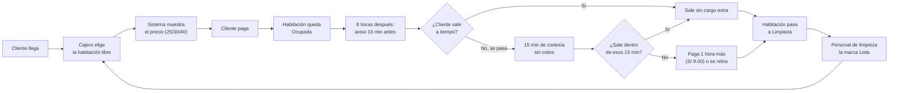

# El Apurimeño — Su nuevo sistema de gestión

## Documento explicativo para la propietaria

Este documento explica, en lenguaje simple, cómo va a funcionar el sistema que estamos construyendo para reemplazar el cuaderno. No contiene detalles técnicos de programación — esos quedan en un documento aparte para el equipo que construye el sistema. Aquí lo importante es que usted entienda **qué va a poder hacer el sistema, cómo cambia el trabajo del día a día, y qué control tiene usted sobre todo esto**.

Si al leerlo algo no coincide con lo que usted tiene en mente, o si algo no le queda claro, es momento de decirlo — este documento es justamente para conversarlo antes de construir nada.

---

## 1. ¿Qué hace este sistema?

Hoy, cada ingreso se anota a mano en un cuaderno: nombre, DNI, hora, habitación y precio. El sistema reemplaza ese cuaderno por una pantalla, pero conservando exactamente la misma información — y agregando cosas que un cuaderno no puede hacer:

- Calcula automáticamente el precio y el tiempo, sin que nadie tenga que hacer cuentas a mano.
- Avisa cuándo un cliente está por cumplir su tiempo.
- Imprime un comprobante para el cliente.
- Lleva la cuenta del dinero de cada turno de caja.
- Guarda el historial de todo — quién cobró qué, cuándo, y en qué habitación — sin que nadie pueda borrarlo.
- Le permite a usted ver cómo va el negocio, incluso estando fuera.

## 2. Un día normal con el sistema

Así se ve, paso a paso, el recorrido de un cliente típico:

El cajero ve esto en una pantalla con las 17 habitaciones a la vista, agrupadas visualmente, cada una mostrando si está libre, ocupada (con el tiempo que le queda), en limpieza, o en mantenimiento.

## 3. Las habitaciones y sus precios

Cada una de las 17 habitaciones tiene su propio precio, según sus comodidades — no según el piso en el que está:

| Tipo de habitación         | Precio (8 horas) |
|------------------------------|:------------------:|
| Sin baño propio               | S/ 25.00           |
| Con baño propio               | S/ 30.00           |
| Grande, con baño propio       | S/ 40.00           |

Estos precios, y a cuántas horas corresponden (hoy son 8), **usted los puede cambiar cuando quiera** desde su panel de administración, habitación por habitación. No hace falta llamar a nadie ni tocar el sistema por dentro.

Más adelante, si usted quiere, se podrán agregar "etiquetas" a una habitación — por ejemplo, si en el futuro alguna tiene TV por cable o internet — para diferenciarlas todavía más. Eso no está en la primera versión, pero el sistema queda preparado para agregarlo sin rehacer nada.

## 4. Clientes con precio especial

Usted ya maneja hoy que algunos clientes conocidos pagan distinto — a veces más, si dejan la habitación sucia, a veces menos, según su comportamiento. El sistema lo hace así:

- **Usted decide un precio fijo** para un cliente específico, en una habitación específica (por ejemplo: "Juan Pérez, en la habitación 202, paga siempre S/ 50"). Ese cliente se identifica por su DNI o por su nombre.
- La próxima vez que ese cliente llegue y pida esa habitación, **el sistema aplica el precio automáticamente**, sin que el cajero tenga que recordarlo.
- Si ese mismo cliente pide otra habitación distinta (una que usted no le fijó precio especial), paga el precio normal de esa habitación.

Aparte de esto, cualquier cajero puede hacer un **ajuste puntual, solo por esa vez** (por ejemplo, "hoy le cobro S/10 más porque vino solo y va a ensuciar más"). Ese ajuste queda anotado con un motivo breve, pero **no se guarda como regla para la próxima vez** — solo usted puede crear una regla permanente. Y algo importante para su tranquilidad: **ningún cajero puede cobrar menos del precio que usted fijó** — solo puede cobrar igual o más, nunca menos. Así nadie puede regalar descuentos por su cuenta.

## 5. Cuando el cliente se pasa del tiempo

Esta es una de las partes más importantes, porque es dinero. Así queda definido:

1. **10 minutos antes** de cumplirse las 8 horas, el sistema le recuerda al cajero que avise al cliente.
2. Cumplida la hora de salida, el cliente tiene **15 minutos de cortesía** para irse, sin que se le cobre nada extra.
3. Si se pasa de esos 15 minutos, tiene dos caminos: **se retira**, o **paga una hora más (S/ 8.00)** para quedarse. Esa hora nueva empieza a contarse desde el momento en que la paga.
4. Si vuelve a pasarse del tiempo de esa hora comprada, **ya no hay cortesía** — se le cobra otra hora de inmediato o se le pide que se retire.

Si el cliente sale antes de que se cumplan sus horas, no se le devuelve dinero por el tiempo que no usó — igual que hoy.

## 6. La tienda de la entrada

El sistema también va a manejar la tienda (bebidas y otros productos) que está en la entrada, junto a la recepción:

- Cada producto tiene **dos precios guardados**: uno para huéspedes (más económico, porque ya están pagando por la limpieza de su estadía) y otro para el público en general. El cajero simplemente elige cuál cobrar — no hay que mantener dos inventarios separados, el stock es uno solo por producto.
- Un huésped se reconoce automáticamente por tener una habitación activa en ese momento.
- Todo se cobra al momento de la compra, igual que ahora — no quedan "cuentas abiertas" pendientes de pago.
- El ingreso de mercadería nueva (cuando usted compra para reponer stock) solo lo puede registrar usted.

## 7. La limpieza de las habitaciones

Cuando un cliente sale, la habitación queda marcada como "Pendiente de limpieza". El personal de limpieza va a tener **su propio acceso desde su celular**, donde ve qué habitaciones están pendientes, y cuando termina de limpiar una, la marca como "Lista" — quedando disponible de inmediato para el siguiente cliente, sin que el cajero tenga que hacer nada más.

## 8. Quién puede hacer qué

El sistema tiene distintos niveles de acceso, y **usted podrá crear, editar y ajustar estos niveles a su gusto** desde su panel — no quedan fijos para siempre. Así arranca pensado:

| Persona                | Puede hacer |
|--------------------------|-------------|
| Usted (y su hija, con su propio usuario cada una) | Todo: precios, habitaciones, productos, usuarios, reportes, y ver el negocio incluso estando fuera. |
| Empleado nocturno (cajero) | Registrar ingresos y salidas, cobrar, vender en la tienda, abrir y cerrar su turno de caja. |
| Personal de limpieza      | Solo ver y marcar el estado de limpieza de las habitaciones, desde su celular. |

## 9. Cómo usted podrá ver el negocio estando fuera

Aunque el sistema principal funciona **dentro del local** (y sigue funcionando aunque se corte el internet, mientras haya wifi local), se guarda una copia de respaldo en la nube. Desde ahí, cuando usted no esté en el negocio, va a poder revisar un **resumen de cómo va el día o la semana** — cuánto se ha vendido, por ejemplo — aunque con algunos minutos de diferencia respecto a lo que pasa en tiempo real dentro del local. No es necesario que usted vea el tablero de habitaciones en vivo desde lejos, solo el resumen del dinero.

## 10. El comprobante que recibe el cliente

Se imprime un comprobante en la impresora térmica con el detalle de lo cobrado — habitación, horas, cualquier hora extra, productos comprados y el total. **No lleva el nombre ni el DNI del cliente impreso** — esos datos quedan guardados solo dentro del sistema, para que usted y su personal puedan consultar quién entró, a qué hora y a qué habitación si alguna vez hace falta revisarlo, sin exponerlo en un papel que el cliente se lleva.

Este comprobante **no reemplaza una boleta o factura oficial** — es un documento interno del negocio, para que quede un registro claro de cada cobro.

## 11. Seguridad de su información

- Cada persona que usa el sistema tiene su propio usuario y contraseña — nadie comparte accesos.
- Todo lo que pasa en el sistema (cobros, cambios de precio, anulaciones) queda registrado con quién lo hizo y cuándo, y **nada se puede borrar** — si algo se corrige, queda anotado como una corrección, no como si nunca hubiera pasado.
- La información se respalda de forma automática y periódica, con una copia adicional guardada fuera del equipo principal, para que un problema con la computadora del negocio no signifique perder la información.

## 12. Qué llega primero y qué llega después

Construir todo lo conversado de una sola vez tomaría mucho tiempo antes de que usted pueda empezar a usar el sistema. Por eso, proponemos entregarlo en dos etapas:

**Primera versión (para empezar a reemplazar el cuaderno ya):**

- Registro de ingresos y salidas con el cálculo automático de tiempo y precio, incluyendo la hora extra.
- Precios especiales por cliente y ajustes puntuales del cajero.
- La tienda, con sus dos precios y su stock.
- El acceso de limpieza desde el celular.
- Apertura y cierre de caja por turno.
- El comprobante impreso.
- Reportes básicos del día: cuánto se vendió, por qué medio de pago, cuánto vino de habitaciones y cuánto de la tienda.
- El respaldo en la nube con el resumen para usted.

**Segunda etapa (una vez que el negocio ya esté usando el sistema día a día):**

- Poder crear y ajustar roles y permisos a su gusto, más allá de los tres iniciales.
- Registro de gastos (sueldos, recibos de servicios, y cualquier otro gasto que usted quiera anotar), con reportes que comparen cuánto entra contra cuánto sale.
- Promociones.
- Las etiquetas adicionales para habitaciones (TV, internet, etc.).
- Preparar el sistema para, más adelante, apoyar también a sus otros dos negocios (la papelería y la ferretería), reutilizando la parte de productos e inventario.

## 13. Temas que todavía tenemos que definir juntos

- Qué tipo de "etiquetas" de servicios extra le gustaría poder poner a una habitación en el futuro (por ahora dejamos la opción abierta, sin definir cuáles).
- Qué tipo de promociones tiene en mente para más adelante.
- Confirmar si, además de efectivo, Yape y Plin, quiere aceptar transferencias bancarias desde el inicio.

Si todo esto refleja bien lo que usted tiene en mente para su negocio, seguimos adelante con la construcción. Si algo debe ajustarse, este es el momento.
