# Planos Técnicos del Sistema — El Apurimeño

## Hospedaje por horas + POS + Tienda

**Versión 1.0 — Especificación definitiva, basada en entrevista completa con el negocio**
Para: Reizo (integrador) y los tres agentes de desarrollo (Claude, Codex, Gemini/Antigravity)

| Campo         | Detalle |
|----------------|---------|
| Negocio         | El Apurimeño — hospedaje por horas, 17 habitaciones, con tienda en la entrada |
| Fecha            | 22 de septiembre de 2026 |
| Estado           | Reglas de negocio validadas por entrevista directa con el propietario (Reizo). Reemplaza cualquier documento anterior. |
| Lectores          | Este documento es el contrato técnico entre los tres agentes de IA que construyen el sistema. El documento hermano `El_Apurimeno_Explicacion_para_el_Negocio.md` es la versión para la propietaria — no técnica. |
| Regla de uso     | Ninguno de los tres agentes debe inventar una regla de negocio que no esté aquí. Las dudas van a la sección 18, no se resuelven por su cuenta. |

## 0. Cómo usar este documento

Este documento es el plano completo del sistema. Las secciones 1 a 6 son el **contexto y las reglas de negocio** — léanlas primero, sin excepción, incluso si su tarea es solo escribir un componente visual. Las secciones 7 a 15 son el **plano técnico** (casos de uso, datos, API, interfaces). Las secciones 16 a 19 son **cómo trabajar los tres en conjunto**, el orden de construcción y lo que falta decidir.

**Regla de oro para los tres agentes:** el cálculo de tiempo y de precio vive en un solo paquete compartido (`packages/domain`, sección 3.3) y nadie más lo reimplementa. Si el POS, el Dashboard o la app de limpieza necesitan saber cuánto cuesta algo o cuánto tiempo queda, se lo preguntan al servidor — nunca lo calculan ellos mismos.

# 1. Visión general del negocio

El Apurimeño es un hospedaje por horas, formal (con RUC), que opera las 24 horas, con 17 habitaciones y una pequeña tienda en la entrada que también funciona como recepción. Hoy todo se registra en un cuaderno de papel. El sistema reemplaza ese cuaderno y agrega control de caja, control de tiempo automático, reportes y acceso remoto para la propietaria.

**Quiénes lo usan:** la propietaria y su hija (mismo nivel de acceso, cuentas separadas), un empleado nocturno que opera como cajero, y personal de limpieza con acceso propio desde el celular.

**Fuera del hospedaje, pero en el mismo edificio:** la propietaria tiene otros dos negocios de solo venta (una papelería con bebidas y una ferretería), compartiendo la misma red wifi. No se digitalizan ahora, pero el módulo de productos/inventario/venta se diseña de forma independiente del hospedaje para poder reutilizarse ahí en 6 a 12 meses (sección 3.4, ADR-07).

**Fuera de alcance, explícitamente:** comprobante tributario real (SUNAT), reservas, alquiler por días, aplicaciones móviles nativas (la app de limpieza es web responsiva), soporte multi-negocio en esta versión, integración con pasarelas de pago.

# 2. Glosario

| Término                  | Significado en este sistema |
|-----------------------------|-------------------------------|
| Alquiler                    | Una estadía en una habitación, desde el ingreso hasta la salida. |
| Hora base                   | Las 8 horas incluidas en el precio de la habitación (editable). |
| Cortesía / gracia            | Los 15 minutos después de cumplida la hora base en que no se cobra nada, aplicable **una sola vez** por alquiler. |
| Hora adicional               | Bloque de 1 hora, S/ 8.00, mínimo indivisible. Puede comprarse antes de que termine el tiempo contratado (extensión) o después de agotada la gracia (liquidación de sobretiempo). |
| Liquidación de sobretiempo   | El cobro de una hora adicional cuando el cliente ya superó su tiempo y la gracia. Se cuenta desde el momento del pago, no desde la hora de salida original. |
| Precio especial de cliente    | Precio fijo total que la propietaria asigna a un cliente (DNI o nombre) para una habitación específica. Reemplaza el precio de lista, no se suma. |
| Ajuste puntual                | Cambio de precio que hace un cajero para una sola operación, con motivo, sin guardarse como regla. Solo puede subir el precio, nunca bajarlo del mínimo fijado. |
| Precio huésped / precio público | Los dos precios que puede tener un producto de la tienda. |
| Ticket                       | Registro interno de un cobro (sus líneas y sus pagos). |
| Comprobante                   | La impresión en papel de un ticket, sin datos del cliente y sin valor tributario. |
| Turno                         | Periodo en que un cajero opera la caja, con arqueo al cerrar. |
| Rango / rol                   | Conjunto de permisos, configurable por la propietaria. |

# 3. Principios de arquitectura y stack tecnológico

## 3.1 Restricciones que definen la arquitectura

| Restricción real del negocio                                             | Consecuencia de diseño |
|------------------------------------------------------------------------------|--------------------------|
| El sistema debe funcionar sin internet, dentro de la red wifi del local.      | El servidor y la base de datos corren **localmente**, en el equipo del negocio. Nada crítico depende de un servicio externo. |
| La propietaria necesita ver un resumen estando lejos, con demora aceptable.    | Existe un **espejo en la nube** (solo lectura, con retraso), separado del sistema que opera el negocio. |
| Tres agentes de IA distintos (Claude, Codex, Gemini/Antigravity) construyen el sistema en paralelo. | Un solo lenguaje de punta a punta, con **tipos compartidos** que ninguno de los tres puede saltarse (sección 3.3). |
| El equipo del cajero puede ser de gama baja.                                  | Evitar tecnologías pesadas; el POS se empaqueta con Tauri, no Electron. |
| La interfaz debe verse moderna (diseño en Figma), pero eso se aplica al final. | Separar la construcción en dos etapas: primero la lógica funcionando con una interfaz simple, después el diseño de Figma aplicado encima (sección 17). |
| El módulo de tienda podría reutilizarse para otros dos negocios en 6–12 meses. | El paquete de productos/inventario/venta no conoce conceptos de habitaciones ni alquileres (ADR-07). |

## 3.2 Stack elegido

| Capa                        | Tecnología                                                                 |
|-------------------------------|-------------------------------------------------------------------------------|
| Lenguaje                       | TypeScript en todo el proyecto — servidor, POS, Dashboard, app de limpieza. |
| Servidor                       | Node.js + Fastify                                                            |
| Base de datos                  | SQLite (archivo local), acceso mediante Prisma ORM                          |
| Validación y tipos compartidos | Zod (esquemas) + tipos inferidos, publicados como paquete interno            |
| Tiempo real                    | WebSockets (Socket.IO)                                                       |
| POS                             | Tauri (Rust solo en el empaquetado; la interfaz es React + TypeScript)      |
| Dashboard                       | Aplicación web — React + TypeScript                                          |
| App de limpieza                  | Aplicación web responsiva (mismo React + TypeScript), abierta desde el navegador del celular — no requiere instalación |
| Impresión térmica                | Node, comandos ESC/POS enviados desde el servidor (no desde el navegador)   |
| Gestor de monorepo               | pnpm workspaces + Turborepo                                                  |
| Respaldo / espejo en la nube      | Sincronización periódica (no en tiempo real) hacia un servicio en la nube, de solo lectura para la propietaria |

**Por qué TypeScript de punta a punta (y no dos lenguajes):** con tres agentes de IA trabajando en paralelo, el mayor riesgo no es la calidad de cada pieza por separado, es que no encajen entre sí. Un solo lenguaje, con un paquete de tipos compartidos que define exactamente qué es una `Habitacion`, un `Alquiler` o un `Ticket`, hace que ninguno de los tres pueda "inventar" su propia versión sin que el compilador se lo impida. Es también el lenguaje con más presencia pareja en el entrenamiento de las tres IAs, lo que reduce errores de cada una por igual.

## 3.3 Estructura del monorepo

```
apurimeno/
├─ apps/
│  ├─ server/          # Fastify + Prisma + SQLite + WebSocket + impresión
│  ├─ pos/              # React + TypeScript, empaquetado con Tauri
│  ├─ dashboard/        # React + TypeScript, app web
│  └─ cleaning/         # React + TypeScript, app web responsiva (móvil)
├─ packages/
│  ├─ domain/            # PricingEngine, TimePolicy — reglas puras, sin dependencias. AQUÍ VIVE LA SECCIÓN 6.
│  ├─ contracts/          # Esquemas Zod + tipos: Room, Rental, Ticket, Product... y las rutas de la API
│  ├─ ui/                  # Componentes compartidos (botones, formato de dinero, diálogos)
│  └─ config/               # ESLint, TSConfig, Prettier compartidos
└─ prisma/
   └─ schema.prisma
```

`packages/domain` no importa nada de `apps/`; es la única fuente de verdad del cálculo de tiempo y precio (sección 6). `packages/contracts` es lo primero que se escribe (sección 16) porque es lo que permite que los tres agentes trabajen en paralelo sin pisarse.

## 3.4 Registro de decisiones de arquitectura (ADR)

### ADR-01 — TypeScript de punta a punta
Ver 3.2. Alternativa considerada: servidor en Python (FastAPI) con frontend en TypeScript. Se descartó porque, con tres agentes en paralelo, mantener un solo lenguaje pesa más que las ventajas puntuales de FastAPI.

### ADR-02 — Monorepo con paquete de dominio compartido
**Decisión:** un solo repositorio, con `packages/domain` y `packages/contracts` como código compartido real (no solo documentación) entre servidor y clientes donde aplique.
**Por qué:** obliga a que las reglas de negocio (sección 6) se escriban una sola vez. Si un agente necesita el cálculo de precio, lo importa; no lo reescribe.

### ADR-03 — SQLite local, con Prisma
**Decisión:** SQLite como base de datos, accedida por Prisma ORM, corriendo en el propio equipo del cajero o en un mini-servidor local.
**Por qué:** cero administración, un solo archivo fácil de respaldar, más que suficiente para 1–3 usuarios simultáneos. Prisma da tipos TypeScript generados automáticamente desde el esquema, lo que refuerza el objetivo de ADR-01/02.
**Alternativa futura:** si el negocio creciera a varias sedes, se migraría a PostgreSQL; Prisma facilita ese cambio sin reescribir la lógica de negocio.

### ADR-04 — POS con Tauri, no Electron ni navegador en modo kiosco
**Decisión:** el POS se empaqueta como aplicación de escritorio con Tauri.
**Por qué:** la propietaria pidió que se sienta como una aplicación real (ícono propio, se abre sola), y Tauri consume muchos menos recursos que Electron porque no incluye un navegador completo — importante porque el equipo del cajero puede ser de gama baja. La interfaz sigue siendo React + TypeScript; Tauri solo decide dónde corre.

### ADR-05 — Impresión térmica desde el servidor, nunca desde el navegador
**Decisión:** el servidor arma y envía el comprobante en ESC/POS.
**Por qué:** los navegadores no controlan bien los comandos de la impresora (corte de papel, página de códigos, cajón de dinero); centralizar la impresión en el servidor permite reintentos y un registro único, sin importar desde qué pantalla se originó el cobro.
**Impresora confirmada:** el negocio ya adquirió el modelo **REDPOS RED-E803** (80 mm, comandos ESC/POS). Su interfaz de conexión es **exclusivamente USB o Bluetooth — no tiene red/wifi**. En consecuencia, el transporte de impresión debe ser local (RAW por USB, o por Bluetooth), nunca TCP/IP a una impresora de red; esto es coherente con que, en el despliegue de la sección 4.3, el mismo equipo hace de servidor y de POS a la vez, por lo que la impresora simplemente se conecta a esa misma máquina. Si en el futuro el negocio adquiere una impresora adicional de red, el transporte puede extenderse sin cambiar el resto del diseño (`IPrinterTransport` se implementa una vez por tipo de conexión). La unidad confirmada también soporta impresión de códigos de barras 1D/2D y logotipos — capacidades opcionales para el comprobante, sujetas a la restricción de la sección 13 (nunca imitar un comprobante fiscal).

### ADR-06 — Local-first con espejo en la nube de solo lectura y con demora
**Decisión:** el sistema operativo (el que usa el cajero día a día) vive enteramente en el local y funciona sin internet dentro de la red wifi propia. Un proceso aparte sincroniza —con demora aceptable— un resumen hacia la nube, que la propietaria consulta de solo lectura cuando está lejos.
**Por qué:** el negocio no puede depender de que haya internet para cobrar. Separar "lo que opera" de "lo que la propietaria mira de lejos" evita que un problema de conexión externa afecte la caja.
**Proveedor elegido: Supabase.** Se evaluaron dos opciones: Supabase (Postgres administrado, con autenticación y API REST/tiempo real ya integradas) y Cloudflare Workers + D1 (SQLite en el borde, más económico a mayor escala pero exige programar la autenticación y la API a mano). Se elige Supabase porque, para un proyecto construido por tres agentes de IA en paralelo, minimizar código propio de infraestructura (login, permisos de acceso, API de lectura) pesa más que optimizar el costo en los márgenes; su plan gratuito (≈500 MB de base de datos, 50,000 usuarios activos al mes) excede ampliamente lo que un resumen agregado de un solo negocio requiere. El proyecto de Supabase no entra en pausa por inactividad porque el sistema sincroniza de forma continua mientras el negocio opera (24 h).
**Consecuencia:** el espejo en la nube nunca escribe hacia el sistema local; es unidireccional. La autenticación del Dashboard remoto reutiliza el sistema de Auth de Supabase, con una tabla de solo lectura (protegida por row-level security) que refleja el resumen sincronizado.

### ADR-07 — El módulo de tienda no conoce el hospedaje
**Decisión:** `Product`, `InventoryMovement`, `Sale` y sus reglas no referencian `Room` ni `Rental`. La única conexión es opcional: una venta puede *anotar* a qué habitación se asoció, únicamente como dato de referencia, nunca como una dependencia estructural.
**Por qué:** la propietaria planea, en 6 a 12 meses, usar esta misma base para su papelería y su ferretería, que no tienen alquileres. Si el módulo de tienda dependiera de conceptos de habitaciones, habría que reescribirlo para esos negocios. Esta decisión no adelanta la construcción del soporte multi-negocio (eso sigue fuera de alcance ahora), solo evita atarse a una reescritura innecesaria más adelante.

### ADR-08 — El diseño visual (Figma) se aplica después de que la lógica funciona
**Decisión:** primero se construyen los flujos con una interfaz simple y funcional; el diseño detallado de Figma se aplica como una segunda pasada sobre los mismos componentes.
**Por qué:** separa "que funcione correctamente" de "que se vea bien", evitando que un cambio de estilo introduzca errores de lógica, y viceversa.

### ADR-09 — Roles y permisos configurables, pero con permisos definidos en código
**Decisión:** los **permisos** (qué acción existe) están definidos en código, porque cada uno corresponde a una comprobación real; los **roles/rangos** (qué combinación de permisos tiene una persona) se crean y editan libremente desde el Dashboard.
**Por qué:** la propietaria pidió un sistema "altamente configurable" para roles — eso se cumple sin caer en la falsa flexibilidad de permitir inventar permisos que ninguna pantalla comprueba realmente.

### ADR-10 — Coordinación entre agentes vía documento + convenciones de repositorio, no una herramienta de orquestación externa
**Decisión:** la coordinación entre Claude, Codex y Gemini/Antigravity se apoya en este documento, en `packages/contracts` como límite estricto entre partes, y en convenciones de ramas/revisión (sección 16) — no en una herramienta externa de orquestación de agentes.
**Por qué:** ese tipo de herramientas son útiles para explorar, pero para un sistema donde los errores cuestan dinero real, un contrato de tipos compartido y una documentación clara son más confiables que depender de una herramienta de un solo mantenedor externo. Nada impide probarla en paralelo, pero no es parte crítica del proceso.

# 4. Arquitectura

## 4.1 Contexto

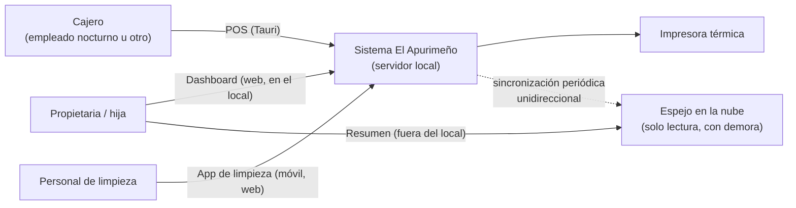

## 4.2 Contenedores

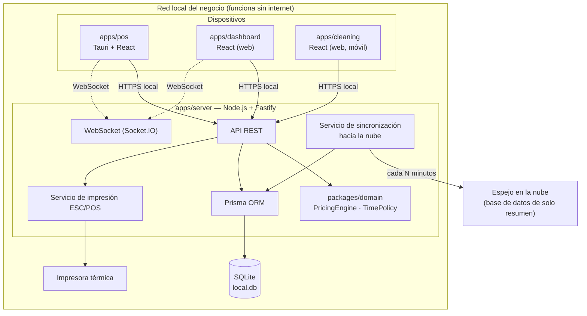

**Por qué la propietaria puede ver el Dashboard incluso sin internet:** mientras esté conectada al wifi del local, `apps/dashboard` habla directamente con `apps/server` por la red local (una IP como `192.168.1.x`), sin salir a internet. Solo cuando está físicamente fuera del local necesita el espejo en la nube.

## 4.3 Despliegue físico

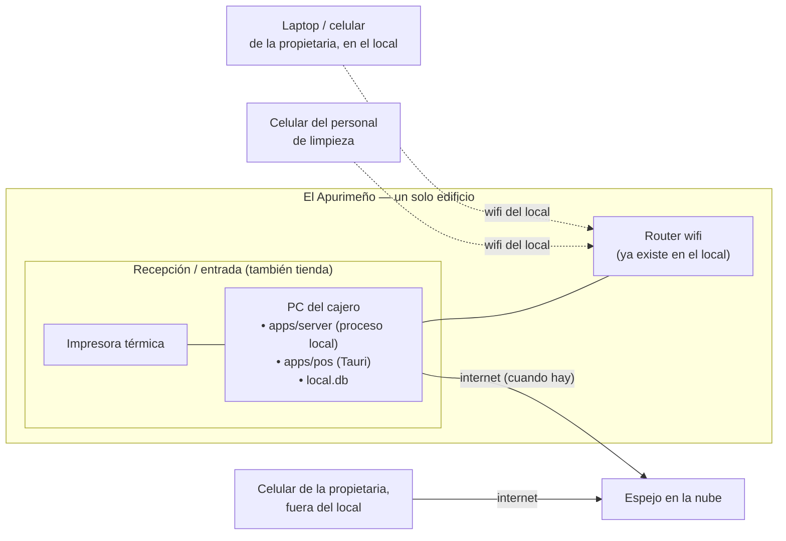

Un solo equipo (el del cajero) hace de servidor y de POS a la vez para el arranque del proyecto — es la opción más simple y económica. Si más adelante el negocio crece, `apps/server` puede moverse a un mini-PC dedicado sin cambiar nada del resto: `apps/pos` solo necesita saber a qué dirección de red conectarse.

# 5. Actores, roles y permisos

## 5.1 Actores

| Actor                   | Aplicación que usa | Naturaleza del acceso |
|---------------------------|----------------------|--------------------------|
| Propietaria                | Dashboard (local y espejo en la nube) | Cuenta propia, permisos completos |
| Hija de la propietaria      | Dashboard (local)                     | Cuenta propia, mismo nivel de permisos que la propietaria (configurable igual) |
| Empleado nocturno (cajero)  | POS                                    | Cuenta propia, permisos de operación |
| Personal de limpieza        | App de limpieza (móvil)                | Cuenta propia, permisos mínimos |

Cada persona tiene **su propio usuario**, aunque dos personas (propietaria e hija) terminen con el mismo conjunto de permisos — nunca se comparte una sola cuenta, para que la auditoría (sección 14.2) siempre sepa quién hizo qué.

## 5.2 Modelo de permisos configurable

Los **permisos** son una lista fija, definida en código, porque cada uno corresponde a una comprobación real dentro del sistema (ADR-09). Los **rangos** (roles) son combinaciones de permisos que la propietaria crea, edita y asigna libremente desde el Dashboard — puede haber tantos rangos como ella quiera, no solo los tres iniciales.

| Permiso                  | Descripción |
|-----------------------------|-------------|
| `pos.access`                 | Entrar al POS |
| `dashboard.access`            | Entrar al Dashboard |
| `cleaning.access`              | Entrar a la app de limpieza |
| `shifts.open` / `shifts.close`  | Abrir / cerrar turno de caja |
| `rentals.checkin`               | Registrar ingreso |
| `rentals.checkout`               | Registrar salida (incluye cobrar o condonar sobretiempo) |
| `rentals.extra_hour`              | Cobrar hora adicional / sobretiempo |
| `rentals.manual_adjustment`        | Aplicar ajuste puntual de precio (solo al alza) |
| `rooms.manage`                       | Crear/editar habitaciones y sus precios |
| `client_pricing.manage`               | Crear precios especiales fijos por cliente + habitación |
| `sales.sell`                            | Vender en la tienda |
| `inventory.manage`                       | Gestionar productos, precios huésped/público, ingreso de mercadería |
| `cleaning.mark_ready`                     | Marcar una habitación como Lista |
| `rooms.maintenance`                        | Marcar mantenimiento / fuera de servicio |
| `tickets.void`                              | Anular un cobro (Administrador); un Cajero puede anular también con un código de autorización temporal (ver 5.4 y CU-21 del SRS), sin necesitar este permiso asignado a su rango |
| `reports.view`                               | Ver reportes |
| `users.manage`                                | Crear usuarios y rangos, asignar permisos |
| `settings.manage`                              | Configuración general (horas base, gracia, impresora, etc.) |
| `audit.view`                                    | Ver el historial de auditoría |

## 5.3 Rangos iniciales sugeridos (editables desde el primer día)

| Rango                | Permisos incluidos |
|------------------------|-----------------------|
| Administrador (propietaria, hija) | Todos |
| Cajero                              | `pos.access`, `shifts.*`, `rentals.*`, `sales.sell` |
| Limpieza                             | `cleaning.access`, `cleaning.mark_ready` |

Estos tres son solo el punto de partida cargado en la base de datos; la propietaria puede crear, por ejemplo, un rango "Supervisor" con permisos intermedios, sin que nadie tenga que tocar código.

# 6. Reglas de negocio (el corazón del sistema)

Todo lo de esta sección vive en `packages/domain`, como funciones puras (sin base de datos, sin reloj del sistema real — el reloj se recibe como parámetro para poder probarlo). Ningún otro paquete recalcula esto por su cuenta.

## 6.1 Parámetros configurables

| Parámetro          | Dónde se guarda          | Valor inicial |
|----------------------|------------------------------|:----------------:|
| `basePrice`            | En cada habitación, individualmente | 25.00 / 30.00 / 40.00 |
| `baseHours`             | Configuración general (aplica a todas las habitaciones) | 8 horas |
| `warningMinutes`         | Configuración general | 10 minutos (antes de cumplirse `baseHours`) |
| `graceMinutes`            | Configuración general | 15 minutos (cortesía, una sola vez por alquiler) |
| `extraHourBlockMinutes`    | Configuración general | 60 minutos |
| `extraHourPrice`            | Configuración general | S/ 8.00 |

## 6.2 Tiempo y precio de un alquiler

**Al ingresar:**

```
total = basePrice de la habitación
scheduledEndAt = startedAt + baseHours
graceUsed = false
```

No hay recargo automático por perfil de cliente — cualquier variación de precio pasa por 6.3 (precio especial) o 6.4 (ajuste puntual), nunca por una regla automática de "tipo de ingreso".

**Estado del tiempo, calculado siempre a partir del reloj (nunca guardado):**

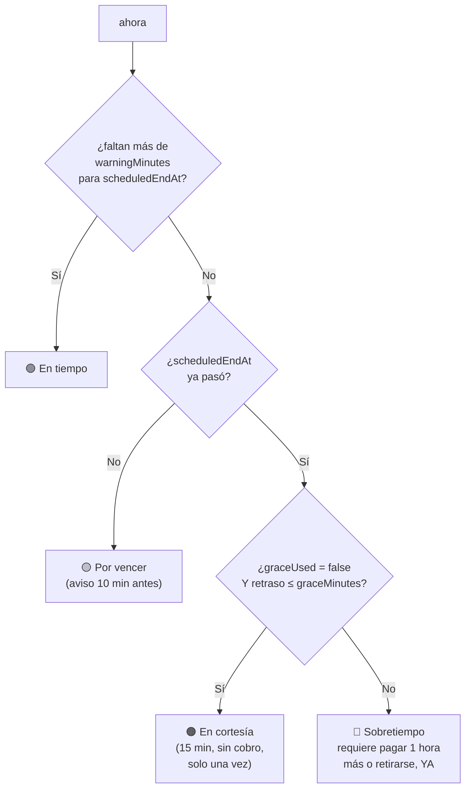

**Comprar una hora adicional — dos casos posibles, misma operación, mismo precio (S/ 8.00, mínimo 1 hora):**

```
CASO A — Extensión anticipada (still dentro del tiempo contratado, estado 🟢 o 🟡):
    scheduledEndAt = scheduledEndAt + extraHourBlockMinutes
    graceUsed no cambia (la cortesía sigue disponible más adelante)

CASO B — Liquidación de sobretiempo (estado 🔴, ya sea la primera vez o una posterior):
    scheduledEndAt = ahora (momento del pago) + extraHourBlockMinutes
    graceUsed = true   // a partir de aquí, nunca más hay cortesía en este alquiler
```

> **Nota de diseño (a confirmar con el negocio):** el caso A (pedir más tiempo de forma anticipada, antes de llegar a la hora de salida) no se mencionó explícitamente en la entrevista — lo que sí quedó claro es el caso B (pagar al pasarse de tiempo). Se incluye el caso A por consistencia y porque es un pedido razonable de cualquier cliente ("quiero quedarme 2 horas más, cóbreme ahora"). Confirmar con la propietaria si esto se usa en la práctica; si nunca ocurre, no afecta nada dejarlo implementado y sin uso.

**Salida:**

```
si estado == 🟢, 🟡 o 🟠 (en cortesía): cerrar sin cargo adicional
si estado == 🔴: no se puede cerrar sin antes cobrar una hora adicional (caso B) o registrar que el cliente se retiró sin pagar (requiere el permiso `rentals.checkout` de todas formas; queda registrado en auditoría)
salida anticipada (antes de scheduledEndAt): se cierra igual, sin devolución (no se resta nada del total ya cobrado)
```

## 6.3 Precio especial de cliente (fijo, por cliente + habitación)

```
si existe un ClientRoomPrice para (documentoOrNombre, roomId):
    total = ClientRoomPrice.fixedPrice        // REEMPLAZA el precio de lista, no se suma
sino:
    total = basePrice de la habitación (6.2)
```

- Solo lo crea/edita quien tenga el permiso `client_pricing.manage` (propietaria, y quien ella autorice).
- Se busca por **documento de identidad** o por **nombre**, para que el cajero pueda encontrarlo aunque el cliente no traiga su documento a la mano.
- Aplica únicamente a la combinación cliente + habitación específica que se configuró; el mismo cliente en otra habitación paga el precio de lista de esa habitación, salvo que también tenga un precio especial ahí.
- No incluye (en esta versión) una notificación de aprobación para removerlo — se agrega o se quita manualmente desde el Dashboard por quien tenga el permiso.

## 6.4 Ajuste puntual del cajero (solo al alza)

```
mínimo = total calculado por 6.2 o 6.3 (lo que hubiera correspondido automáticamente)
ajuste puntual: nuevoTotal >= mínimo        // NUNCA por debajo
requiere: motivo (texto corto, obligatorio)
NO se guarda como regla — la próxima visita de este cliente, se vuelve a calcular por 6.2/6.3 desde cero
```

Este ajuste se aplica en el momento del cobro (ingreso, hora adicional, o venta de tienda) y queda registrado en el ticket y en la auditoría con el motivo y quién lo hizo, pero es exclusivamente para esa transacción.

## 6.5 Tienda

```
si hay un alquiler abierto asociado a la venta (opcional, solo como referencia) → puede usarse precio "huésped"
si no → precio "público"
```

- Un solo `stockOnHand` por producto — nunca se duplica el inventario para tener los dos precios.
- Toda venta se cobra en el momento; no existen ventas "a cuenta" de una habitación.
- El ingreso de mercadería nueva (reposición de stock) solo lo puede hacer quien tenga `inventory.manage` (la propietaria).

## 6.6 Turno de caja

- Un cajero no puede cobrar nada sin un turno abierto.
- El efectivo esperado al cerrar el turno = efectivo inicial + pagos en efectivo (alquileres, horas adicionales, ventas) + movimientos de caja manuales (ingreso) − movimientos de caja manuales (retiro) − reversos en efectivo.
- Yape y Plin no afectan el efectivo físico, pero pueden llevar un número de operación anotado (opcional en la primera versión; la propietaria decide más adelante si lo hace obligatorio).
- El arqueo se hace "a ciegas": el cajero cuenta el efectivo antes de que el sistema le muestre cuánto esperaba encontrar.

## 6.7 Casos de prueba obligatorios

Estos casos deben pasar como pruebas automáticas de `packages/domain` antes de construir cualquier pantalla. Supuestos: habitación con `basePrice = 30`, `baseHours = 8`, `graceMinutes = 15`, `extraHourPrice = 8`.

| # | Escenario                                                              | Resultado esperado |
|---|----------------------------------------------------------------------|----------------------|
| T1 | Ingreso normal                                                        | Total S/ 30.00; salida programada = inicio + 8 h |
| T2 | Cliente sale exactamente a la hora                                     | Sin cargo adicional |
| T3 | Cliente sale 10 minutos tarde (dentro de la cortesía)                    | Sin cargo adicional; `graceUsed` sigue en `false` |
| T4 | Cliente sale 16 minutos tarde (pasó la cortesía) y paga                  | Cobra 1 hora (S/ 8.00); nueva hora de salida = momento del pago + 60 min; `graceUsed = true` |
| T5 | Cliente sale antes de tiempo (2 horas antes)                              | Sin cargo adicional, sin devolución |
| T6 | Cliente pide 1 hora más estando aún dentro de su tiempo contratado (caso A) | Cobra S/ 8.00; nueva salida = salida anterior + 60 min; `graceUsed` sin cambios |
| T7 | Con `graceUsed = true`, el cliente vuelve a pasarse de tiempo               | Sin cortesía: se cobra 1 hora de inmediato (S/8) o se retira |
| T8 | Cliente con precio especial fijo de S/ 50 en esa habitación                | Total S/ 50.00, sin importar el precio de lista de la habitación |
| T9 | Ese mismo cliente entra a otra habitación sin precio especial asignado      | Paga el precio de lista de esa otra habitación |
| T10 | Cajero aplica ajuste puntual de +S/ 10 con motivo "cliente solo"              | Total S/ 40.00 por esa vez; la próxima visita de ese cliente vuelve a ser S/ 30.00 |
| T11 | Cajero intenta aplicar un ajuste puntual por debajo del mínimo                 | Rechazado: el sistema no permite un total menor al que correspondería automáticamente |
| T12 | Venta en tienda asociada a una habitación con alquiler activo                    | Se ofrece precio "huésped" |
| T13 | Venta en tienda sin habitación asociada                                            | Se ofrece precio "público" |

# 7. Casos de uso

## 7.1 Mapa general

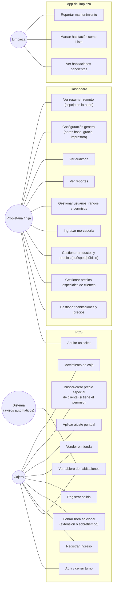

## 7.2 Casos de uso detallados

### UC-03 Registrar ingreso

| Campo | Detalle |
|---|---|
| Actor | Cajero (`rentals.checkin`) |
| Precondición | Turno abierto; habitación Libre |
| Flujo | 1) Cajero elige habitación → 2) Sistema busca si el cliente (por documento o nombre) tiene un precio especial para esa habitación (6.3); si no, usa el precio de lista → 3) Cajero puede aplicar un ajuste puntual (6.4) → 4) Cajero cobra → 5) Habitación pasa a Ocupada; se calcula `scheduledEndAt`; se emite el comprobante |
| Alternativo | Si el cliente no trae documento, se puede registrar solo con nombre (no es obligatorio, pero se pide siempre) |

### UC-04 Cobrar hora adicional

| Campo | Detalle |
|---|---|
| Actor | Cajero (`rentals.extra_hour`) |
| Precondición | Alquiler abierto |
| Flujo | El sistema determina automáticamente si corresponde el Caso A (extensión anticipada) o el Caso B (liquidación de sobretiempo) según el estado del tiempo (6.2) → cobra S/ 8.00 → actualiza `scheduledEndAt` y, si corresponde, `graceUsed` |
| Nota | Esta es la única operación de "más tiempo"; no existen dos pantallas distintas para "extender" y "pagar sobretiempo" — el sistema decide cuál de los dos casos aplica |

### UC-05 Registrar salida

| Campo | Detalle |
|---|---|
| Actor | Cajero (`rentals.checkout`) |
| Flujo | Si el estado del tiempo es 🔴 Sobretiempo, el sistema exige cobrar una hora adicional (UC-04) antes de permitir cerrar, o registrar explícitamente que el cliente se retiró sin pagar (con motivo, queda en auditoría) → habitación pasa a Pendiente de limpieza |

### UC-06 Vender en tienda

| Campo | Detalle |
|---|---|
| Actor | Cajero (`sales.sell`) |
| Flujo | Elige productos → si hay una habitación con alquiler activo, puede asociarla (opcional, solo referencia) y el sistema sugiere el precio huésped; si no, precio público → cobra → descuenta stock |

### UC-08 Precio especial de cliente

| Campo | Detalle |
|---|---|
| Actor | Quien tenga `client_pricing.manage` (propietaria por defecto) |
| Flujo | Busca cliente por documento o nombre (o lo crea si es nuevo) → elige habitación → define precio fijo total → guarda. Válido desde ese momento para futuras visitas de ese cliente a esa habitación. |

### UC-30 / UC-31 Limpieza

| Campo | Detalle |
|---|---|
| Actor | Personal de limpieza (`cleaning.access`, `cleaning.mark_ready`) |
| Flujo | Ve, en su celular, la lista de habitaciones en estado Pendiente de limpieza → al terminar, marca directamente como Lista → la habitación queda disponible de inmediato, sin paso adicional del cajero |
| Alternativo | Si detecta un daño, puede marcar la habitación como "Necesita mantenimiento" en lugar de "Lista"; eso la deja bloqueada hasta que alguien con `rooms.maintenance` la reactive |

## 7.3 Casos de uso de apoyo

| Caso | Resumen |
|---|---|
| UC-01/02 | Abrir/cerrar turno con arqueo ciego; tablero de habitaciones agrupado visualmente, actualizado en vivo por WebSocket |
| UC-07 | Ajuste puntual: motivo obligatorio, solo al alza (6.4) |
| UC-09 | Movimiento de caja manual (ingreso/retiro), con motivo |
| UC-10 | Anulación de ticket: el Administrador la ejecuta directamente (`tickets.void`); un Cajero puede ejecutarla con un código de autorización temporal — aleatorio, de un solo uso, vigencia breve — generado por un Administrador desde el Dashboard, incluso de forma remota (ver 5.4). Genera un ticket compensatorio; nunca borra el original |
| UC-20–23 | CRUD de habitaciones, precios especiales, productos (con sus dos precios) e ingreso de mercadería — todos exclusivos de quien tenga el permiso correspondiente |
| UC-24 | Gestión de usuarios y rangos: crear personas, asignarles un rango existente o uno nuevo, activar/desactivar permisos individuales |
| UC-25 | Reportes (detalle en sección 12.4) |
| UC-28 | Resumen remoto: totales del día/semana, sin el tablero de habitaciones en vivo (la propietaria lo pidió así explícitamente) |

# 8. Máquinas de estado

## 8.1 Habitación

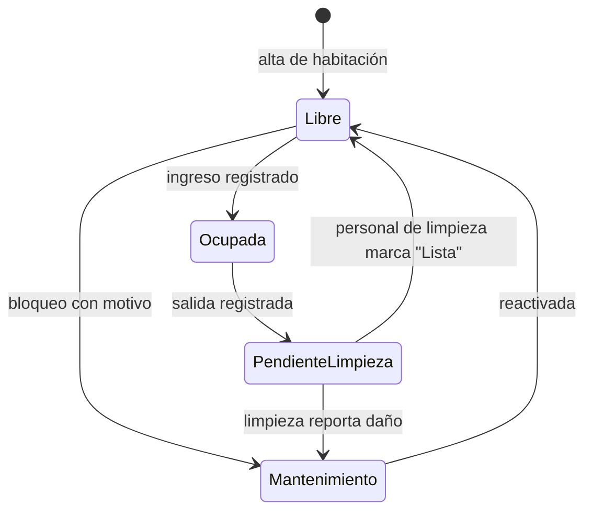

## 8.2 Alquiler

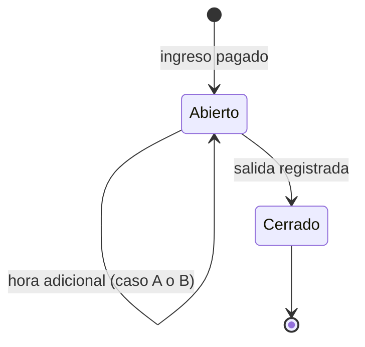

El estado del *tiempo* (🟢🟡🟠🔴 de la sección 6.2) nunca se guarda — se calcula siempre a partir de `scheduledEndAt`, `graceUsed` y la hora actual. Así, si el servidor se reinicia, no hay nada que "reconstruir": el cálculo siempre da el resultado correcto.

## 8.3 Ticket

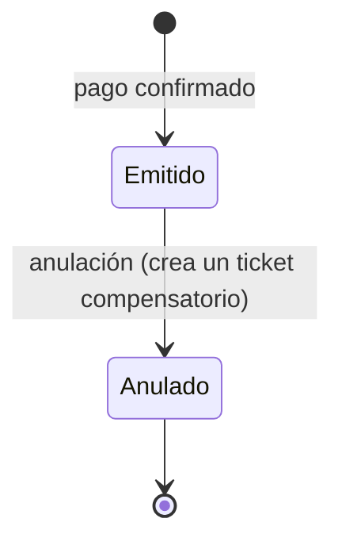

## 8.4 Trabajo de impresión

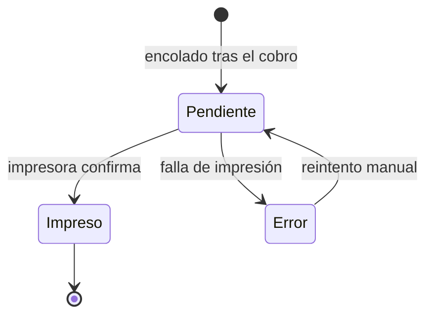

# 9. Modelo de datos

## 9.1 Principios

- Nada financiero se borra ni se edita (alquileres, tickets, pagos, movimientos de caja/stock): los errores se corrigen con operaciones compensatorias, nunca editando el original.
- El dinero se guarda en **céntimos enteros** (S/ 30.00 → `3000`), nunca en `float`/`double`.
- Las fechas se guardan en UTC; la hora de Lima se calcula al mostrar.
- Cada alquiler guarda una **copia** del precio y las horas base con las que se cobró (`appliedBasePrice`, `appliedBaseHours`), para que un cambio de precio posterior nunca altere alquileres ya cerrados.
- Prisma genera los tipos TypeScript automáticamente desde este esquema — es la fuente de verdad que los tres agentes comparten para saber cómo se llama cada campo.

## 9.2 Diagrama entidad-relación

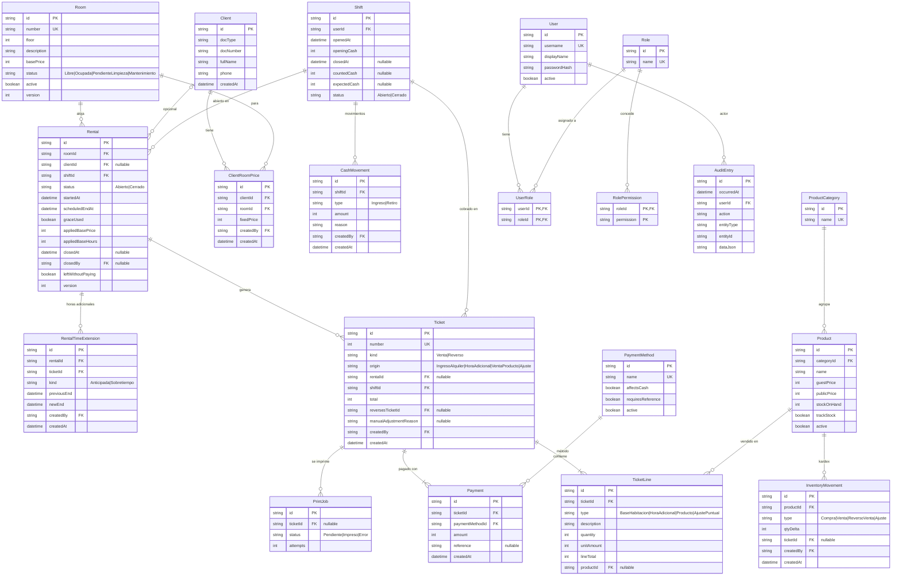

## 9.3 Boceto de `schema.prisma` (referencia para los tres agentes)

```prisma
// prisma/schema.prisma — boceto de referencia; ajustar tipos exactos al implementar

model Room {
  id          String   @id @default(cuid())
  number      String   @unique
  floor       Int
  description String?
  basePrice   Int      // céntimos
  status      RoomStatus @default(LIBRE)
  active      Boolean  @default(true)
  version     Int      @default(1)
  rentals     Rental[]
  clientPrices ClientRoomPrice[]
}

enum RoomStatus { LIBRE OCUPADA PENDIENTE_LIMPIEZA MANTENIMIENTO }

model Client {
  id         String   @id @default(cuid())
  docType    String?
  docNumber  String?
  fullName   String
  phone      String?
  createdAt  DateTime @default(now())
  rentals    Rental[]
  specialPrices ClientRoomPrice[]
  @@index([docNumber])
  @@index([fullName])
}

model ClientRoomPrice {
  id         String   @id @default(cuid())
  clientId   String
  client     Client   @relation(fields: [clientId], references: [id])
  roomId     String
  room       Room     @relation(fields: [roomId], references: [id])
  fixedPrice Int
  createdBy  String
  createdAt  DateTime @default(now())
  @@unique([clientId, roomId])
}

model Rental {
  id               String   @id @default(cuid())
  roomId           String
  room             Room     @relation(fields: [roomId], references: [id])
  clientId         String?
  shiftId          String
  status           RentalStatus @default(ABIERTO)
  startedAt        DateTime @default(now())
  scheduledEndAt   DateTime
  graceUsed        Boolean  @default(false)
  appliedBasePrice Int
  appliedBaseHours Int
  closedAt         DateTime?
  closedBy         String?
  leftWithoutPaying Boolean @default(false)
  version          Int      @default(1)
  extensions       RentalTimeExtension[]
  tickets          Ticket[]
  // Regla de negocio: no puede haber dos Rental ABIERTO para el mismo roomId
  // (se garantiza con un índice único parcial a nivel de base de datos)
}

enum RentalStatus { ABIERTO CERRADO }

model RentalTimeExtension {
  id           String   @id @default(cuid())
  rentalId     String
  rental       Rental   @relation(fields: [rentalId], references: [id])
  ticketId     String
  kind         ExtensionKind
  previousEnd  DateTime
  newEnd       DateTime
  createdBy    String
  createdAt    DateTime @default(now())
}

enum ExtensionKind { ANTICIPADA SOBRETIEMPO }

model Ticket {
  id                     String   @id @default(cuid())
  number                 Int      @unique @default(autoincrement())
  kind                   TicketKind @default(VENTA)
  origin                 TicketOrigin
  rentalId               String?
  rental                 Rental?  @relation(fields: [rentalId], references: [id])
  shiftId                String
  total                  Int
  reversesTicketId       String?  @unique
  manualAdjustmentReason String?
  createdBy              String
  createdAt              DateTime @default(now())
  lines                  TicketLine[]
  payments               Payment[]
  printJobs              PrintJob[]
}

enum TicketKind { VENTA REVERSO }
enum TicketOrigin { INGRESO_ALQUILER HORA_ADICIONAL VENTA_PRODUCTO AJUSTE }

model TicketLine {
  id         String   @id @default(cuid())
  ticketId   String
  ticket     Ticket   @relation(fields: [ticketId], references: [id])
  type       LineType
  description String
  quantity   Int      @default(1)
  unitAmount Int
  lineTotal  Int
  productId  String?
}

enum LineType { BASE_HABITACION HORA_ADICIONAL PRODUCTO AJUSTE_PUNTUAL }

// Shift, CashMovement, PaymentMethod, Payment, Product, ProductCategory,
// InventoryMovement, User, Role, UserRole, RolePermission, AuditEntry,
// PrintJob: mismo patrón — ver el diagrama ER (9.2) para sus campos.
```

## 9.4 Invariantes que la base de datos debe garantizar por sí misma

| Invariante                                            | Mecanismo |
|-----------------------------------------------------------|-------------|
| Nunca dos alquileres `ABIERTO` en la misma habitación        | Índice único parcial: `UNIQUE(roomId) WHERE status = 'ABIERTO'` |
| Nunca dos turnos `ABIERTO` del mismo cajero o terminal a la vez | Índice único parcial equivalente en `Shift` |
| Un `ClientRoomPrice` único por cliente + habitación              | `@@unique([clientId, roomId])` (ya en el boceto) |
| Numeración de tickets sin huecos ni duplicados                    | Secuencia incrementada dentro de la misma transacción del cobro |

# 10. Flujos críticos

## 10.1 Ingreso

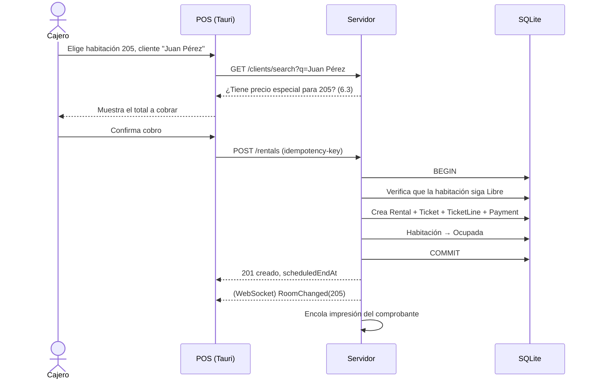

## 10.2 Aviso automático y sobretiempo

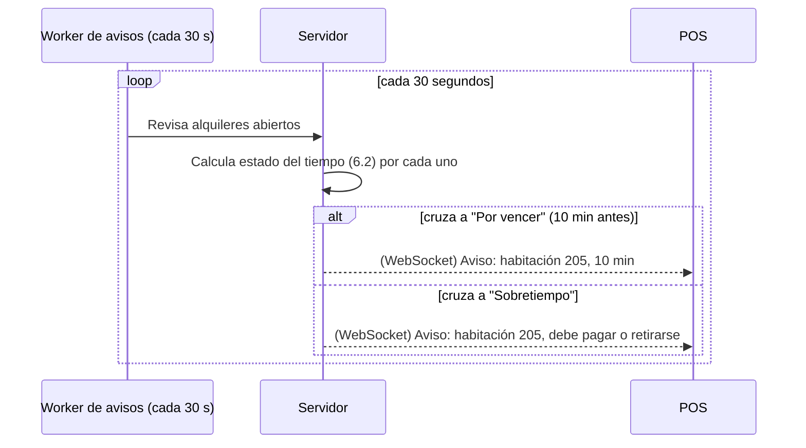

## 10.3 Cobro de hora adicional (sobretiempo)

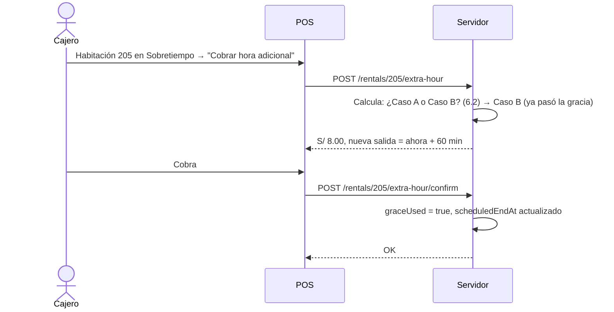

## 10.4 Limpieza

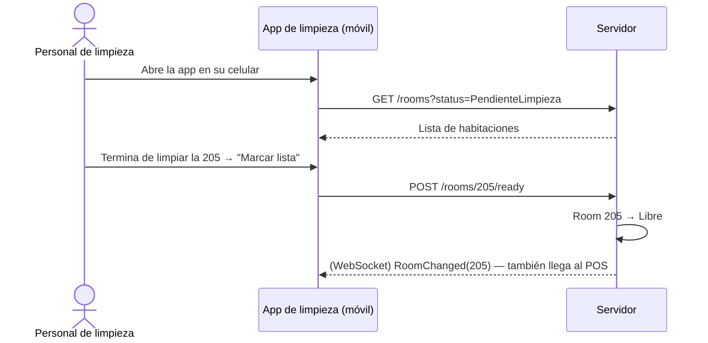

# 11. Contrato de API

## 11.1 Convenciones

- REST sobre HTTPS local; JSON en camelCase; dinero siempre en céntimos.
- Cada ruta y su forma de entrada/salida se define una sola vez, en `packages/contracts`, con esquemas Zod — el servidor los usa para validar, los clientes los usan para tener autocompletado y tipos correctos. Ningún cliente define su propia versión de un tipo.
- Operaciones que cobran, mueven stock o cambian una habitación llevan un header `Idempotency-Key`.

## 11.2 Endpoints principales

| Método | Ruta                              | Permiso                 | Propósito |
|--------|-------------------------------------|----------------------------|-----------|
| POST   | `/auth/login`                        | —                          | Inicio de sesión |
| GET    | `/rooms/board`                        | `pos.access`               | Tablero de habitaciones con su estado y tiempo calculado |
| POST   | `/rentals`                             | `rentals.checkin`          | Registrar ingreso |
| GET    | `/rentals/:id/quote-extra-hour`          | `rentals.extra_hour`       | Cotizar la hora adicional (indica si es Caso A o B) |
| POST   | `/rentals/:id/extra-hour`                 | `rentals.extra_hour`       | Confirmar cobro de hora adicional |
| POST   | `/rentals/:id/checkout`                     | `rentals.checkout`         | Registrar salida |
| GET    | `/clients/search?q=`                          | `rentals.checkin`          | Buscar cliente por documento o nombre |
| POST   | `/clients/:id/room-price`                       | `client_pricing.manage`    | Crear/editar precio especial cliente+habitación |
| POST   | `/sales`                                          | `sales.sell`                | Venta en tienda |
| POST   | `/rooms/:id/ready`                                  | `cleaning.mark_ready`       | Marcar habitación lista |
| POST   | `/rooms/:id/maintenance`                              | `rooms.maintenance`         | Marcar en mantenimiento |
| POST   | `/shifts` / `/shifts/current/close`                      | `shifts.open` / `shifts.close` | Abrir/cerrar turno |
| POST   | `/auth/authorization-codes`                                | `tickets.void` (Administrador) | Generar un código de autorización temporal (uso único, vigencia breve) para que un Cajero anule un ticket, incluso de forma remota |
| POST   | `/tickets/:id/void`                                        | `tickets.void`, o un código de autorización temporal válido en el cuerpo de la solicitud | Anular un cobro |
| GET    | `/reports/:name?from=&to=&...`                               | `reports.view`               | Reportes (sección 12.4) |
| GET    | `/admin/*` (usuarios, roles, habitaciones, productos, config) | según recurso                 | CRUD administrativo |
| GET    | `/health`                                                       | —                              | Estado del servidor, base de datos, impresora |

## 11.3 Eventos por WebSocket

| Evento             | Cuándo se emite | Quién lo escucha |
|-----------------------|--------------------|---------------------|
| `RoomChanged`           | Cambia el estado de una habitación (ingreso, salida, limpieza, mantenimiento) | POS, Dashboard |
| `RentalTimeWarning`      | Un alquiler cruza a "Por vencer" o a "Sobretiempo" | POS |
| `TicketIssued`            | Se confirma cualquier cobro | Dashboard |
| `PrintJobFailed`           | Falla una impresión | POS |

Los clientes siempre pueden volver a pedir el estado completo por REST; los eventos son solo un aviso para refrescar antes de que pase el próximo ciclo de actualización automática.

# 12. Interfaces

## 12.1 POS (Tauri) — principios

- Pantalla principal = tablero de las 17 habitaciones, con texto e ícono de estado (no solo color).
- Un ingreso típico: elegir habitación → confirmar tiempo/cliente → cobrar → listo, en pocos toques.
- La lógica de precio y tiempo nunca vive en el POS — siempre se le pregunta al servidor.

## 12.2 Dashboard (web) — mapa de secciones

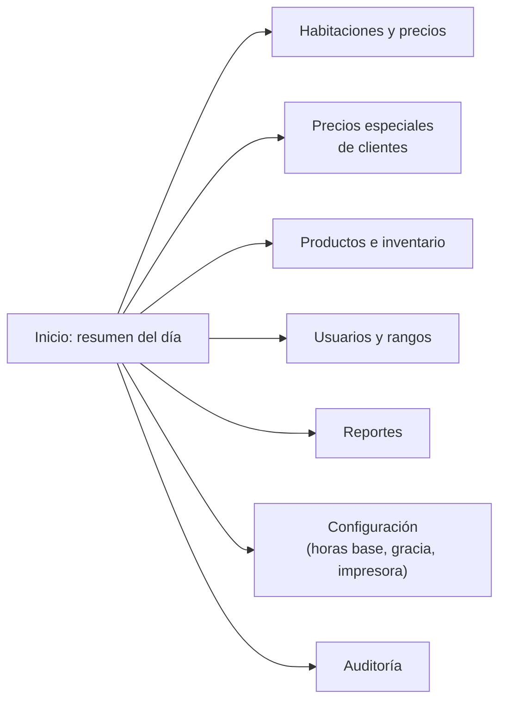

## 12.3 App de limpieza (móvil, web) — principios

- Una sola pantalla: lista de habitaciones "Pendiente de limpieza", con un botón grande "Lista" por cada una (y "Reportar daño" como opción secundaria).
- Sin acceso a nada de precios, cobros ni reportes.

## 12.4 Reportes (versión completa del producto terminado)

| Reporte                       | Contenido |
|----------------------------------|-------------|
| Ventas por periodo                | Filtrable por fecha, origen (habitación base, hora adicional, tienda), método de pago |
| Productos                          | Más vendidos, por horario, comparativo entre periodos |
| Ocupación                            | Habitaciones más usadas, por horario del día |
| Ingresos vs. egresos                   | Sueldos, recibos/servicios, categorías libres de gasto que la propietaria cree, comparado contra lo vendido |
| Arqueos                                 | Diferencias de caja por turno |
| Control                                  | Ajustes puntuales por cajero, anulaciones, precios especiales creados |

La primera versión (MVP, sección 17) incluye una parte de esto; el resto es Fase 2.

# 13. Comprobante térmico

- Se imprime desde el servidor (ADR-05), nunca desde el navegador o el POS directamente.
- Impresora confirmada: **REDPOS RED-E803**, 80 mm, ESC/POS, conectada por **USB o Bluetooth** al mismo equipo que hace de servidor/POS (sección 4.3) — no por red.
- Contenido: nombre del negocio, número correlativo interno, fecha/hora, habitación, horas, líneas de hora adicional si las hubo, productos, total, método de pago. **Sin nombre ni documento del cliente** (definido explícitamente por la propietaria).
- Debe incluir una leyenda visible de que es un documento interno, sin valor tributario — nunca debe parecer una boleta o factura electrónica formal.
- Ancho de referencia: 80 mm (48 columnas), que es el ancho real de la impresora adquirida. Probar con nombres largos, varios productos y montos de 3–4 cifras antes de dar por cerrada esta parte.
- Cuidado especial con tildes y "ñ": las impresoras térmicas suelen requerir seleccionar explícitamente una página de códigos (no asumir que UTF-8 se imprime bien por defecto); esto debe probarse con la impresora física real, no solo simulado.
- La unidad soporta logotipos y códigos de barras 1D/2D. El logotipo del negocio puede usarse libremente en el encabezado. Un código de barras o QR es opcional y **no obligatorio**; si se decide incluir uno (por ejemplo, para uso interno de control), su contenido y apariencia no deben imitar el formato de un código QR/hash de un comprobante electrónico SUNAT, por la misma razón que aplica al resto del documento.

# 14. Seguridad, respaldo y operación

## 14.1 Seguridad

- Cada usuario tiene su propia cuenta y contraseña; nunca se comparten sesiones.
- Las contraseñas se guardan con hash (nunca en texto plano); la primera cuenta de administrador se crea con una contraseña generada, nunca un valor por defecto conocido.
- El Dashboard, al usarse fuera del local (vía el espejo en la nube), requiere el mismo inicio de sesión — el espejo no es de acceso libre.
- Toda acción sensible (cambio de precio, anulación, ajuste puntual, creación de precio especial, cambio de permisos) queda en la auditoría con quién la hizo y cuándo.

## 14.2 Auditoría

Tabla de solo escritura (`AuditEntry`): quién, qué acción, sobre qué entidad, cuándo, y el detalle antes/después cuando aplica. Nunca se edita ni se borra.

## 14.3 Respaldo y espejo en la nube

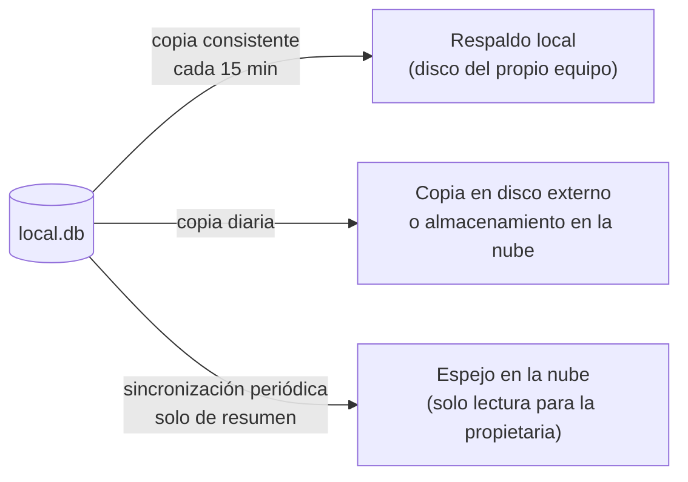

- El respaldo local y externo guardan una copia completa y restaurable del sistema.
- El espejo en la nube es distinto: solo sincroniza **resúmenes** (totales, no cada operación en detalle), es de solo lectura, y nunca escribe de vuelta hacia el sistema local — evita que un problema de conexión a internet, o un uso indebido del acceso remoto, pueda afectar la operación real del negocio.
- Se recomienda probar una restauración completa al menos una vez antes de poner el sistema en producción.

# 15. Estrategia de pruebas

| Nivel                | Qué cubre | Cómo |
|------------------------|-------------|--------|
| `packages/domain`        | Todos los casos de la tabla 6.7, con decenas de variaciones adicionales de tiempo y precio | Pruebas unitarias rápidas, con el reloj simulado (nunca el reloj real de la máquina) |
| `apps/server`              | Casos de uso completos contra una base SQLite real (no simulada en memoria) | Pruebas de integración |
| API de punta a punta        | Autorización por permiso, idempotencia, concurrencia (dos ingresos a la misma habitación a la vez) | Pruebas end-to-end |
| Impresión                    | Comprobante con datos límite (nombre largo, tildes, montos grandes) en 32 y 48 columnas | Pruebas de "foto esperada" (snapshot) + una prueba manual en impresora física |
| Piloto con el negocio          | Una o dos semanas usando el sistema en paralelo con el cuaderno actual | Checklist manual, comparando totales al final de cada día |

# 16. Coordinación entre Claude, Codex y Gemini/Antigravity

## 16.1 Regla general

Ninguno de los tres agentes empieza a escribir una pantalla o un endpoint sin que exista primero, en `packages/contracts`, el tipo/esquema correspondiente. Si algo que se necesita no existe ahí todavía, el paso es agregarlo ahí primero (en una tarea separada, revisada), no improvisarlo dentro de la app que se esté construyendo.

## 16.2 Cómo se sugiere dividir el trabajo

| Área                          | Depende de | Sugerido para |
|----------------------------------|--------------|------------------|
| `packages/domain` y `packages/contracts` | Nada (se hace primero) | Un solo agente a la vez, revisado por Reizo antes de que los otros dos avancen sobre ella |
| `apps/server` (API, base de datos, impresión) | `packages/domain` y `packages/contracts` | Un agente dedicado, dado que toca la parte más sensible (dinero, concurrencia) |
| `apps/pos` (Tauri)                | `packages/contracts` | Puede avanzar en paralelo con el servidor, usando datos de prueba (mocks) hasta que la API real esté lista |
| `apps/dashboard`                    | `packages/contracts` | Igual que el POS: en paralelo, con mocks al inicio |
| `apps/cleaning`                       | `packages/contracts` | El más simple; buen candidato para el tercer agente mientras los otros dos avanzan en piezas más grandes |

## 16.3 Convenciones de repositorio

- Una rama por tarea, nombrada por el área que toca (`server/rentals-extra-hour`, `pos/room-board`).
- Ningún agente hace `merge` directo a la rama principal sin que Reizo revise — sobre todo en `packages/domain` y `apps/server`, donde un error significa dinero mal calculado.
- Los cambios en `packages/contracts` se avisan explícitamente (por ejemplo, en la descripción de la tarea) porque afectan a los otros agentes que dependan de esos tipos.
- Este documento y sus versiones futuras son la referencia que dirime cualquier desacuerdo entre lo que un agente "cree" que debería hacer el sistema y lo que realmente se definió con el negocio.

# 17. Roadmap: MVP y Fase 2

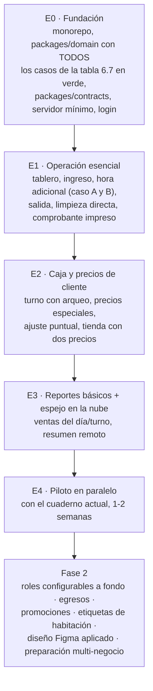

| Entrega | Contenido | MVP o Fase 2 |
|---|---|:---:|
| E0 | `packages/domain` con los 13 casos de la tabla 6.7 probados; `packages/contracts`; servidor con login y base de datos | MVP |
| E1 | Ingreso, hora adicional (los dos casos), salida, tablero, limpieza (marcado directo), comprobante impreso real | MVP |
| E2 | Turno con arqueo ciego, precios especiales por cliente+habitación, ajuste puntual con su regla de mínimo, tienda con precio huésped/público y stock | MVP |
| E3 | Reportes básicos (ventas por turno/método/origen), espejo en la nube con resumen para la propietaria | MVP |
| E4 | Piloto en paralelo con el cuaderno, capacitación al personal | MVP (cierre) |
| Fase 2 | Roles y permisos totalmente configurables desde el Dashboard; registro de egresos (sueldos, recibos, categorías libres) con reportes ingresos vs. egresos; promociones; etiquetas de servicios extra en habitaciones; aplicación del diseño de Figma; preparación afinada del módulo de tienda para los otros dos negocios | Fase 2 |

**Por qué el diseño de Figma queda en Fase 2 y no en el MVP:** para que el negocio pueda empezar a usar el sistema y dejar el cuaderno cuanto antes, sin esperar a que el diseño visual esté terminado. La interfaz del MVP debe ser simple pero clara y usable — no necesita ser fea, solo no necesita ser la versión final de Figma.

# 18. Preguntas abiertas

| # | Pregunta | Por qué importa | Mientras tanto |
|---|---|---|---|
| P-01 | *(Resuelto)* ¿Existe la "extensión anticipada" (Caso A de 6.2) en la práctica? | — | Confirmado: sí ocurre, incluso en el mismo momento del ingreso, no solo durante la estadía. El total y la hora de salida iniciales del alquiler deben calcularse incluyendo esas horas desde el ingreso; se recomienda ofrecer una selección rápida no obligatoria (por ejemplo, botones de +1h/+2h/+5h) en el POS |
| P-02 | ¿Qué etiquetas de servicio extra le gustaría poder poner a una habitación (TV, internet, etc.)? | Define el catálogo inicial de Fase 2 | Se deja el campo listo, vacío, configurable |
| P-03 | ¿Qué tipo de promociones tiene en mente? | Diseño de Fase 2 | Fuera del MVP, sin definir aún |
| P-04 | ¿Se activa transferencia bancaria como método de pago desde el inicio? | Configuración de métodos de pago | Se deja el método creado pero desactivado por defecto |
| P-05 | ¿Yape/Plin piden número de operación de forma obligatoria u opcional? | Validación del formulario de cobro | Opcional por defecto, configurable |
| P-06 | *(Resuelto)* Modelo/marca de la impresora térmica | — | Confirmado: REDPOS RED-E803, 80 mm, ESC/POS, conexión USB o Bluetooth (sin red), con soporte de logotipo y códigos de barras 1D/2D — ver ADR-05 y sección 13 |

# 19. Anexos

## 19.1 Configuración inicial sugerida

| Clave | Valor inicial |
|---|:---:|
| `baseHours` | 8 |
| `warningMinutes` | 10 |
| `graceMinutes` | 15 |
| `extraHourBlockMinutes` | 60 |
| `extraHourPrice` | 800 (céntimos) |
| `printer.columns` | 48 |

## 19.2 Habitaciones semilla (según la lista real del negocio)

| Habitación | Precio |
|---|:---:|
| 101, 102, 103, 104 | S/ 25.00 |
| 107 | S/ 30.00 |
| 105, 106 | S/ 40.00 |
| 201, 203, 204 | S/ 25.00 |
| 202 | S/ 30.00 |
| 205, 206 | S/ 40.00 |
| 302 | S/ 25.00 |
| 301, 303, 304 | S/ 30.00 |

## 19.3 Métodos de pago iniciales

| Método | Afecta caja | Requiere referencia |
|---|:---:|:---:|
| Efectivo | Sí | No |
| Yape | No | Opcional |
| Plin | No | Opcional |
| Transferencia | No | Sí (desactivado por defecto, P-04) |

## 19.4 Rangos y permisos iniciales

Ver sección 5.3. Cargados como datos semilla, editables desde el primer día por quien tenga `users.manage`.

---

# Cierre

Este documento refleja las reglas de negocio tal como quedaron confirmadas en la entrevista con la propietaria, a través de Reizo, y las decisiones técnicas necesarias para que Claude, Codex y Gemini/Antigravity puedan construir el sistema en paralelo sin pisarse. El punto de partida siempre es la sección 6 (reglas de negocio) y `packages/contracts` — todo lo demás se construye alrededor de eso, no al revés.
