# Especificación de Requisitos de Software (SRS)

## Sistema Integral de Gestión — El Apurimeño

**Hospedaje por horas · Punto de venta (tienda) · Administración remota**

---

## 1. Portada del documento

| Campo | Valor |
|---|---|
| Nombre del proyecto | Sistema Integral de Gestión "El Apurimeño" |
| Nombre del sistema | Apurimeño OS (nombre de trabajo; sujeto a confirmación) |
| Versión del documento | 1.0 |
| Tipo de documento | Especificación de Requisitos de Software (SRS) |
| Fecha de emisión | 23 de septiembre de 2026 |
| Estado del documento | Definitivo para inicio de desarrollo — sujeto a las salvedades marcadas como `[PENDIENTE DE DEFINICIÓN]` |
| Propósito | Servir como fuente única de verdad funcional y de negocio para el análisis, diseño, desarrollo, prueba y mantenimiento del sistema, y como contrato de trabajo entre el integrador del proyecto (Reizo) y los agentes de desarrollo asistido por IA (Claude, Codex, Gemini/Antigravity) |
| Elaborado a partir de | Entrevista estructurada y sucesivas aclaraciones directas con el responsable del proyecto, representando a la propietaria del negocio |

---

## 2. Control del documento

### 2.1 Historial de versiones

| Versión | Fecha | Descripción | Estado |
|---|---|---|---|
| 0.1 | 21 sep 2026 | Primer borrador técnico basado en supuestos genéricos de un negocio de hospedaje por horas, sin validar con el negocio real | Superado |
| 0.2 | 21 sep 2026 | Revisión crítica del borrador 0.1; corrección de contradicciones de diseño (liquidación de sobretiempo, integridad de datos, arquitectura) | Superado |
| 0.3 | 22 sep 2026 | Reconstrucción completa tras entrevista real con el negocio: reglas de tiempo, precios por habitación, precios especiales por cliente, tienda, limpieza, roles, infraestructura local-first | Superado por este documento (fue publicado como dos documentos separados: explicación de negocio y planos técnicos) |
| **1.0** | **23 sep 2026** | **Especificación de Requisitos de Software formal, siguiendo el estándar de este documento, consolidando todo el conocimiento acumulado del proyecto** | **Vigente** |

### 2.2 Audiencia del documento

| Audiencia | Uso que le da a este documento |
|---|---|
| Propietaria del negocio | Sección 3 a 10 (validación de que el sistema entiende correctamente su negocio); apéndice de glosario |
| Reizo (integrador / gestor del proyecto) | Documento completo; es el árbitro final ante cualquier ambigüedad entre agentes de desarrollo |
| Agentes de desarrollo (Claude, Codex, Gemini/Antigravity) | Documento completo; en particular las secciones 16 (RF), 17 (RNF), 18-20 (modelo de datos y estados), 22 (validaciones) y 34 (trazabilidad) |
| Futuros mantenedores del sistema | Documento completo, en especial secciones 8 (reglas de negocio), 37 (decisiones tomadas) y 38 (decisiones pendientes), para no revertir decisiones ya justificadas |
| Equipo de pruebas (QA) | Secciones 14 (casos de uso del sistema), 16 (requisitos funcionales, con criterios de aceptación), 31 (escenarios operativos) y 32 (casos borde) |

### 2.3 Convenciones utilizadas

| Prefijo | Significado |
|---|---|
| `OBJ-N-XXX` | Objetivo del negocio |
| `OBJ-S-XXX` | Objetivo del sistema |
| `CUN-XXX` | Caso de uso del negocio (proceso operativo, con o sin software) |
| `CU-XXX` | Caso de uso del sistema (interacción concreta con el software) |
| `RN-XXX` | Regla de negocio |
| `RF-XXX` | Requisito funcional |
| `RNF-<CAT>-XXX` | Requisito no funcional, agrupado por categoría (PERF, SEG, DISP, etc.) |
| `RES-XXX` | Restricción |
| `SUP-XXX` | Supuesto o dependencia |
| `PEND-XXX` | Decisión pendiente de definición |
| `RIE-XXX` | Riesgo del proyecto |

**Prioridades** (usadas en requisitos funcionales y en la sección MoSCoW): Crítica, Alta, Media, Baja.

**Estados de un requisito**: Definido, Parcialmente definido, Pendiente — usados en la revisión de completitud (sección 43).

**Términos especiales:** ver Glosario del dominio (sección 40). Los más usados a lo largo del documento son: *alquiler* (la estadía de un cliente en una habitación), *hora base* (las 8 horas incluidas en el precio), *cortesía* (los 15 minutos de tolerancia tras la hora base), *hora adicional* (el bloque de 1 hora que se cobra al superar la cortesía o al extender anticipadamente), *precio especial de cliente* (precio fijo negociado por la propietaria para un cliente en una habitación concreta), *ajuste puntual* (variación de precio de una sola transacción, decidida por el cajero, solo al alza) y *turno* (el periodo de caja de un cajero).

---

## 3. Introducción

### 3.1 Propósito del documento

Este documento especifica, de manera completa y verificable, qué debe hacer el sistema de software que reemplazará el registro en cuaderno de papel del negocio El Apurimeño, y bajo qué reglas, restricciones y condiciones debe hacerlo. No especifica *cómo* se implementa técnicamente cada detalle interno (eso corresponde al documento de diseño/arquitectura técnica, ya elaborado por separado como "Planos Técnicos"), salvo en los puntos donde una decisión tecnológica ya fue tomada y condiciona el propio alcance funcional (por ejemplo, la existencia de una aplicación separada para el personal de limpieza).

Este documento debe permitir que un equipo de desarrollo — humano o un conjunto de agentes de inteligencia artificial trabajando en paralelo — comprenda el negocio, sus reglas, sus actores, sus datos y sus restricciones con la profundidad suficiente para construir el sistema sin tener que volver a consultar al negocio para decisiones ya tomadas, y sabiendo exactamente qué decisiones siguen abiertas.

### 3.2 Propósito del sistema

El sistema tiene como propósito digitalizar y controlar la operación diaria de un hospedaje por horas de 17 habitaciones que además opera una pequeña tienda de consumo en su entrada, resolviendo tres problemas concretos del negocio actual: (1) la dependencia de un registro manual en papel, propenso a errores, pérdida de información y ausencia de control financiero verificable; (2) la imposibilidad de la propietaria de supervisar el negocio cuando no está físicamente presente; y (3) la falta de trazabilidad sobre decisiones comerciales informales (precios especiales, ajustes, condonaciones) que hoy dependen enteramente de la memoria y la buena fe del personal.

### 3.3 Contexto del proyecto

El negocio "El Apurimeño" es un hospedaje por horas formalmente constituido (cuenta con RUC), que opera de forma ininterrumpida las 24 horas del día, atendido por un equipo reducido de cuatro personas: la propietaria, su hija (con el mismo nivel de responsabilidad administrativa), un empleado que cubre el turno nocturno como cajero, y personal de limpieza. Actualmente, cada ingreso de cliente se registra a mano en un cuaderno, anotando nombre, documento de identidad, hora de ingreso, habitación asignada y precio cobrado. No existe hoy ningún sistema de control de caja, de inventario de la tienda contigua, ni de supervisión remota para la propietaria.

El proyecto surge de la necesidad de la propietaria de digitalizar su negocio, impulsado y coordinado por un integrador tecnológico (en adelante, Reizo) que mantiene una relación personal con la familia propietaria. El desarrollo del sistema será ejecutado con el apoyo de tres asistentes de inteligencia artificial distintos, trabajando en paralelo bajo la supervisión de Reizo — una circunstancia que, como se detalla en la sección 29 (Restricciones), condiciona ciertas decisiones de arquitectura y de proceso, aunque no las reglas de negocio en sí.

### 3.4 Alcance general

El sistema cubrirá el ciclo completo de una estadía por horas (desde el registro del ingreso hasta la liberación de la habitación tras su limpieza), la venta de productos de la tienda contigua con precios diferenciados para huéspedes y público general, el control de caja por turnos, la gestión de usuarios con permisos configurables, la impresión de comprobantes internos no fiscales, y el acceso administrativo y de supervisión remota para la propietaria. El detalle exhaustivo de lo incluido y lo excluido se desarrolla en la sección 9.

### 3.5 Objetivos generales

Proveer a El Apurimeño de una herramienta digital que reemplace de forma segura y completa el registro en papel, dote al negocio de control financiero verificable, y permita a su propietaria supervisar y decidir sobre su negocio sin necesidad de presencia física constante.

### 3.6 Objetivos específicos

Ver sección 5.1 (Objetivos del negocio, codificados `OBJ-N-XXX`) y sección 12.1 (Objetivos del sistema, codificados `OBJ-S-XXX`).

### 3.7 Definiciones, acrónimos y abreviaturas

Ver Glosario del dominio, sección 40. Adicionalmente, en este documento: **SRS** = Especificación de Requisitos de Software; **RBAC** = control de acceso basado en roles (*Role-Based Access Control*); **ESC/POS** = lenguaje de comandos estándar para impresoras térmicas de punto de venta; **LAN** = red local (*Local Area Network*); **MVP** = Producto Mínimo Viable.

### 3.8 Referencias conceptuales

Este documento sigue, como referencia conceptual y sin adherirse literalmente a su texto, las prácticas de IEEE 830 e ISO/IEC/IEEE 29148 para especificación de requisitos de software, complementadas con notación de casos de uso de UML (representada mediante diagramas Mermaid) y prácticas estándar de análisis de negocio (Business Analysis). Es la evolución formal de dos documentos previos del proyecto: *"El Apurimeño — Explicación para el Negocio"* y *"Planos Técnicos del Sistema"*, ambos consolidados y ampliados aquí.

### 3.9 Organización del documento

El documento se organiza en seis partes: **Parte I** (secciones 4 a 11) describe el negocio y su dominio, independientemente del software. **Parte II** (secciones 12 a 15) describe el sistema como solución: sus usuarios, su contexto, su arquitectura funcional y sus casos de uso. **Parte III** (secciones 16 y 17) contiene los requisitos funcionales y no funcionales propiamente dichos. **Parte IV** (secciones 18 a 24) especifica el modelo de datos conceptual, los estados, las validaciones, los permisos, la auditoría y el manejo de errores. **Parte V** (secciones 25 a 33) cubre reportes, configuración, integraciones, interfaces, restricciones, supuestos, escenarios operativos completos y casos borde. **Parte VI** (secciones 34 a 43) cierra con trazabilidad, priorización, riesgos, decisiones tomadas y pendientes, el roadmap, el glosario, los anexos y la revisión final de completitud.

---

# PARTE I — EL NEGOCIO Y SU DOMINIO

## 4. Introducción al dominio del problema

### 4.1 Descripción del dominio

El dominio de este proyecto es la operación de un establecimiento de hospedaje de corta estadía ("por horas"), un modelo de negocio extendido en el contexto local, cuya unidad económica fundamental no es la "noche" como en la hotelería convencional, sino el **bloque de tiempo dentro de una habitación**, vendido en unidades de horas, con reglas propias de tolerancia y sobretiempo. A este dominio principal se suma, como una capa operativamente distinta pero físicamente integrada, un pequeño comercio minorista (tienda de bebidas y consumibles) ubicado en el mismo punto de acceso que la recepción del hospedaje.

### 4.2 Naturaleza del negocio

El Apurimeño es un negocio familiar, formalmente registrado, de operación continua (24 horas, todos los días), cuya actividad principal es el alquiler de habitaciones por bloques de horas. Es un negocio de alta rotación (cada habitación puede recibir varios clientes al día) y de cobro inmediato (no existe la noción de crédito o cuenta por cobrar: todo se paga en el momento). La confianza operativa recae hoy casi enteramente en el criterio del personal de turno y en la memoria y buen juicio de la propietaria para las decisiones comerciales no estandarizadas (precios especiales, tolerancia con ciertos clientes).

### 4.3 Modelo operativo actual

Actualmente, la operación se sostiene sobre un **cuaderno físico** en el que el personal de recepción anota, para cada ingreso: el nombre del cliente, su documento de identidad, la hora de ingreso, el número de habitación asignada y el precio cobrado. No existe ningún registro estructurado de: las salidas y su horario real, los cobros por tiempo adicional, las ventas de la tienda, los movimientos de caja, ni las decisiones de precios especiales o ajustes puntuales que el personal aplica de manera informal.

El control de que una habitación esté disponible, ocupada o en proceso de limpieza es enteramente visual y depende del conocimiento tácito del personal presente en cada momento — no existe una fuente central de verdad sobre el estado de las 17 habitaciones.

### 4.4 Actores que participan actualmente

Sin la intervención del sistema, el modelo operativo actual involucra a los mismos cuatro roles humanos que participarán en el sistema (propietaria, hija, cajero nocturno, personal de limpieza), más el propio cliente del hospedaje y el cliente ocasional de la tienda. Ver el detalle formal de cada uno en la sección 6.

### 4.5 Recursos administrados

El negocio administra, en esencia, cuatro tipos de recursos: (1) las **17 habitaciones físicas**, cada una con su propio precio según sus comodidades (sin baño, con baño, grande con baño); (2) el **tiempo**, vendido en bloques de horas con reglas de tolerancia y cobro por exceso; (3) el **efectivo y otros medios de pago** recibidos, que hoy no tienen ningún control de arqueo formal; y (4) el **inventario de la tienda** (bebidas y consumibles), hoy sin ningún registro de stock, compras o ventas.

### 4.6 Eventos importantes del negocio

Los eventos que estructuran la operación diaria son: el ingreso de un cliente (inicio de un alquiler), el vencimiento del tiempo contratado (con su ventana de aviso y de tolerancia), la decisión del cliente de pagar tiempo adicional o retirarse, el registro de la salida, la limpieza de la habitación y su regreso a disponibilidad, la venta de productos en la tienda (asociada o no a un huésped), la apertura y el cierre de turno de caja, y — de forma menos frecuente pero significativa — la asignación de un precio especial a un cliente recurrente por parte de la propietaria.

### 4.7 Información que genera el negocio

Cada uno de los eventos anteriores genera, o debería generar, información que hoy se pierde o queda incompleta: identidad del cliente, habitación y horario exacto de cada estadía, montos efectivamente cobrados (incluyendo variaciones sobre el precio de lista), detalle de lo vendido en la tienda, y el efectivo real que debería existir en caja en un momento dado.

### 4.8 Problemas actuales

| Problema | Descripción | Causa | Consecuencias | Actores afectados | Frecuencia | Impacto operativo | Contribución del sistema |
|---|---|---|---|---|---|---|---|
| P-01 Registro manual propenso a errores y pérdida | El cuaderno es la única fuente de verdad; una página dañada, extraviada o mal escrita representa información irrecuperable | Ausencia de cualquier respaldo digital | Imposibilidad de reconstruir el historial de un día u obtener totales confiables | Propietaria, cajero | Diaria (riesgo latente en cada turno) | Alto: afecta directamente el control financiero del negocio | Registro estructurado, persistente y respaldado automáticamente (RF de alquileres, RNF de respaldo) |
| P-02 Ausencia de control de caja | No existe apertura/cierre de turno ni arqueo; el efectivo esperado nunca se compara contra el efectivo real | No hay proceso ni herramienta para ello | Imposibilidad de detectar faltantes o sobrantes de caja de forma sistemática | Propietaria, cajero (este último sin forma de demostrar honestidad de su manejo) | Cada turno | Alto: expone al negocio a pérdidas no detectables y al empleado a sospechas no verificables | Módulo de turnos con arqueo ciego (RN-XXX, RF-XXX, CU-XXX) |
| P-03 Cálculo manual de tiempo y precio | El cajero calcula mentalmente cuándo vence el tiempo de un cliente y cuánto corresponde cobrar por sobretiempo | Ausencia de una herramienta de cálculo y aviso | Errores de cobro (a favor o en contra del negocio), discusiones con clientes, inconsistencia entre cajeros | Cajero, clientes, propietaria (por la pérdida de ingresos que esto puede representar) | Múltiples veces al día | Medio-Alto | Motor de reglas de tiempo y precio, con avisos automáticos (RN de tiempo, RF de alquileres) |
| P-04 Decisiones comerciales informales sin trazabilidad | Precios especiales y ajustes puntuales se comunican verbalmente y no quedan registrados en ningún lado | Ausencia de un sistema que los soporte | La propietaria no puede auditar si el personal aplicó correctamente sus decisiones, ni distinguir un ajuste autorizado de uno no autorizado | Propietaria | Frecuente (cada vez que hay un cliente con condiciones especiales) | Medio-Alto: riesgo de pérdida de ingresos no detectable | Precio especial por cliente+habitación y ajuste puntual auditado con motivo (RN-XXX, RF-XXX) |
| P-05 Sin control de inventario de la tienda | No existe registro de qué se vende, a qué precio, ni cuánto stock queda | Ausencia de sistema | Roturas de stock no anticipadas, imposibilidad de saber qué productos son rentables | Propietaria | Continua | Medio | Módulo de tienda con stock único y doble precio (RN-XXX, RF-XXX) |
| P-06 Sin visibilidad remota para la propietaria | La propietaria solo conoce el estado del negocio si está presente o si alguien le informa verbalmente | Ausencia de cualquier canal digital | Decisiones de negocio (compras, personal, horarios) tomadas con información incompleta o desactualizada | Propietaria | Continua | Alto (afecta la toma de decisiones estratégicas) | Espejo en la nube con resumen de ingresos/egresos (RF-XXX, RNF-DISP-XXX) |
| P-07 Datos personales del cliente expuestos innecesariamente | El cuaderno registra DNI y nombre sin ningún control de acceso; cualquiera que lo hojee accede a esa información | Ausencia de separación entre registro interno y comprobante que recibe el cliente | Riesgo de exposición de datos personales sensibles | Clientes del hospedaje | Diaria | Medio (riesgo reputacional y de privacidad) | Comprobante impreso sin datos personales del cliente; datos personales solo accesibles internamente y con permiso (RN-XXX, RNF-SEG-XXX) |

### 4.9 Necesidades detectadas

Es importante no confundir una necesidad (una carencia real del negocio) con una funcionalidad (una capacidad concreta del sistema que responde a ella). Las necesidades identificadas son: la necesidad de **un registro confiable e irreversible** de cada transacción; la necesidad de **control verificable del dinero** que pasa por el negocio; la necesidad de **aplicar consistentemente las reglas de tiempo y precio** sin depender del cálculo mental de cada cajero; la necesidad de la propietaria de **delegar operación sin perder control**, es decir, de poder autorizar excepciones (precios especiales) sin tener que estar presente para cada una; y la necesidad de **visibilidad remota** sobre el desempeño financiero del negocio.

### 4.10 Oportunidades de mejora

Más allá de resolver los problemas anteriores, el proyecto abre oportunidades que exceden el alcance inmediato pero que conviene señalar: la posibilidad de que el mismo módulo de inventario y venta sirva de base a los otros dos negocios de la propietaria (una papelería y una ferretería que comparten el mismo edificio y red), y la posibilidad de que, con datos históricos confiables, la propietaria tome decisiones informadas de dotación de personal, compras e inversión que hoy no puede tomar por falta de información (ver sección 4.9 y objetivo `OBJ-N-005`).

## 5. Visión del negocio

### 5.1 Objetivos del negocio

| ID | Descripción | Motivación | Problema relacionado | Indicador de éxito | Procesos relacionados |
|---|---|---|---|---|---|
| OBJ-N-001 | Eliminar la dependencia del registro en papel | El cuaderno es frágil, no auditable y no escalable | P-01 | El 100% de los ingresos, salidas y ventas quedan registrados digitalmente desde el primer día de operación del sistema | CUN-01, CUN-02 |
| OBJ-N-002 | Obtener control verificable sobre el efectivo del negocio | Hoy no hay forma de detectar faltantes o sobrantes | P-02 | Cada turno cierra con un arqueo registrado y comparado contra lo esperado por el sistema | CUN-06 |
| OBJ-N-003 | Estandarizar el cobro del tiempo y evitar pérdidas por cálculo manual | El cálculo mental de horas y sobretiempo genera inconsistencias | P-03 | El sistema calcula automáticamente el 100% de los cobros por tiempo, sin intervención manual de aritmética | CUN-01, CUN-03 |
| OBJ-N-004 | Dar trazabilidad a las decisiones comerciales de la propietaria | Los precios especiales y ajustes hoy son invisibles para la propietaria una vez tomados por el personal | P-04 | Toda variación de precio queda registrada con motivo, autor y momento | CUN-01, CUN-07 |
| OBJ-N-005 | Permitir a la propietaria supervisar y decidir sobre su negocio sin presencia física constante | Hoy depende de estar presente o de reportes verbales | P-06 | La propietaria puede consultar un resumen financiero actualizado desde fuera del local, con una demora razonable | CUN-08 |
| OBJ-N-006 | Sentar una base reutilizable para los otros negocios de la propietaria | Papelería y ferretería podrían beneficiarse de la misma base de inventario y venta en 6 a 12 meses | Oportunidad (sección 4.10) | El módulo de tienda queda diseñado sin dependencias estructurales del hospedaje | CUN-04 |
| OBJ-N-007 | Proteger la privacidad de los datos personales de los clientes | El cuaderno expone DNI y nombre sin control | P-07 | Ningún comprobante impreso contiene datos personales del cliente; el acceso a esos datos internos requiere permiso específico | CUN-01 |

### 5.2 Procesos principales del negocio

#### CUN-01 — Gestionar la estadía de un huésped

| Campo | Detalle |
|---|---|
| Objetivo | Alojar a un cliente en una habitación disponible, cobrando correctamente por el tiempo utilizado, desde el ingreso hasta la liberación de la habitación |
| Iniciador | Cliente que se presenta en recepción |
| Participantes | Cajero (ejecuta), propietaria (define precios y precios especiales), cliente (paga y ocupa) |
| Entradas | Disponibilidad de habitaciones, identidad del cliente (si la proporciona), tiempo deseado |
| Actividades principales | Verificar disponibilidad; determinar el precio (de lista, especial o con ajuste); cobrar; ocupar la habitación; monitorear el tiempo; cobrar tiempo adicional si corresponde; registrar la salida; enviar la habitación a limpieza |
| Reglas de negocio | RN-01 a RN-15 (sección 8, categoría "Reglas temporales" y "Reglas de precios") |
| Resultados | Ingreso económico para el negocio; habitación liberada y lista para el siguiente cliente |
| Excepciones | El cliente se retira sin pagar el sobretiempo; el cliente cambia de parecer antes de ingresar; la habitación requiere mantenimiento en vez de limpieza |
| Información generada | Registro del alquiler completo (horarios, precio aplicado, cliente si se identificó), comprobante interno |

#### CUN-02 — Vender productos en la tienda de la entrada

| Campo | Detalle |
|---|---|
| Objetivo | Generar ingresos adicionales mediante la venta de bebidas y consumibles a huéspedes y al público general |
| Iniciador | Cliente (huésped o público) que solicita un producto |
| Participantes | Cajero (atiende y cobra), propietaria (gestiona precios y reposición de stock) |
| Entradas | Solicitud de producto, condición del comprador (huésped o público) |
| Actividades principales | Identificar si el comprador es huésped (habitación activa) o público; aplicar el precio correspondiente; cobrar; descontar del stock |
| Reglas de negocio | RN-16 a RN-20 (categoría "Reglas de inventario" y "Reglas comerciales") |
| Resultados | Ingreso económico; disminución de stock |
| Excepciones | Producto sin stock suficiente |
| Información generada | Registro de venta, movimiento de inventario |

#### CUN-03 — Cobrar tiempo adicional (extensión o sobretiempo)

| Campo | Detalle |
|---|---|
| Objetivo | Permitir a un huésped permanecer más tiempo del contratado, cobrando correctamente según haya o no consumido ya su margen de cortesía |
| Iniciador | El sistema (al detectar proximidad o superación del vencimiento) o el propio cliente (al solicitar más tiempo) |
| Participantes | Cajero, cliente |
| Entradas | Estado actual del tiempo del alquiler |
| Actividades principales | Avisar al cliente; determinar si corresponde cortesía, extensión anticipada o liquidación de sobretiempo; cobrar la hora adicional; actualizar la nueva hora de salida |
| Reglas de negocio | RN-05 a RN-12 |
| Resultados | Ingreso adicional para el negocio; alquiler extendido |
| Excepciones | El cliente decide retirarse en vez de pagar; el cliente vuelve a exceder el tiempo de la hora ya pagada |
| Información generada | Registro de cada hora adicional cobrada, con su tipo (anticipada o sobretiempo) |

#### CUN-04 — Reponer y administrar el inventario de la tienda

| Campo | Detalle |
|---|---|
| Objetivo | Mantener disponibilidad de productos para la venta |
| Iniciador | La propietaria, al detectar necesidad de reposición |
| Participantes | Propietaria (exclusivamente) |
| Entradas | Mercadería adquirida |
| Actividades principales | Registrar el ingreso de mercadería nueva; ajustar precios de venta (huésped/público) cuando corresponda |
| Reglas de negocio | RN-17 |
| Resultados | Stock actualizado |
| Excepciones | Ninguna relevante identificada |
| Información generada | Movimiento de inventario tipo "compra" |

#### CUN-05 — Mantener las habitaciones en condición de uso

| Campo | Detalle |
|---|---|
| Objetivo | Asegurar que una habitación recién desocupada vuelva a estar disponible en el menor tiempo razonable, en condiciones adecuadas |
| Iniciador | La salida de un huésped (automáticamente cambia el estado de la habitación) |
| Participantes | Personal de limpieza |
| Entradas | Habitación en estado "pendiente de limpieza" |
| Actividades principales | Limpiar la habitación; marcarla como lista, o reportar un daño que requiera mantenimiento |
| Reglas de negocio | RN-21, RN-22 |
| Resultados | Habitación disponible nuevamente, o bloqueada para mantenimiento |
| Excepciones | Se detecta un daño que impide devolver la habitación a servicio de inmediato |
| Información generada | Cambio de estado de la habitación, con momento y responsable |

#### CUN-06 — Administrar el turno de caja

| Campo | Detalle |
|---|---|
| Objetivo | Controlar el efectivo y demás medios de pago manejados durante un periodo de trabajo de un cajero |
| Iniciador | El cajero, al comenzar su jornada |
| Participantes | Cajero |
| Entradas | Monto de efectivo inicial |
| Actividades principales | Abrir turno con monto inicial; operar durante el turno (cobros, movimientos manuales de caja); al finalizar, contar el efectivo físico y compararlo contra lo esperado por el sistema |
| Reglas de negocio | RN-23 a RN-27 |
| Resultados | Cierre de turno con o sin diferencia de caja registrada |
| Excepciones | Diferencia significativa de caja al cierre |
| Información generada | Registro de apertura, movimientos y cierre de turno |

#### CUN-07 — Asignar condiciones comerciales especiales a un cliente

| Campo | Detalle |
|---|---|
| Objetivo | Permitir a la propietaria reconocer formalmente a clientes recurrentes con un precio distinto al de lista, ya sea por buen o mal comportamiento previo |
| Iniciador | La propietaria (o quien ella autorice) |
| Participantes | Propietaria |
| Entradas | Identidad del cliente (documento o nombre), habitación, precio a fijar |
| Actividades principales | Buscar o registrar al cliente; asociar un precio fijo a la combinación cliente + habitación; el sistema aplicará ese precio automáticamente en visitas futuras |
| Reglas de negocio | RN-13, RN-14 |
| Resultados | Precio especial disponible para aplicación automática futura |
| Excepciones | El cliente solicita la misma habitación pero el precio especial fue eliminado o modificado |
| Información generada | Registro del precio especial, con quién lo creó y cuándo |

#### CUN-08 — Supervisar el negocio de forma remota

| Campo | Detalle |
|---|---|
| Objetivo | Permitir a la propietaria conocer el desempeño financiero del negocio sin estar presente físicamente |
| Iniciador | La propietaria |
| Participantes | Propietaria |
| Entradas | Ninguna (consulta) |
| Actividades principales | Consultar un resumen de ingresos y egresos correspondiente a un periodo reciente |
| Reglas de negocio | RN-28 |
| Resultados | Visibilidad financiera remota |
| Excepciones | Sin conexión a internet en el punto donde se encuentra la propietaria (el resumen no está disponible hasta que se restablezca) |
| Información generada | Ninguna (es un proceso de consulta) |

### 5.3 Procesos secundarios o administrativos

Se identifican como procesos secundarios, de menor frecuencia pero igualmente necesarios: la **gestión de usuarios y permisos** (alta de nuevo personal, asignación de rangos), la **gestión del catálogo de habitaciones** (alta, edición de precio, baja temporal por mantenimiento), la **gestión del catálogo de productos** de la tienda, y la **consulta de reportes y auditoría** por parte de la propietaria.

### 5.4 Dependencias entre procesos

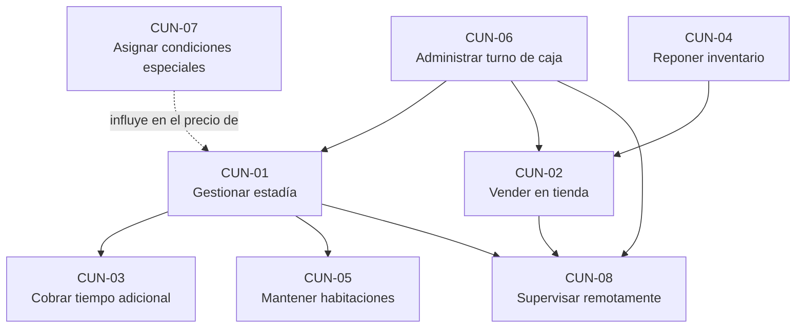

Ningún cobro (CUN-01, CUN-02, CUN-03) puede ocurrir sin un turno de caja abierto (CUN-06) — esta es la dependencia estructural más importante del negocio, y se traduce en la regla RN-23.

### 5.5 Flujo operativo global del negocio

Una operación típica y completa recorre el negocio de la siguiente manera: comienza cuando el cajero **abre su turno** (CUN-06) al iniciar su jornada. Durante el turno, ocurren de forma entremezclada e independiente entre sí: **ingresos de huéspedes** (CUN-01), que en algún momento pueden requerir el **cobro de tiempo adicional** (CUN-03) y eventualmente terminan en una **salida**, que dispara el proceso de **limpieza** (CUN-05); y **ventas de la tienda** (CUN-02), tanto a huéspedes activos como al público que simplemente transita por la entrada del negocio. De forma paralela y asincrónica, la **propietaria** puede, en cualquier momento, **asignar un precio especial** a un cliente (CUN-07), lo cual afectará el precio de sus próximos ingresos, y **consultar el estado financiero del negocio de forma remota** (CUN-08). El ciclo de cada turno se cierra cuando el cajero realiza el **arqueo de caja** al finalizar su jornada (CUN-06).

**Variante — cliente con precio especial ya asignado:** el flujo de CUN-01 se modifica en el paso de determinación del precio: en vez de aplicarse el precio de lista de la habitación, se detecta y aplica automáticamente el precio fijo previamente asignado por la propietaria para ese cliente en esa habitación específica.

**Variante — cliente que excede su tiempo:** el flujo de CUN-01 se entrelaza con CUN-03 en el momento del vencimiento: el sistema determina si corresponde cortesía (sin cobro), extensión anticipada o liquidación de sobretiempo, según el historial de ese alquiler específico (ver reglas de negocio RN-05 a RN-12).

## 6. Actores del negocio

Se distingue explícitamente entre **actor del negocio** (un rol humano que participa en la operación, con o sin sistema de por medio) y **usuario del sistema** (la cuenta con la que ese rol interactúa con el software, ver sección 11). Un mismo actor del negocio puede corresponder a un único usuario del sistema, como es el caso en este proyecto.

| Código | Nombre | Descripción | Responsabilidades | Objetivos | Procesos en los que participa | Información que necesita | Información que genera |
|---|---|---|---|---|---|---|---|
| ACT-01 | Propietaria | Dueña del negocio; máxima autoridad operativa y comercial | Definir precios, autorizar condiciones especiales, supervisar el negocio, gestionar personal | Control total del negocio, rentabilidad, tranquilidad de supervisión remota | CUN-01 (define precios), CUN-04, CUN-07, CUN-08, y todos los procesos secundarios de gestión | Estado financiero, ocupación, inventario, desempeño del personal | Precios, precios especiales, decisiones de personal y compras |
| ACT-02 | Hija de la propietaria | Colabora con el mismo nivel de responsabilidad administrativa que la propietaria | Idénticas a ACT-01 en la práctica operativa | Idénticos a ACT-01 | Idénticos a ACT-01 | Idéntica a ACT-01 | Idéntica a ACT-01 |
| ACT-03 | Cajero (empleado, incluye turno nocturno) | Atiende la recepción/tienda; ejecuta las operaciones diarias de cobro | Registrar ingresos y salidas, cobrar tiempo adicional, vender en tienda, administrar su turno de caja | Atender correctamente al cliente, cumplir su turno sin diferencias de caja | CUN-01, CUN-02, CUN-03, CUN-06 | Disponibilidad de habitaciones, precios vigentes, precios especiales de clientes reconocidos | Registros de cada transacción que ejecuta |
| ACT-04 | Personal de limpieza | Encargado de dejar las habitaciones en condición de uso tras cada salida | Limpiar habitaciones pendientes; marcarlas como listas o reportar mantenimiento | Rotación eficiente de habitaciones | CUN-05 | Lista de habitaciones pendientes de limpieza | Cambios de estado de habitación |
| ACT-05 | Cliente huésped | Persona que alquila una habitación | Pagar por el tiempo utilizado; eventualmente comprar en la tienda | Alojamiento por el tiempo que necesite, a un precio conocido de antemano | CUN-01, CUN-02, CUN-03 | Precio y condiciones de la habitación | Su propio historial de estadías (dato interno del negocio) |
| ACT-06 | Cliente del público general (tienda) | Persona que compra en la tienda sin ser huésped | Pagar por lo que compra | Adquirir productos | CUN-02 | Precio de público de los productos | Ninguna (no se le registra información personal) |

## 7. Casos de uso del negocio

Los casos de uso del negocio (`CUN-XXX`) fueron desarrollados en detalle en la sección 5.2, siguiendo el formato completo requerido (objetivo, actor principal, participantes, entradas, actividades, reglas de negocio, resultados, excepciones e información generada). Esta sección presenta el resumen consolidado y su relación con los actores.

| ID | Nombre | Actor principal | Actores secundarios | Frecuencia |
|---|---|---|---|---|
| CUN-01 | Gestionar la estadía de un huésped | Cajero | Cliente huésped, Propietaria (define precios) | Muy alta (múltiples veces por turno) |
| CUN-02 | Vender productos en la tienda | Cajero | Cliente huésped, Cliente del público | Alta |
| CUN-03 | Cobrar tiempo adicional | Cajero | Cliente huésped | Media-Alta |
| CUN-04 | Reponer y administrar inventario | Propietaria | — | Baja-Media |
| CUN-05 | Mantener las habitaciones en condición de uso | Personal de limpieza | — | Alta (una vez por cada salida) |
| CUN-06 | Administrar el turno de caja | Cajero | — | Una vez por turno (apertura y cierre) |
| CUN-07 | Asignar condiciones comerciales especiales | Propietaria | — | Baja |
| CUN-08 | Supervisar el negocio de forma remota | Propietaria | — | Variable, según necesidad |

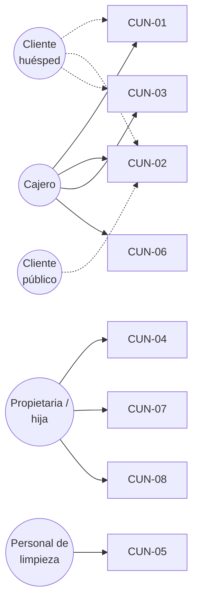

## 8. Reglas de negocio

Esta sección constituye el catálogo formal y completo de las reglas de negocio identificadas a lo largo de la interacción con el proyecto. Cada regla se presenta con su origen (de dónde surge, para trazabilidad de la decisión) y los actores/procesos que afecta. La correspondencia detallada con requisitos funcionales específicos se formaliza en la matriz de trazabilidad (sección 34).

### 8.1 Reglas temporales (vencimiento, cortesía y sobretiempo)

Esta categoría es, junto con las reglas de precios, el núcleo más delicado del sistema: un error aquí se traduce directamente en dinero mal cobrado.

| ID | Descripción | Origen | Actores afectados | Procesos afectados | Excepciones |
|---|---|---|---|---|---|
| RN-01 | El alquiler incluye una duración base de 8 horas, contadas desde el momento del ingreso. Este valor es un parámetro configurable globalmente, no un valor fijo en el sistema. | Aclaración explícita del negocio | Cajero, cliente | CUN-01 | Ninguna |
| RN-02 | Si el cliente se retira antes de agotar su tiempo contratado, no corresponde ninguna devolución de dinero. | Aclaración explícita | Cajero, cliente | CUN-01 | Ninguna |
| RN-03 | El sistema debe generar un aviso 10 minutos antes de que se cumpla la hora de salida programada del alquiler. Valor configurable. | Aclaración explícita | Cajero | CUN-01, CUN-03 | Ninguna |
| RN-04 | Cumplida la hora de salida programada, el cliente dispone de un periodo de cortesía de 15 minutos sin cargo adicional. Este periodo se otorga **una sola vez** por alquiler. Valor configurable. | Aclaración explícita | Cajero, cliente | CUN-01, CUN-03 | Ver RN-07 |
| RN-05 | Superado el periodo de cortesía, el cliente debe pagar de inmediato una hora adicional o retirarse de la habitación. | Aclaración explícita | Cajero, cliente | CUN-03 | El cliente se retira sin pagar (ver excepción en CU de checkout, sección 14) |
| RN-06 | Cuando la hora adicional se cobra por haberse superado la cortesía (liquidación de sobretiempo), el nuevo periodo de una hora se cuenta **desde el momento en que se realiza el pago**, no desde la hora de salida original. | Corrección explícita del negocio sobre un diseño previo incorrecto | Cajero, cliente | CUN-03 | Ninguna |
| RN-07 | Una vez que el periodo de cortesía fue consumido dentro de un alquiler, no se vuelve a otorgar cortesía dentro del mismo alquiler, aunque el cliente pague y vuelva a exceder una hora adicional posterior. | Aclaración explícita | Cajero, cliente | CUN-03 | Ninguna |
| RN-08 | El cliente puede adquirir horas adicionales de forma anticipada, es decir, sin haber llegado aún al vencimiento de su tiempo contratado. Esto puede ocurrir en dos momentos: (a) en el mismo momento del ingreso, sumando horas adicionales a la duración base desde el inicio del alquiler (el precio y la hora de salida iniciales ya las incluyen), o (b) en cualquier momento posterior mientras el alquiler siga vigente (antes de vencer). En ambos casos, el tiempo pagado se **suma** a la hora de salida programada y no consume el periodo de cortesía. | Aclaración explícita, confirmada por el negocio como una práctica real y frecuente | Cajero, cliente | CUN-01, CUN-03 | — |
| RN-09 | El bloque de tiempo adicional es siempre de una hora completa; no existen fracciones de hora vendibles. | Aclaración explícita | Cajero, cliente | CUN-03 | Ninguna |
| RN-10 | El precio de cada hora adicional es fijo (S/ 8.00), configurable globalmente, y no varía según el precio base de la habitación ni el tipo de cliente. | Aclaración explícita | Cajero, cliente | CUN-03 | Puede verse afectado por un ajuste puntual (RN-17/RN-18) |
| RN-11 | El estado temporal de un alquiler (a tiempo / por vencer / en cortesía / en sobretiempo) se calcula dinámicamente a partir de la hora actual, nunca se almacena como un dato fijo en la base de datos. | Decisión de diseño (evita inconsistencias tras reinicios del sistema) | Sistema | CUN-01, CUN-03 | — |
| RN-12 | Un alquiler no puede cerrarse (registrar la salida) mientras se encuentre en estado de sobretiempo, salvo que se cobre la hora adicional correspondiente o se registre explícitamente, con motivo, que el cliente se retiró sin pagar. | Inferencia necesaria para la integridad financiera del negocio | Cajero | CUN-01, CUN-03 | El cliente se retira sin pagar (excepción auditada) |

### 8.2 Reglas de precios

| ID | Descripción | Origen | Actores afectados | Procesos afectados |
|---|---|---|---|---|
| RN-13 | Cada habitación posee un precio base individual, determinado por sus comodidades (sin baño, con baño, grande con baño), y no guarda relación con el piso en el que se ubica. | Aclaración explícita, confirmada con evidencia fotográfica de la tarifa real del negocio | Propietaria, cajero | CUN-01 |
| RN-14 | La propietaria (o quien ella autorice) puede asignar a un cliente específico un precio fijo total para una combinación concreta de cliente + habitación. Este precio **reemplaza por completo** al precio de lista de esa habitación para ese cliente; no se suma a él. | Aclaración explícita | Propietaria, cajero | CUN-01, CUN-07 |
| RN-15 | Un precio especial asignado a un cliente para una habitación específica no se extiende automáticamente a otras habitaciones que ese mismo cliente pudiera solicitar. | Aclaración explícita | Propietaria, cajero | CUN-01, CUN-07 |
| RN-16 | Solo un usuario con el permiso `client_pricing.manage` (por defecto, la propietaria) puede crear, modificar o eliminar un precio especial de cliente. | Aclaración explícita | Propietaria | CUN-07 |
| RN-17 | Cualquier cajero puede aplicar, en el momento de una transacción específica, un ajuste puntual sobre el precio que correspondería automáticamente (precio de lista o precio especial de cliente), indicando un motivo obligatorio. | Aclaración explícita | Cajero | CUN-01, CUN-02, CUN-03 |
| RN-18 | El ajuste puntual **nunca** puede resultar en un total inferior al que hubiese correspondido automáticamente. Solo puede aumentar el precio, nunca disminuirlo. | Aclaración explícita, corrección deliberada del negocio para evitar descuentos no autorizados | Cajero | CUN-01, CUN-02, CUN-03 |
| RN-19 | El ajuste puntual aplica exclusivamente a la transacción en la que se originó; no se guarda como una regla permanente ni afecta las visitas futuras del cliente. | Aclaración explícita | Cajero, Propietaria | CUN-01, CUN-02, CUN-03 |

### 8.3 Reglas comerciales y de inventario (tienda)

| ID | Descripción | Origen | Actores afectados | Procesos afectados |
|---|---|---|---|---|
| RN-20 | Cada producto de la tienda posee dos precios de venta: un precio para huéspedes y un precio para público general. | Aclaración explícita | Cajero | CUN-02 |
| RN-21 | El stock de un producto es único y compartido; no se duplica el inventario por tener dos precios de venta. | Aclaración explícita, decisión recomendada y aceptada | Propietaria, cajero | CUN-02, CUN-04 |
| RN-22 | Un comprador se considera huésped si, al momento de la venta, existe un alquiler abierto que pueda asociarse a él; en caso contrario, se aplica el precio de público. | Aclaración explícita | Cajero | CUN-02 |
| RN-23 | Toda venta de la tienda se cobra en el momento de realizarse; no existen ventas con pago diferido ni cuentas abiertas de ningún tipo (ni para huéspedes ni para público). | Aclaración explícita, reafirmada expresamente | Cajero, cliente | CUN-02 |
| RN-24 | La asociación de una venta a una habitación específica es opcional y tiene únicamente valor de referencia interna; nunca es un requisito para completar la venta. | Aclaración explícita | Cajero | CUN-02 |
| RN-25 | Solo un usuario con el permiso `inventory.manage` (por defecto, la propietaria) puede registrar el ingreso de mercadería nueva. | Aclaración explícita | Propietaria | CUN-04 |
| RN-26 | No se permite completar una venta que dejaría el stock de un producto en un valor negativo, salvo que exista una configuración explícita que lo autorice. | Inferencia estándar de integridad de inventario; no contradice ninguna aclaración del negocio | Cajero | CUN-02 |

### 8.4 Reglas de disponibilidad de habitaciones

| ID | Descripción | Origen | Actores afectados | Procesos afectados |
|---|---|---|---|---|
| RN-27 | Una habitación no puede tener más de un alquiler abierto simultáneamente. | Inferencia necesaria de integridad operativa | Cajero | CUN-01 |
| RN-28 | Solo puede iniciarse un alquiler sobre una habitación cuyo estado sea "Libre". | Inferencia necesaria | Cajero | CUN-01 |
| RN-29 | Al registrarse la salida de un alquiler, la habitación pasa automáticamente al estado "Pendiente de limpieza". | Aclaración explícita | Sistema | CUN-01, CUN-05 |
| RN-30 | Una habitación en "Pendiente de limpieza" solo puede pasar al estado "Libre" mediante la acción explícita del personal de limpieza (o de un usuario con el permiso equivalente); no existe un paso adicional de confirmación por parte del cajero. | Aclaración explícita | Personal de limpieza | CUN-05 |
| RN-31 | El personal de limpieza puede, en lugar de marcar una habitación como lista, reportarla como que requiere mantenimiento; en ese caso, la habitación queda bloqueada hasta su reactivación explícita por un usuario autorizado. | Aclaración explícita | Personal de limpieza, propietaria | CUN-05 |

### 8.5 Reglas de caja

| ID | Descripción | Origen | Actores afectados | Procesos afectados |
|---|---|---|---|---|
| RN-32 | Ningún cobro (alquiler, tiempo adicional o venta de tienda) puede registrarse sin que exista un turno de caja abierto. | Inferencia estándar de control de caja | Cajero | CUN-01, CUN-02, CUN-03, CUN-06 |
| RN-33 | El efectivo esperado al cierre de un turno se calcula sumando el efectivo inicial más los cobros recibidos en efectivo, más los ingresos manuales de caja y menos los retiros manuales de caja. | Inferencia estándar de control de caja | Sistema | CUN-06 |
| RN-34 | El arqueo de cierre de turno se realiza a ciegas: el cajero debe ingresar el efectivo físico contado antes de que el sistema le revele el monto que esperaba encontrar. | Práctica estándar de control de caja, recomendada y no objetada | Cajero | CUN-06 |
| RN-35 | Los medios de pago distintos al efectivo (Yape, Plin y otros que se habiliten) no afectan el cálculo del efectivo físico esperado. | Inferencia estándar | Sistema | CUN-06 |

### 8.6 Reglas financieras y de integridad de datos

| ID | Descripción | Origen | Actores afectados | Procesos afectados |
|---|---|---|---|---|
| RN-36 | Ninguna operación financiera (alquiler, hora adicional, venta, movimiento de caja) puede eliminarse del sistema. Toda corrección se realiza mediante una operación compensatoria (anulación/reverso) que queda formalmente vinculada a la operación original. | Práctica estándar exigida por la naturaleza financiera del sistema | Sistema, propietaria | Todos |
| RN-37 | Toda cifra monetaria se representa y almacena en unidades enteras menores (céntimos); no se utilizan tipos de punto flotante para dinero. | Práctica estándar de ingeniería financiera | Sistema | Todos |
| RN-38 | Un comprobante impreso para el cliente nunca incluye su nombre ni su documento de identidad; esos datos permanecen exclusivamente en el registro interno del sistema. | Aclaración explícita | Cliente, propietaria | CUN-01 |
| RN-39 | Un comprobante impreso debe declarar explícitamente que es un documento interno sin valor tributario, y no debe adoptar ningún formato (numeración, terminología) que lo asemeje a una boleta o factura electrónica oficial. | Recomendación de cumplimiento derivada de la naturaleza no fiscal explícitamente solicitada | Propietaria, negocio | CUN-01, CUN-02 |

### 8.7 Reglas de usuarios y permisos

| ID | Descripción | Origen | Actores afectados | Procesos afectados |
|---|---|---|---|---|
| RN-40 | Cada persona que opera el sistema posee una cuenta de usuario individual; no se comparten credenciales entre personas, incluso cuando dos personas tengan el mismo nivel de permisos. | Aclaración explícita | Todos los actores del sistema | Todos |
| RN-41 | Los permisos del sistema constituyen un catálogo fijo y predefinido (cada uno corresponde a una verificación real en el software); los rangos, entendidos como combinaciones asignables de permisos, son configurables libremente por quien posea el permiso de administración de usuarios. | Aclaración explícita, con matiz técnico necesario para que la configurabilidad sea real y no ilusoria | Propietaria | Gestión de usuarios |
| RN-42 | Toda acción sensible (cambio de precio, anulación, ajuste puntual, creación de precio especial, cambio de permisos de un usuario) debe quedar registrada de forma inmutable, indicando el usuario responsable y el momento exacto en que ocurrió. | Aclaración explícita (necesidad de trazabilidad de decisiones comerciales) | Propietaria | Todos |

### 8.8 Reglas administrativas y de configuración

| ID | Descripción | Origen | Actores afectados | Procesos afectados |
|---|---|---|---|---|
| RN-43 | Los parámetros de tiempo (horas base, minutos de aviso, minutos de cortesía) y el precio de la hora adicional son configurables globalmente por un usuario con el permiso de configuración; un cambio afecta únicamente a los alquileres iniciados con posterioridad al cambio. | Aclaración explícita | Propietaria | CUN-01, CUN-03 |
| RN-44 | Un cambio en el precio de una habitación no afecta a los alquileres ya iniciados con el precio anterior; cada alquiler conserva registrado el precio con el que efectivamente se pactó. | Inferencia necesaria de integridad histórica (consistente con RN-36) | Sistema | CUN-01 |
| RN-45 | La propietaria puede consultar, estando fuera del local, un resumen de ingresos y egresos del negocio, aceptando una demora razonable respecto al estado en tiempo real de la operación local. No se le exige, ni el sistema debe ofrecerle, visibilidad en tiempo real del tablero de ocupación de habitaciones desde fuera del local. | Aclaración explícita | Propietaria | CUN-08 |
| RN-46 | Un cajero puede anular un ticket sin ser Administrador únicamente si cuenta con un código de autorización temporal: aleatorio, de un solo uso y de vigencia breve, generado por un usuario Administrador desde el Dashboard (incluyendo la posibilidad de generarlo de forma remota, sin estar presente en el local). El código habilita exclusivamente esa operación puntual; no equivale a otorgarle al cajero el permiso de anulación de forma permanente. | Aclaración explícita, resuelve `PEND-04` | Cajero, Administrador | CUN-01, CUN-06 (a través de CU-21) |

## 9. Alcance del sistema

### 9.1 Qué incluye el sistema

El sistema incluye, de manera exhaustiva: el registro y control completo del ciclo de vida de un alquiler por horas (ingreso, seguimiento del tiempo, cobro de tiempo adicional, salida); la gestión del catálogo de habitaciones con precio individual configurable; la gestión de precios especiales por cliente y habitación; el registro de ajustes puntuales de precio con motivo; la venta de productos de la tienda con doble precio (huésped/público) y control de stock único; el ciclo de limpieza de habitaciones con acceso propio para el personal correspondiente; la apertura, operación y cierre (con arqueo) de turnos de caja; la emisión de comprobantes internos no fiscales impresos en impresora térmica; la gestión de usuarios, rangos y permisos configurables; el registro auditable de toda acción sensible; reportes operativos y financieros (con distinto nivel de profundidad entre la primera versión y las siguientes, ver 9.3 y 9.4); y un mecanismo de acceso remoto de solo lectura, con demora aceptable, para que la propietaria consulte un resumen financiero fuera del local.

### 9.2 Qué NO incluye el sistema

Quedan explícitamente fuera del alcance de este proyecto, en su totalidad: la emisión de comprobantes fiscales reales (boleta o factura electrónica ante la autoridad tributaria); cualquier modalidad de reserva anticipada de habitaciones; la modalidad de alquiler por días completos (el negocio opera en su totalidad bajo la modalidad de horas); aplicaciones móviles nativas (el acceso móvil del personal de limpieza se resuelve como una aplicación web responsiva); integración con pasarelas de pago electrónico (los medios de pago digitales se registran manualmente, con un número de operación opcional); y el soporte funcional real para múltiples negocios o sedes dentro de un mismo sistema (aunque la arquitectura del módulo de tienda se diseñe de forma desacoplada para facilitar una eventual reutilización futura, ver `OBJ-N-006` y `RES-XXX` en la sección 29).

### 9.3 Alcance de la primera versión (MVP)

La primera versión del sistema, orientada a reemplazar el cuaderno de papel en el menor tiempo posible, incluye: gestión de habitaciones con precio individual; el ciclo completo de alquiler (ingreso, tiempo adicional con sus dos modalidades, salida) con todas las reglas temporales de la sección 8.1; precios especiales de cliente y ajustes puntuales, con sus reglas completas; la tienda con doble precio y stock único; el ciclo de limpieza con marcado directo; turnos de caja con arqueo ciego; medios de pago efectivo, Yape y Plin (con referencia opcional); comprobante térmico no fiscal sin datos personales; roles predefinidos (Administrador, Cajero, Limpieza) operando sobre un motor de permisos ya completo, aunque sin una interfaz de creación libre de nuevos rangos; reportes básicos de ventas por turno, método de pago y origen (habitación/tienda); y el mecanismo de sincronización hacia el espejo en la nube con el resumen remoto para la propietaria.

### 9.4 Funcionalidades futuras (posteriores al MVP)

Quedan explícitamente programadas para una segunda etapa, sin quedar fuera del alcance final del producto: la interfaz de creación y edición libre de rangos y permisos personalizados desde el panel administrativo; el registro estructurado de egresos (sueldos de personal y recibos de servicios como categorías obligatorias, más categorías libres definidas por la propietaria) y los reportes comparativos de ingresos contra egresos; el sistema de promociones (sin definición de reglas concretas aún, ver `PEND-03`); las etiquetas configurables de servicios adicionales por habitación (sin catálogo definido aún, ver `PEND-02`); y la aplicación del diseño visual definitivo (elaborado en Figma por el equipo del proyecto) sobre la interfaz funcional ya construida.

### 9.5 Restricciones del alcance

El alcance de este documento se limita a la operación de un único establecimiento (El Apurimeño). Cualquier extensión hacia los otros dos negocios de la propietaria (papelería y ferretería) constituye un proyecto separado y futuro, que este documento no especifica, más allá de la decisión arquitectónica de no acoplar el módulo de tienda a conceptos propios del hospedaje.

## 10. Stakeholders

| Stakeholder | Intereses | Necesidades | Nivel de influencia | Relación con el sistema |
|---|---|---|---|---|
| Propietaria | Rentabilidad, control, tranquilidad, continuidad del negocio familiar | Visibilidad financiera, control de personal, reducción de pérdidas no detectables | Muy alta — es quien valida y decide sobre el negocio | Usuaria administradora principal; patrocinadora funcional del proyecto |
| Hija de la propietaria | Idénticos a los de la propietaria, en su rol de colaboradora administrativa | Idénticas | Alta | Usuaria administradora |
| Personal operativo (cajero, limpieza) | Herramientas simples que no entorpezcan su trabajo diario; protección ante acusaciones infundadas de manejo indebido de caja | Claridad de sus responsabilidades; un sistema de arqueo que los proteja tanto como controle | Media (su adopción del sistema es crítica para el éxito operativo, aunque no deciden el alcance) | Usuarios operativos |
| Reizo (integrador del proyecto) | Entregar un sistema técnicamente sólido, coordinar el desarrollo con tres agentes de IA, mantener una buena relación con la familia propietaria | Especificación clara y suficiente para dirigir el desarrollo sin reinterpretar el negocio | Muy alta — es el responsable técnico y de gestión del proyecto | Gestor del proyecto; interlocutor formal entre el negocio y el desarrollo |
| Clientes del hospedaje y de la tienda | Precio claro, atención rápida, privacidad de sus datos | Comprobante confiable, privacidad | Baja (no participan en decisiones del proyecto, pero su experiencia condiciona reglas como RN-38) | Terceros afectados indirectamente por el sistema |

---

# PARTE II — EL SISTEMA

## 11. Usuarios y roles del sistema

Como se estableció en RN-40 y RN-41, el sistema separa el concepto de **permiso** (una capacidad concreta, fija, verificada por el software) del concepto de **rango o rol** (una combinación de permisos, libremente configurable). Esta sección describe los rangos iniciales con los que el sistema se pone en marcha; la propietaria puede crear rangos adicionales desde el primer día a través del motor de permisos, aunque la interfaz específicamente pensada para hacerlo con comodidad forma parte de la Fase 2 (sección 9.4).

### 11.1 Rangos iniciales

| Rango | Responsabilidades | Objetivos | Operaciones permitidas | Operaciones restringidas | Experiencia esperada | Frecuencia de uso |
|---|---|---|---|---|---|---|
| **Administrador** (propietaria e hija, cada una con cuenta propia) | Configurar el sistema, supervisar la operación, tomar decisiones comerciales | Control total y visibilidad completa del negocio | Todas las del sistema, incluyendo configuración, usuarios, precios, precios especiales, reportes y auditoría | Ninguna | Baja a media en el uso de software, por lo que la interfaz administrativa debe priorizar claridad sobre densidad de funciones | Diaria a intermitente, incluyendo acceso remoto |
| **Cajero** (empleado, incluido el turno nocturno) | Operar la recepción y la tienda | Atender correctamente y sin errores de caja | Abrir/cerrar turno, registrar ingresos y salidas, cobrar tiempo adicional, vender en tienda, aplicar ajustes puntuales (solo al alza), movimientos de caja | Gestión de precios base, precios especiales de cliente, gestión de usuarios, reportes financieros completos, configuración del sistema, reposición de inventario | Media, uso intensivo y repetitivo durante el turno | Continua durante cada turno |
| **Limpieza** | Dejar las habitaciones listas para su reutilización | Rotación eficiente de habitaciones | Ver habitaciones pendientes de limpieza; marcarlas como listas; reportar mantenimiento | Cualquier operación de cobro, precios, reportes o configuración | Baja; la interfaz debe ser mínima y directa, apta para un teléfono móvil | Cada vez que se libera una habitación |

### 11.2 Matriz inicial de permisos por módulo

Esta matriz resume, a nivel de módulo funcional (ver detalle de módulos en la sección 13), qué rango tiene acceso a qué área del sistema. La matriz detallada por acción individual se presenta en la sección 22.

| Módulo | Administrador | Cajero | Limpieza |
|---|:---:|:---:|:---:|
| Alquileres (ingreso, tiempo adicional, salida) | ✅ | ✅ | ❌ |
| Habitaciones (catálogo y precios) | ✅ | Solo lectura | Solo lectura (de las pendientes de limpieza) |
| Precios especiales de cliente | ✅ | ❌ | ❌ |
| Tienda (venta) | ✅ | ✅ | ❌ |
| Inventario (reposición) | ✅ | ❌ | ❌ |
| Limpieza (marcar lista / mantenimiento) | ✅ | ❌ | ✅ |
| Caja / turnos | ✅ (incluye cierre forzado de otros) | ✅ (el propio) | ❌ |
| Usuarios, rangos y permisos | ✅ | ❌ | ❌ |
| Reportes | ✅ | ❌ | ❌ |
| Auditoría | ✅ | ❌ | ❌ |
| Configuración general | ✅ | ❌ | ❌ |
| Resumen remoto (espejo en la nube) | ✅ | ❌ | ❌ |

## 12. Contexto del sistema

### 12.1 Objetivos del sistema

Estos objetivos traducen los objetivos del negocio (sección 5.1) en capacidades que el software debe proveer.

| ID | Descripción | Objetivo de negocio relacionado |
|---|---|---|
| OBJ-S-001 | Registrar digitalmente el ciclo completo de cada alquiler, sin dependencia de un registro externo en papel | OBJ-N-001 |
| OBJ-S-002 | Calcular automáticamente el precio y el tiempo de cada alquiler, incluyendo cortesía, extensión anticipada y sobretiempo, sin intervención aritmética manual | OBJ-N-003 |
| OBJ-S-003 | Proveer control de caja verificable mediante apertura, movimientos y cierre con arqueo por turno | OBJ-N-002 |
| OBJ-S-004 | Permitir a la propietaria definir y aplicar automáticamente precios especiales por cliente, y registrar auditablemente los ajustes puntuales del personal | OBJ-N-004 |
| OBJ-S-005 | Ofrecer a la propietaria un resumen financiero remoto, actualizado con una demora razonable, accesible fuera del local | OBJ-N-005 |
| OBJ-S-006 | Diseñar el módulo de productos e inventario sin dependencias estructurales de los conceptos del hospedaje | OBJ-N-006 |
| OBJ-S-007 | Excluir datos personales del cliente de todo comprobante impreso, preservándolos únicamente en el registro interno con acceso controlado | OBJ-N-007 |

### 12.2 Diagrama de contexto

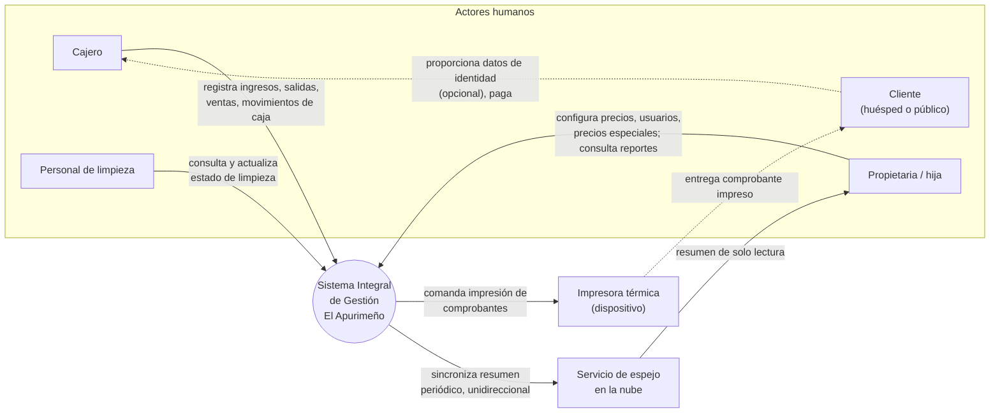

**Información que entra al sistema:** datos de identidad del cliente (cuando se proporcionan), selección de habitación, tiempo solicitado, montos de pago recibidos, decisiones de precio (especial o ajuste puntual), datos de productos vendidos, movimientos de caja, y decisiones de configuración de la propietaria.

**Información que sale del sistema:** comprobantes impresos (sin datos personales del cliente), estado en tiempo real del tablero de habitaciones (para el POS y el Dashboard local), avisos de vencimiento de tiempo, reportes y resúmenes financieros, y el resumen periódico hacia el espejo en la nube.

**Dispositivos y servicios externos al alcance funcional del sistema, pero con los que interactúa:** la impresora térmica (dispositivo físico de salida) y el servicio de espejo en la nube (almacenamiento remoto de solo resumen). No existen, en esta versión, integraciones con sistemas externos de terceros (ver sección 27).

## 13. Arquitectura funcional del producto

Esta sección describe el sistema dividido en módulos funcionales — qué hace cada parte del software desde la perspectiva del negocio — sin entrar en decisiones de arquitectura técnica (esas se desarrollan en el documento "Planos Técnicos", ya elaborado, y no se repiten aquí salvo cuando condicionan directamente el alcance funcional).

### 13.1 Descripción de cada módulo

**Módulo de Habitaciones.** Propósito: mantener el catálogo de las 17 habitaciones, su precio individual y su estado operativo. Responsabilidades: alta/edición de habitaciones y su precio; seguimiento del estado (Libre, Ocupada, Pendiente de limpieza, Mantenimiento). Actores: Administrador (gestión), Cajero (consulta y usa para iniciar alquileres), Limpieza (consulta y actualiza el subconjunto pendiente de limpieza). Información administrada: identificador de habitación, precio base, estado actual, historial de cambios de estado. Dependencias: ninguna hacia otros módulos; es una dependencia de Alquileres. Funcionalidades principales: CRUD de habitaciones, consulta del tablero de disponibilidad. Reglas relacionadas: RN-13, RN-27 a RN-31, RN-44.

**Módulo de Alquileres.** Propósito: gestionar el ciclo de vida completo de una estadía por horas. Responsabilidades: registrar el ingreso, calcular y monitorear el tiempo, gestionar el cobro de tiempo adicional en sus dos modalidades, registrar la salida. Actores: Cajero (ejecuta), Cliente (beneficiario indirecto). Información administrada: alquileres, su horario, su precio aplicado, su historial de extensiones. Dependencias: Habitaciones, Clientes/Precios especiales, Caja/Turnos, Comprobantes. Funcionalidades principales: cotizar ingreso, confirmar ingreso, cotizar y confirmar tiempo adicional, registrar salida. Reglas relacionadas: RN-01 a RN-19, RN-27 a RN-31, RN-36, RN-37, RN-44.

**Módulo de Clientes y Precios Especiales.** Propósito: identificar clientes recurrentes y aplicar automáticamente condiciones comerciales que la propietaria haya definido para ellos. Responsabilidades: búsqueda de clientes por documento o nombre; alta/edición/baja de precios especiales por cliente + habitación. Actores: Administrador (gestión), Cajero (consulta, al iniciar un alquiler). Información administrada: datos de identificación del cliente, precios especiales asociados. Dependencias: ninguna estructural; es consultado por Alquileres. Funcionalidades principales: búsqueda de cliente, gestión de precio especial. Reglas relacionadas: RN-14 a RN-16.

**Módulo de Tienda (Productos, Inventario y Ventas).** Propósito: gestionar la venta de productos de consumo, con precios diferenciados y control de stock. Responsabilidades: catálogo de productos con doble precio; registro de ventas; control de stock; registro de reposición de mercadería. Actores: Administrador (gestión de catálogo e inventario), Cajero (venta). Información administrada: productos, categorías, stock, movimientos de inventario, ventas. Dependencias: **ninguna hacia el módulo de Alquileres o Habitaciones** (decisión deliberada, ver `RES-02`); solo consulta opcionalmente si existe un alquiler activo para sugerir el precio de huésped. Funcionalidades principales: catálogo de productos, venta, reposición de stock. Reglas relacionadas: RN-20 a RN-26.

**Módulo de Limpieza.** Propósito: coordinar la puesta a disposición de una habitación tras su desocupación. Responsabilidades: listar habitaciones pendientes; marcar como lista o reportar mantenimiento. Actores: Limpieza (ejecuta), Administrador (puede reactivar mantenimiento). Información administrada: estado de limpieza de cada habitación y su historial. Dependencias: Habitaciones. Funcionalidades principales: listar pendientes, marcar lista, reportar mantenimiento. Reglas relacionadas: RN-29 a RN-31.

**Módulo de Caja y Turnos.** Propósito: controlar el efectivo y demás medios de pago manejados por cada cajero durante su periodo de trabajo. Responsabilidades: apertura/cierre de turno, registro de movimientos manuales, cálculo del efectivo esperado, arqueo. Actores: Cajero (ejecuta), Administrador (supervisa, puede forzar cierres). Información administrada: turnos, movimientos de caja, diferencias de arqueo. Dependencias: es consultado por Alquileres, Tienda (todo cobro requiere un turno abierto). Funcionalidades principales: abrir turno, registrar movimiento manual, cerrar turno con arqueo. Reglas relacionadas: RN-32 a RN-35.

**Módulo de Comprobantes e Impresión.** Propósito: emitir el documento interno no fiscal que recibe el cliente. Responsabilidades: componer el contenido del comprobante a partir de un cobro; enviarlo a la impresora térmica; reintentar ante fallas. Actores: Sistema (automático, disparado por cualquier cobro). Información administrada: comprobantes emitidos, su estado de impresión. Dependencias: Alquileres, Tienda (cualquier módulo que genere un cobro). Funcionalidades principales: emitir comprobante, reintentar impresión fallida. Reglas relacionadas: RN-38, RN-39.

**Módulo de Usuarios, Rangos y Permisos.** Propósito: controlar quién puede hacer qué dentro del sistema. Responsabilidades: gestión de cuentas de usuario, asignación de rangos, definición de rangos personalizados. Actores: Administrador (exclusivo). Información administrada: usuarios, rangos, asignaciones de permisos. Dependencias: es consultado por todos los demás módulos para autorizar cada operación. Funcionalidades principales: CRUD de usuarios, CRUD de rangos, asignación de permisos a un rango. Reglas relacionadas: RN-40 a RN-42.

**Módulo de Auditoría.** Propósito: dejar constancia inmutable de toda acción sensible del sistema. Responsabilidades: registrar cada acción con su actor, momento y detalle. Actores: Sistema (automático), Administrador (consulta). Información administrada: registro histórico de auditoría. Dependencias: es alimentado por todos los demás módulos. Funcionalidades principales: registrar evento de auditoría, consultar historial con filtros. Reglas relacionadas: RN-36, RN-42.

**Módulo de Reportes.** Propósito: transformar los datos operativos y financieros en información útil para la toma de decisiones. Responsabilidades: agregación y presentación de datos de ventas, ocupación e inventario (y, en la Fase 2, egresos). Actores: Administrador (consulta). Dependencias: consulta a Alquileres, Tienda, Caja (y, en Fase 2, Egresos). Funcionalidades principales: ver reportes con filtros. Reglas relacionadas: RN-45 (para el resumen remoto).

**Módulo de Configuración.** Propósito: permitir a la propietaria ajustar los parámetros operativos del sistema sin intervención técnica. Responsabilidades: gestión de parámetros de tiempo y precio de hora adicional, datos del comprobante, configuración de la impresora. Actores: Administrador (exclusivo). Dependencias: es consultado por Alquileres, Comprobantes. Funcionalidades principales: editar parámetros globales. Reglas relacionadas: RN-43.

**Módulo de Sincronización Remota (Espejo en la Nube).** Propósito: dar a la propietaria visibilidad financiera fuera del local. Responsabilidades: sincronizar periódicamente un resumen (no el detalle operativo completo) hacia un servicio en la nube, de solo lectura. Actores: Sistema (automático), Administrador (consulta remota). Dependencias: consulta a Reportes. Funcionalidades principales: sincronizar resumen, consultar resumen remoto. Reglas relacionadas: RN-45.

### 13.2 Tabla resumen de módulos

| Módulo | Propósito | Usuarios | Dependencias |
|---|---|---|---|
| Habitaciones | Catálogo y estado de las 17 habitaciones | Administrador, Cajero, Limpieza | Ninguna |
| Alquileres | Ciclo de vida de una estadía por horas | Cajero | Habitaciones, Clientes/Precios especiales, Caja, Comprobantes |
| Clientes y Precios Especiales | Reconocer clientes y aplicar condiciones comerciales fijas | Administrador, Cajero | Ninguna |
| Tienda (Productos/Inventario/Ventas) | Venta de consumo con doble precio | Administrador, Cajero | Caja, Comprobantes (opcionalmente Alquileres, solo como referencia) |
| Limpieza | Puesta a disposición de habitaciones | Limpieza, Administrador | Habitaciones |
| Caja y Turnos | Control del efectivo y medios de pago | Cajero, Administrador | Ninguna (es dependencia de otros) |
| Comprobantes e Impresión | Emisión del documento interno no fiscal | Sistema (automático) | Alquileres, Tienda |
| Usuarios, Rangos y Permisos | Control de acceso | Administrador | Ninguna (es dependencia de todos) |
| Auditoría | Registro inmutable de acciones sensibles | Sistema (automático), Administrador | Todos (los alimenta) |
| Reportes | Información para decisiones | Administrador | Alquileres, Tienda, Caja |
| Configuración | Parámetros operativos ajustables | Administrador | Ninguna (es dependencia de Alquileres, Comprobantes) |
| Sincronización Remota | Visibilidad financiera fuera del local | Sistema (automático), Administrador | Reportes |

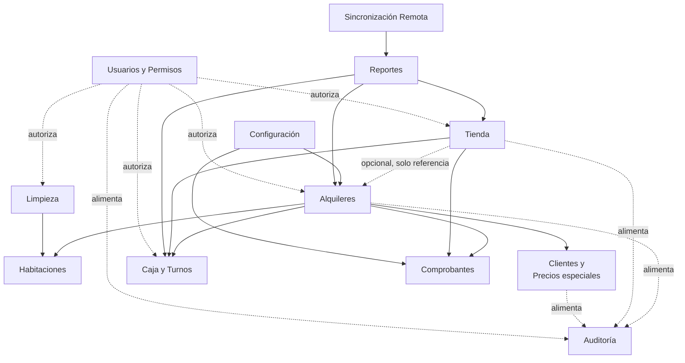

## 14. Casos de uso del sistema

### 14.1 Nivel de detalle aplicado

Dada la enorme disparidad de complejidad entre las operaciones del sistema, este documento desarrolla con el máximo nivel de detalle (los catorce campos solicitados: objetivo, actores, precondiciones, postcondiciones, disparador, flujos principal y alternativos, excepciones, reglas relacionadas, datos, validaciones, permisos, auditoría, requisitos relacionados y notas) los casos de uso que concentran la mayor complejidad de negocio o el mayor riesgo financiero. Los casos de uso administrativos de naturaleza más sencilla (altas, bajas y ediciones de catálogos) se presentan en un formato tabular más compacto, sin que ello implique menor obligatoriedad de implementación — simplemente no requieren la misma profundidad de flujos alternativos para ser comprendidos sin ambigüedad.

### 14.2 Tabla general de casos de uso

| ID | Nombre | Actor | Módulo | Objetivo | Prioridad |
|---|---|---|---|---|---|
| CU-01 | Iniciar sesión | Todos | Usuarios y Permisos | Autenticarse en el sistema | Crítica |
| CU-02 | Abrir turno | Cajero | Caja y Turnos | Habilitar la operación de cobro | Crítica |
| CU-03 | Consultar tablero de habitaciones | Cajero, Administrador | Habitaciones | Ver disponibilidad y estado en vivo | Crítica |
| CU-04 | Registrar ingreso de huésped | Cajero | Alquileres | Iniciar una estadía cobrada | Crítica |
| CU-05 | Cotizar y cobrar tiempo adicional | Cajero | Alquileres | Extender el tiempo de una estadía, cobrando correctamente | Crítica |
| CU-06 | Registrar salida de huésped | Cajero | Alquileres | Finalizar una estadía y liberar la habitación a limpieza | Crítica |
| CU-07 | Registrar salida sin pago de sobretiempo | Cajero | Alquileres | Cerrar un alquiler cuando el cliente se retira sin pagar lo adeudado | Alta |
| CU-08 | Crear/editar precio especial de cliente | Administrador | Clientes y Precios Especiales | Fijar condiciones comerciales para un cliente recurrente | Alta |
| CU-09 | Buscar cliente | Cajero, Administrador | Clientes y Precios Especiales | Encontrar a un cliente por documento o nombre | Alta |
| CU-10 | Aplicar ajuste puntual de precio | Cajero | Alquileres / Tienda | Modificar el precio de una transacción específica, solo al alza | Alta |
| CU-11 | Vender producto en tienda | Cajero | Tienda | Registrar una venta de consumo | Crítica |
| CU-12 | Registrar ingreso de mercadería | Administrador | Tienda | Reponer stock | Media |
| CU-13 | Gestionar catálogo de habitaciones | Administrador | Habitaciones | Mantener el catálogo y sus precios | Alta |
| CU-14 | Marcar habitación en mantenimiento / reactivar | Administrador | Habitaciones | Bloquear o reactivar una habitación | Media |
| CU-15 | Consultar habitaciones pendientes de limpieza | Limpieza | Limpieza | Saber dónde limpiar | Crítica |
| CU-16 | Marcar habitación como lista | Limpieza | Limpieza | Devolver la habitación a disponibilidad | Crítica |
| CU-17 | Reportar habitación para mantenimiento (desde limpieza) | Limpieza | Limpieza | Evitar que se alquile una habitación dañada | Alta |
| CU-18 | Registrar movimiento manual de caja | Cajero | Caja y Turnos | Reflejar ingresos/retiros de efectivo no asociados a una venta | Media |
| CU-19 | Cerrar turno (arqueo) | Cajero | Caja y Turnos | Controlar el efectivo al final de la jornada | Crítica |
| CU-20 | Forzar cierre de turno de otro usuario | Administrador | Caja y Turnos | Resolver turnos abandonados o con incidencias | Baja |
| CU-21 | Anular un ticket | Administrador (o Cajero con autorización) | Alquileres / Tienda / Caja | Corregir un cobro erróneo sin borrar el registro original | Alta |
| CU-22 | Reimprimir comprobante | Cajero | Comprobantes | Entregar una copia al cliente | Media |
| CU-23 | Gestionar usuarios | Administrador | Usuarios y Permisos | Alta/baja/edición de cuentas de personal | Alta |
| CU-24 | Gestionar rangos y permisos | Administrador | Usuarios y Permisos | Configurar niveles de acceso a medida | Media (Fase 2 para la interfaz completa) |
| CU-25 | Consultar auditoría | Administrador | Auditoría | Revisar el historial de acciones sensibles | Media |
| CU-26 | Consultar reportes | Administrador | Reportes | Analizar el desempeño del negocio | Alta |
| CU-27 | Configurar parámetros generales | Administrador | Configuración | Ajustar horas base, gracia, precio de hora adicional, etc. | Alta |
| CU-28 | Consultar resumen remoto | Administrador | Sincronización Remota | Ver el negocio desde fuera del local | Alta |
| CU-29 | Gestionar catálogo de productos | Administrador | Tienda | Mantener productos y sus dos precios | Alta |
| CU-30 | Gestionar métodos de pago | Administrador | Configuración | Habilitar/deshabilitar medios de pago | Media |

### 14.3 Casos de uso desarrollados en detalle

---

#### CU-04 — Registrar ingreso de huésped

**Objetivo:** Registrar el ingreso de un cliente a una habitación disponible, determinando y cobrando correctamente el precio correspondiente.
**Actor principal:** Cajero.
**Actores secundarios:** Cliente (huésped), Administrador (indirectamente, como autor de precios especiales previamente configurados).
**Precondiciones:** Existe un turno de caja abierto para el terminal/usuario (CU-02); la habitación seleccionada se encuentra en estado "Libre".
**Postcondiciones:** Se crea un alquiler en estado "Abierto" con su hora de salida programada calculada; se emite un ticket de cobro pagado en su totalidad; la habitación pasa a estado "Ocupada"; se genera un comprobante para impresión.
**Disparador:** Un cliente se presenta en recepción solicitando una habitación.

**Flujo principal:**
1. El cajero selecciona, en el tablero de habitaciones, una habitación en estado "Libre".
2. El sistema muestra el precio base de esa habitación.
3. El cajero indica, si el cliente lo proporciona, su documento de identidad o nombre.
4. El sistema busca si existe un precio especial (RN-14) para la combinación cliente + habitación seleccionada.
5. Si existe, el sistema reemplaza el precio base por el precio especial; si no, mantiene el precio base.
6. El cajero indica, de forma opcional, si el cliente desea pagar horas adicionales desde este mismo momento (RN-08, caso a); el sistema ofrece una selección rápida de cantidades frecuentes (por ejemplo, 1, 2 o 5 horas) además de permitir indicar cualquier otra cantidad de horas enteras (RF-64).
7. El sistema recalcula el total, sumando el importe de las horas adicionales indicadas al precio de la habitación (de lista o especial).
8. El cajero confirma el precio (o aplica un ajuste puntual, ver CU-10, antes de continuar).
9. El sistema calcula la hora de salida programada sumando la duración base configurada (RN-01), más las horas adicionales indicadas en el paso 6 si las hubiera, a la hora actual.
10. El cajero recibe el pago y lo confirma en el sistema, indicando el método de pago.
11. El sistema crea el alquiler, el ticket y el pago en una única operación consistente; cambia el estado de la habitación a "Ocupada"; genera el comprobante para impresión.
12. El sistema confirma la operación al cajero, mostrando la nueva hora de salida programada.

**Flujos alternativos:**
- A1. *Cliente no proporciona documento ni nombre:* el sistema permite continuar sin esos datos (RN establece que se solicitan siempre, pero no son obligatorios); no podrá aplicarse un precio especial en esta visita porque no hay forma de identificarlo.
- A2. *El cajero aplica un ajuste puntual antes de cobrar:* se ejecuta CU-10 como parte de este flujo, en el paso 8.
- A3. *El cliente no desea horas adicionales al ingresar:* se omiten los pasos 6 y 7; el resto del flujo continúa sin cambios.

**Flujos de excepción:**
- E1. *La habitación dejó de estar "Libre" entre que el cajero la seleccionó y confirmó el cobro* (por ejemplo, otro terminal la ocupó primero): el sistema rechaza la operación, informa que la habitación ya no está disponible y no se registra ningún cobro.
- E2. *El monto entregado por el cliente es insuficiente respecto al total*: el sistema no permite confirmar la operación hasta que el monto recibido cubra el total.
- E3. *Fallo de comunicación tras confirmar el cobro pero antes de recibir la respuesta*: al reintentar con la misma operación, el sistema debe reconocer que ya fue procesada y devolver el mismo resultado, sin duplicar el cobro (ver RNF de concurrencia, sección 17.15).

**Reglas de negocio relacionadas:** RN-01, RN-02, RN-08 (caso a), RN-09, RN-10, RN-13, RN-14, RN-15, RN-17 a RN-19, RN-27, RN-28, RN-32, RN-36 a RN-38, RN-44.
**Datos de entrada:** habitación seleccionada, identidad del cliente (opcional), horas adicionales al ingreso (opcional), método de pago, monto recibido.
**Datos generados:** registro de alquiler (incluyendo, si corresponde, las horas adicionales pagadas al ingreso), ticket, pago, comprobante, cambio de estado de habitación.
**Validaciones:** habitación en estado "Libre"; turno abierto; monto recibido suficiente para cubrir el total; cantidad de horas adicionales, si se indica, debe ser un entero positivo.
**Permisos requeridos:** `rentals.checkin`.
**Auditoría requerida:** sí — usuario, habitación, cliente (si se identificó), precio aplicado (de lista, especial o con ajuste), horas adicionales pagadas al ingreso (si las hubo), momento.
**Requisitos funcionales relacionados:** RF-01 a RF-06, RF-64 (sección 16).
**Notas:** Este es el caso de uso de mayor frecuencia del sistema; su rendimiento y confiabilidad son críticos (ver RNF-PERF-01).

---

#### CU-05 — Cotizar y cobrar tiempo adicional

**Objetivo:** Permitir que un huésped permanezca más tiempo, determinando automáticamente si corresponde una extensión anticipada o una liquidación de sobretiempo, y cobrando el importe correspondiente.
**Actor principal:** Cajero.
**Actores secundarios:** Cliente (huésped).
**Precondiciones:** Existe un alquiler en estado "Abierto" para la habitación en cuestión; turno de caja abierto.
**Postcondiciones:** Se registra una hora adicional (de tipo "Extensión anticipada" o "Liquidación de sobretiempo"); se actualiza la hora de salida programada del alquiler; si corresponde, se marca como consumido el periodo de cortesía; se emite un ticket pagado y su comprobante.
**Disparador:** El sistema emite un aviso de proximidad o superación del vencimiento (RN-03, RN-04), o el cliente solicita proactivamente más tiempo.

**Flujo principal:**
1. El cajero selecciona, desde el tablero, una habitación ocupada.
2. El sistema determina el estado temporal actual del alquiler (a tiempo, por vencer, en cortesía o en sobretiempo — RN-11) y, en consecuencia, si la operación corresponde a una extensión anticipada (RN-08) o a una liquidación de sobretiempo (RN-06).
3. El sistema cotiza el importe: una hora adicional al precio configurado (RN-09, RN-10).
4. El cajero cobra el importe.
5. El sistema registra la hora adicional, indicando su tipo.
6. Si la operación fue una liquidación de sobretiempo y el periodo de cortesía aún no había sido consumido, el sistema lo marca como consumido para el resto de ese alquiler (RN-07).
7. El sistema recalcula la hora de salida programada: si fue extensión anticipada, se suma a la hora de salida vigente (RN-08); si fue liquidación de sobretiempo, se calcula desde el momento del pago (RN-06).
8. El sistema emite el comprobante correspondiente.

**Flujos alternativos:**
- A1. *El cajero aplica un ajuste puntual sobre el precio de la hora adicional:* se ejecuta CU-10 como parte de este flujo, en el paso 3.

**Flujos de excepción:**
- E1. *El cliente decide no pagar y retirarse:* no se ejecuta este caso de uso; se ejecuta en su lugar CU-06 o CU-07 según corresponda.
- E2. *Fallo de comunicación durante el cobro:* igual tratamiento que E3 de CU-04.

**Reglas de negocio relacionadas:** RN-03 a RN-12, RN-17 a RN-19, RN-32, RN-36, RN-37.
**Datos de entrada:** habitación, método de pago, monto recibido.
**Datos generados:** registro de hora adicional (con su tipo), actualización de la hora de salida programada, ticket, pago, comprobante.
**Validaciones:** el alquiler debe estar en estado "Abierto"; turno abierto; monto suficiente.
**Permisos requeridos:** `rentals.extra_hour`.
**Auditoría requerida:** sí — usuario, alquiler, tipo de operación (extensión o sobretiempo), momento.
**Requisitos funcionales relacionados:** RF-07 a RF-12.
**Notas:** El paso 2 (determinación automática del tipo de operación) es la lógica de negocio más delicada del sistema completo; debe implementarse como una función aislada y exhaustivamente probada (ver sección 16, RF-08, y la referencia a `packages/domain` en los Planos Técnicos).

---

#### CU-06 — Registrar salida de huésped

**Objetivo:** Finalizar una estadía, asegurando que cualquier sobretiempo pendiente haya sido resuelto, y liberar la habitación hacia el proceso de limpieza.
**Actor principal:** Cajero.
**Precondiciones:** Existe un alquiler en estado "Abierto" para la habitación.
**Postcondiciones:** El alquiler pasa a estado "Cerrado"; la habitación pasa a estado "Pendiente de limpieza".
**Disparador:** El cliente informa su intención de retirarse.

**Flujo principal:**
1. El cajero selecciona la habitación desde el tablero y elige "Registrar salida".
2. El sistema determina el estado temporal del alquiler.
3. Si el estado es "a tiempo", "por vencer" o "en cortesía", el sistema permite cerrar el alquiler sin cargo adicional.
4. El cajero confirma la salida.
5. El sistema cierra el alquiler y cambia el estado de la habitación a "Pendiente de limpieza".

**Flujos alternativos:**
- A1. *Salida anticipada* (el cliente se retira antes de agotar su tiempo contratado): se seguiste el mismo flujo principal; el sistema no calcula ni ofrece ninguna devolución (RN-02).

**Flujos de excepción:**
- E1. *El alquiler se encuentra en estado "en sobretiempo"*: el sistema **no permite** completar este caso de uso (RN-12); redirige al cajero a CU-05 (cobrar la hora adicional) o a CU-07 (registrar salida sin pago, con motivo y autorización).

**Reglas de negocio relacionadas:** RN-02, RN-12, RN-29.
**Datos de entrada:** habitación (o alquiler) seleccionado.
**Datos generados:** cierre de alquiler, cambio de estado de habitación.
**Validaciones:** el alquiler no debe estar en estado de sobretiempo no resuelto.
**Permisos requeridos:** `rentals.checkout`.
**Auditoría requerida:** sí — usuario, alquiler, momento de cierre.
**Requisitos funcionales relacionados:** RF-13, RF-14.
**Notas:** Ninguna.

---

#### CU-07 — Registrar salida sin pago de sobretiempo

**Objetivo:** Permitir cerrar un alquiler cuando el cliente se retiró sin abonar el sobretiempo que técnicamente correspondía, dejando constancia auditable de la situación.
**Actor principal:** Cajero.
**Precondiciones:** El alquiler se encuentra en estado "en sobretiempo" (RN-12); el cliente ya no está presente o se niega a pagar.
**Postcondiciones:** El alquiler se cierra igualmente; queda registrado que existió un sobretiempo no cobrado, con su motivo.
**Disparador:** El cajero intenta cerrar un alquiler en sobretiempo (CU-06, flujo E1) y elige explícitamente esta alternativa en vez de cobrar.

**Flujo principal:**
1. El cajero, desde el intento fallido de CU-06 (E1), selecciona "Registrar salida sin pago".
2. El sistema exige un motivo obligatorio (por ejemplo: "cliente se retiró sin avisar").
3. El cajero confirma.
4. El sistema cierra el alquiler, marcándolo con un indicador de "sobretiempo no cobrado", el motivo, y el usuario responsable.
5. La habitación pasa a "Pendiente de limpieza".

**Flujos alternativos:** Ninguno relevante adicional.
**Flujos de excepción:** Ninguno adicional a los ya cubiertos por la precondición.
**Reglas de negocio relacionadas:** RN-12, RN-29, RN-36, RN-42.
**Datos de entrada:** motivo.
**Datos generados:** cierre de alquiler con indicador de sobretiempo no cobrado.
**Validaciones:** motivo no vacío.
**Permisos requeridos:** `rentals.checkout` (se recomienda evaluar, como `[PENDIENTE DE DEFINICIÓN]`, si esta variante específica debería requerir además un permiso o autorización de supervisor — ver `PEND-04`).
**Auditoría requerida:** sí, de forma obligatoria y destacada — este es exactamente el tipo de evento que alimenta reportes de control futuros (Fase 2).
**Requisitos funcionales relacionados:** RF-15.
**Notas:** Este caso de uso existe para que la integridad del registro (RN-36) no obligue, en la práctica, a que el cajero "invente" un cierre limpio cuando la realidad fue distinta; es preferible una excepción visible y auditada a un dato falso.

---

#### CU-08 — Crear/editar precio especial de cliente

**Objetivo:** Fijar un precio total para una combinación específica de cliente y habitación, que se aplicará automáticamente en visitas futuras.
**Actor principal:** Administrador.
**Precondiciones:** Ninguna especial, salvo poseer el permiso correspondiente.
**Postcondiciones:** Existe (o se actualiza) un precio especial para esa combinación cliente + habitación.
**Disparador:** La propietaria decide reconocer condiciones especiales para un cliente.

**Flujo principal:**
1. El administrador busca al cliente por documento o nombre (CU-09); si no existe, lo registra.
2. El administrador selecciona la habitación para la cual desea fijar el precio.
3. El administrador ingresa el precio fijo total.
4. El sistema guarda o actualiza el precio especial para esa combinación exacta.

**Flujos alternativos:**
- A1. *Edición de un precio especial existente:* el flujo es idéntico, partiendo de un registro ya existente en el paso 2.

**Flujos de excepción:**
- E1. *El administrador intenta eliminar un precio especial:* operación permitida; a partir de ese momento, esa combinación cliente + habitación vuelve a usar el precio de lista (RN-14).

**Reglas de negocio relacionadas:** RN-14, RN-15, RN-16.
**Datos de entrada:** cliente (documento/nombre), habitación, precio fijo.
**Datos generados:** registro de precio especial, con autor y momento.
**Validaciones:** precio mayor o igual a cero; combinación cliente + habitación única (no puede haber dos precios especiales activos para la misma combinación).
**Permisos requeridos:** `client_pricing.manage`.
**Auditoría requerida:** sí.
**Requisitos funcionales relacionados:** RF-16 a RF-18.
**Notas:** No se contempla, en esta versión, un flujo de aprobación/notificación para eliminar un precio especial (se descartó explícitamente para el MVP); su eliminación es una operación administrativa directa.

---

#### CU-10 — Aplicar ajuste puntual de precio

**Objetivo:** Permitir que un cajero modifique, exclusivamente al alza, el precio de una transacción específica, dejando constancia del motivo.
**Actor principal:** Cajero.
**Precondiciones:** Se encuentra en curso una operación de cobro (ingreso, hora adicional o venta de tienda) cuyo precio automático ya fue calculado.
**Postcondiciones:** El total de la transacción refleja el nuevo monto; el motivo y el monto original quedan registrados.
**Disparador:** El cajero decide, por criterio propio ante una situación puntual, cobrar más de lo que el sistema calculó automáticamente.

**Flujo principal:**
1. Sobre una cotización ya calculada (de CU-04, CU-05 o CU-11), el cajero selecciona "Aplicar ajuste".
2. El sistema solicita el nuevo monto total y un motivo.
3. El sistema valida que el nuevo monto sea mayor o igual al monto que había calculado automáticamente.
4. El cajero confirma; la transacción continúa su flujo normal (cobro) con el nuevo monto.

**Flujos alternativos:** Ninguno adicional.
**Flujos de excepción:**
- E1. *El cajero ingresa un monto inferior al mínimo permitido (RN-18):* el sistema rechaza el ajuste y explica que el monto no puede ser menor al precio que correspondería automáticamente.
- E2. *El cajero no ingresa un motivo:* el sistema no permite continuar sin él.

**Reglas de negocio relacionadas:** RN-17, RN-18, RN-19.
**Datos de entrada:** nuevo monto, motivo.
**Datos generados:** registro del ajuste dentro del ticket correspondiente (monto original, monto ajustado, motivo, autor).
**Validaciones:** nuevo monto ≥ monto mínimo calculado automáticamente; motivo obligatorio y no vacío.
**Permisos requeridos:** `rentals.manual_adjustment` (o el equivalente de tienda, si aplica a una venta).
**Auditoría requerida:** sí, de forma obligatoria.
**Requisitos funcionales relacionados:** RF-19, RF-20.
**Notas:** Este caso de uso se invoca **dentro** de otros (CU-04, CU-05, CU-11), no de forma independiente; se documenta por separado por la importancia y especificidad de sus reglas.

---

#### CU-11 — Vender producto en tienda

**Objetivo:** Registrar la venta de uno o más productos, aplicando el precio correcto según si el comprador es huésped o público general, y descontando el stock correspondiente.
**Actor principal:** Cajero.
**Precondiciones:** Turno de caja abierto; el o los productos seleccionados tienen stock suficiente (si llevan control de stock).
**Postcondiciones:** Se registra la venta y su cobro; se descuenta el stock de los productos vendidos.
**Disparador:** Un cliente (huésped o del público) solicita comprar uno o más productos.

**Flujo principal:**
1. El cajero selecciona uno o más productos y sus cantidades.
2. El cajero indica, opcionalmente, si la venta corresponde a un huésped con alquiler activo (asociándola a esa habitación, únicamente como referencia — RN-24) o si es venta al público.
3. El sistema aplica el precio de huésped o de público según corresponda (RN-20, RN-22).
4. El cajero cobra el total.
5. El sistema registra la venta, el pago, y descuenta el stock de cada producto vendido (RN-23, RN-26).
6. El sistema emite el comprobante.

**Flujos alternativos:**
- A1. *El cajero aplica un ajuste puntual sobre el total de la venta:* se ejecuta CU-10 dentro de este flujo, en el paso 3.

**Flujos de excepción:**
- E1. *Stock insuficiente para completar la venta (RN-26):* el sistema rechaza la venta de ese producto en la cantidad solicitada.

**Reglas de negocio relacionadas:** RN-20 a RN-26, RN-32, RN-36, RN-37.
**Datos de entrada:** productos, cantidades, condición de huésped/público, método de pago, monto recibido.
**Datos generados:** venta, pago, movimientos de inventario, comprobante.
**Validaciones:** turno abierto; stock suficiente; monto recibido suficiente.
**Permisos requeridos:** `sales.sell`.
**Auditoría requerida:** sí.
**Requisitos funcionales relacionados:** RF-21 a RF-25.
**Notas:** Ninguna.

---

#### CU-16 — Marcar habitación como lista

**Objetivo:** Devolver una habitación al estado "Libre" tras haber sido limpiada.
**Actor principal:** Personal de limpieza.
**Precondiciones:** La habitación se encuentra en estado "Pendiente de limpieza".
**Postcondiciones:** La habitación pasa a estado "Libre" y queda disponible para un nuevo alquiler.
**Disparador:** El personal de limpieza termina de limpiar una habitación.

**Flujo principal:**
1. El personal de limpieza consulta, desde su acceso móvil, la lista de habitaciones pendientes (CU-15).
2. Selecciona la habitación que acaba de limpiar.
3. Selecciona "Marcar como lista".
4. El sistema cambia el estado de la habitación a "Libre" de forma directa, sin requerir confirmación adicional de ningún otro rol (RN-30).

**Flujos alternativos:** Ninguno.
**Flujos de excepción:** Ninguno relevante; ver CU-17 para la alternativa de reportar mantenimiento en lugar de marcar lista.
**Reglas de negocio relacionadas:** RN-30.
**Datos de entrada:** ninguno adicional a la selección de la habitación.
**Datos generados:** cambio de estado de habitación, con responsable y momento.
**Validaciones:** la habitación debe encontrarse en estado "Pendiente de limpieza".
**Permisos requeridos:** `cleaning.mark_ready`.
**Auditoría requerida:** sí.
**Requisitos funcionales relacionados:** RF-26.
**Notas:** La sencillez deliberada de este caso de uso es un requisito en sí mismo: la interfaz debe minimizar los pasos, dado que se ejecuta repetidamente y desde un dispositivo móvil.

---

#### CU-19 — Cerrar turno (arqueo)

**Objetivo:** Finalizar el periodo de trabajo de un cajero, controlando el efectivo real contra el efectivo esperado por el sistema.
**Actor principal:** Cajero.
**Precondiciones:** Existe un turno abierto para el usuario actual.
**Postcondiciones:** El turno pasa a estado "Cerrado", con el efectivo contado, el esperado y la diferencia (si la hubiera) registrados.
**Disparador:** El cajero finaliza su jornada de trabajo.

**Flujo principal:**
1. El cajero selecciona "Cerrar turno".
2. El sistema solicita el monto de efectivo físico contado, **sin revelar** el monto que espera encontrar (RN-34).
3. El cajero ingresa el monto contado.
4. El sistema calcula el efectivo esperado (RN-33) y la diferencia contra lo contado.
5. El sistema cierra el turno, dejando registrados ambos montos y la diferencia.

**Flujos alternativos:** Ninguno relevante.
**Flujos de excepción:**
- E1. *Existe una diferencia significativa entre lo esperado y lo contado:* el sistema permite el cierre igualmente, pero puede solicitar (según configuración) una nota explicativa — comportamiento sujeto a confirmación, ver `PEND-05`.

**Reglas de negocio relacionadas:** RN-32 a RN-35.
**Datos de entrada:** efectivo contado.
**Datos generados:** cierre de turno, con efectivo esperado, contado y diferencia.
**Validaciones:** el turno debe estar abierto; el monto contado no puede ser negativo.
**Permisos requeridos:** `shifts.close`.
**Auditoría requerida:** sí, de forma obligatoria.
**Requisitos funcionales relacionados:** RF-27, RF-28.
**Notas:** Ninguna.

---

#### CU-21 — Anular un ticket

**Objetivo:** Corregir un cobro erróneo (de un alquiler, una hora adicional o una venta) sin eliminar el registro original, preservando la integridad histórica.
**Actor principal:** Administrador (directamente), o Cajero (mediante un código de autorización temporal generado por un Administrador — RN-46).
**Precondiciones:** Existe un ticket emitido, en estado vigente (no anulado previamente); si el actor es un Cajero, existe un código de autorización temporal vigente y no utilizado, generado por un Administrador para esta operación.
**Postcondiciones:** El ticket original queda marcado como anulado; se genera un ticket compensatorio vinculado a él; si la anulación afecta un alquiler o el stock, se resuelven sus efectos correspondientes; si la anulación fue autorizada por código, ese código queda consumido y no puede reutilizarse.
**Disparador:** Se detecta un error en un cobro ya registrado.

**Flujo principal:**
1. El administrador (o el cajero) localiza el ticket a anular.
2. Si el actor es un Cajero, el sistema solicita un código de autorización temporal; el Administrador lo genera desde el Dashboard (de forma presencial o remota) y lo comunica al cajero por el medio que corresponda (por ejemplo, verbalmente o por mensaje); el cajero lo ingresa en el sistema.
3. El sistema valida que el código sea correcto, esté vigente y no haya sido usado previamente.
4. Se indica el motivo de la anulación.
5. El sistema genera un ticket compensatorio, vinculado al original, por el importe inverso; si se usó un código, lo marca como consumido.
6. Si el ticket anulado corresponde al ingreso de un alquiler aún abierto, el sistema resuelve el estado del alquiler y de la habitación de forma consistente (por ejemplo, liberándola si corresponde).
7. Si el ticket anulado corresponde a una venta con descuento de stock, el sistema genera el movimiento de inventario compensatorio correspondiente.

**Flujos alternativos:**
- A1. *El actor es un Administrador:* se omiten los pasos 2 y 3 (no requiere código, dado que ya posee el permiso `tickets.void` de forma directa).

**Flujos de excepción:**
- E1. *El ticket ya fue anulado previamente:* el sistema rechaza una segunda anulación sobre el mismo ticket.
- E2. *El código ingresado por el cajero es incorrecto, expiró o ya fue utilizado:* el sistema rechaza la anulación y no ejecuta ningún efecto.

**Reglas de negocio relacionadas:** RN-36, RN-42, RN-46.
**Datos de entrada:** ticket a anular, motivo, código de autorización temporal (solo si el actor es Cajero).
**Datos generados:** ticket compensatorio, ajustes de estado de alquiler/habitación/inventario según corresponda, consumo del código de autorización (si se usó).
**Validaciones:** el ticket debe estar vigente; motivo obligatorio; si el actor es Cajero, el código debe ser válido, vigente y no usado previamente.
**Permisos requeridos:** `tickets.void` (Administrador) — el Cajero no requiere este permiso asignado a su rango; el código de autorización temporal actúa como una habilitación puntual independiente del esquema de permisos por rango.
**Auditoría requerida:** sí, de forma obligatoria y destacada, incluyendo — cuando aplique — qué Administrador generó el código utilizado.
**Requisitos funcionales relacionados:** RF-29, RF-30, RF-65, RF-66.
**Notas:** Este caso de uso es, junto con CU-07, el más relevante para los futuros reportes de control (Fase 2). El mecanismo de código de autorización temporal se diseña de forma general, pensando en que podría extenderse en el futuro a otras operaciones sensibles, aunque en esta versión se aplica únicamente a la anulación de tickets.

---

#### CU-24 — Gestionar rangos y permisos

**Objetivo:** Permitir a la propietaria configurar libremente combinaciones de permisos (rangos) y asignarlas al personal.
**Actor principal:** Administrador.
**Precondiciones:** Ninguna especial.
**Postcondiciones:** Existe un rango nuevo o modificado, con su conjunto de permisos; los usuarios asignados a ese rango quedan sujetos a los permisos actualizados.
**Disparador:** La propietaria necesita un nivel de acceso que no corresponde exactamente a ninguno de los rangos existentes.

**Flujo principal:**
1. El administrador crea un nuevo rango, asignándole un nombre.
2. Selecciona, del catálogo fijo de permisos del sistema, cuáles concede ese rango.
3. El sistema guarda el rango.
4. El administrador puede asignar ese rango a uno o más usuarios (ver CU-23).

**Flujos alternativos:**
- A1. *Edición de un rango existente:* modifica el conjunto de permisos de un rango ya creado; el cambio aplica de inmediato a todos los usuarios que lo tengan asignado.

**Flujos de excepción:** Ninguno relevante.
**Reglas de negocio relacionadas:** RN-41.
**Datos de entrada:** nombre del rango, conjunto de permisos seleccionados.
**Datos generados:** registro de rango y su conjunto de permisos.
**Validaciones:** nombre de rango no vacío; los permisos seleccionados deben pertenecer al catálogo fijo del sistema.
**Permisos requeridos:** `users.manage`.
**Auditoría requerida:** sí.
**Requisitos funcionales relacionados:** RF-31, RF-32.
**Notas:** El **motor** que hace cumplir estos permisos debe estar completo desde el MVP (los tres rangos iniciales ya operan sobre él); lo que corresponde a la Fase 2 es específicamente la **interfaz de administración** que permite crear y editar rangos con comodidad desde el Dashboard (ver sección 9.3 y 9.4).

---

#### CU-28 — Consultar resumen remoto

**Objetivo:** Permitir a la propietaria conocer el desempeño financiero reciente del negocio estando fuera del local.
**Actor principal:** Administrador (propietaria o hija).
**Precondiciones:** El dispositivo de consulta cuenta con conexión a internet; existe al menos una sincronización previa hacia el espejo en la nube.
**Postcondiciones:** Ninguna (operación de solo consulta).
**Disparador:** La propietaria desea conocer el estado del negocio sin estar presente.

**Flujo principal:**
1. La propietaria accede al resumen remoto desde su dispositivo, fuera de la red local del negocio.
2. El sistema muestra los totales de ingresos (y, en la Fase 2, egresos) correspondientes al periodo más reciente sincronizado.
3. El sistema indica el momento de la última sincronización, para que la propietaria sepa cuán actualizado está el dato.

**Flujos alternativos:** Ninguno relevante.
**Flujos de excepción:**
- E1. *No hay conexión a internet en el punto donde se encuentra la propietaria:* el resumen no está disponible hasta que se restablezca la conexión (RN-45); no es un error del sistema, es una condición esperada y documentada.

**Reglas de negocio relacionadas:** RN-45.
**Datos de entrada:** ninguno.
**Datos generados:** ninguno (consulta).
**Validaciones:** sesión de administrador válida.
**Permisos requeridos:** `dashboard.access` (nivel Administrador).
**Auditoría requerida:** no es imprescindible para esta consulta de solo lectura, aunque puede registrarse el acceso por razones de seguridad general.
**Requisitos funcionales relacionados:** RF-33, RF-34.
**Notas:** Se reitera (RN-45) que, de forma deliberada, este caso de uso **no** incluye la visibilidad en tiempo real del tablero de ocupación; esa limitación fue solicitada explícitamente por la propietaria, no es una carencia técnica.

### 14.4 Casos de uso administrativos (formato compacto)

| ID | Nombre | Flujo esencial | Reglas relacionadas | Permiso |
|---|---|---|---|---|
| CU-01 | Iniciar sesión | Usuario ingresa credenciales; el sistema valida y establece la sesión | RN-40 | — |
| CU-02 | Abrir turno | Cajero indica el efectivo inicial; el sistema crea el turno en estado "Abierto" | RN-32 | `shifts.open` |
| CU-03 | Consultar tablero de habitaciones | El sistema muestra las 17 habitaciones con su estado y, si están ocupadas, su tiempo restante o de sobretiempo | RN-11, RN-27 | `pos.access` |
| CU-09 | Buscar cliente | Se ingresa un documento o nombre parcial; el sistema devuelve coincidencias | — | `rentals.checkin` |
| CU-12 | Registrar ingreso de mercadería | El administrador indica producto y cantidad ingresada; el sistema incrementa el stock | RN-25 | `inventory.manage` |
| CU-13 | Gestionar catálogo de habitaciones | Alta/edición de habitación (número, precio); un cambio de precio no afecta alquileres ya iniciados | RN-13, RN-44 | `rooms.manage` |
| CU-14 | Marcar habitación en mantenimiento / reactivar | El administrador bloquea o reactiva una habitación, con motivo | RN-31 | `rooms.maintenance` |
| CU-15 | Consultar habitaciones pendientes de limpieza | El sistema muestra el subconjunto de habitaciones en estado "Pendiente de limpieza" | RN-29 | `cleaning.access` |
| CU-17 | Reportar habitación para mantenimiento (desde limpieza) | El personal de limpieza, en lugar de marcar lista, reporta un daño; la habitación pasa a "Mantenimiento" | RN-31 | `cleaning.access` |
| CU-18 | Registrar movimiento manual de caja | El cajero registra un ingreso o retiro de efectivo con motivo | RN-33 | `shifts.cash_movement` |
| CU-20 | Forzar cierre de turno de otro usuario | El administrador cierra un turno abandonado, dejando constancia | RN-32 a RN-34 | `shifts.force_close` |
| CU-22 | Reimprimir comprobante | Se reenvía a la impresora un comprobante ya emitido, marcado explícitamente como copia | RN-39 | `tickets.reprint` |
| CU-23 | Gestionar usuarios | Alta/baja/edición de cuentas; asignación de un rango existente | RN-40 | `users.manage` |
| CU-25 | Consultar auditoría | Búsqueda filtrada del historial de acciones sensibles | RN-42 | `audit.view` |
| CU-26 | Consultar reportes | Consulta de reportes de ventas, ocupación e inventario, con filtros | — | `reports.view` |
| CU-27 | Configurar parámetros generales | Edición de horas base, minutos de aviso/gracia, precio de hora adicional, datos del comprobante | RN-43 | `settings.manage` |
| CU-29 | Gestionar catálogo de productos | Alta/edición de producto, con sus dos precios | RN-20 | `inventory.manage` |
| CU-30 | Gestionar métodos de pago | Habilitar/deshabilitar un medio de pago; indicar si afecta caja y si requiere referencia | RN-35 | `settings.manage` |

## 15. Diagramas de casos de uso

### 15.1 Diagrama general del sistema

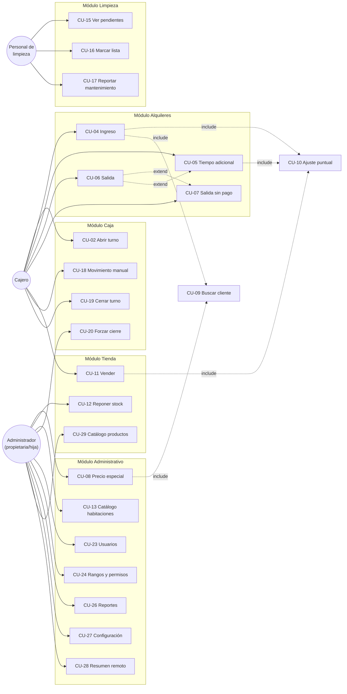

Este diagrama representa la totalidad de los actores primarios frente a los módulos que operan directamente. Las relaciones `include` indican que un caso de uso siempre incorpora a otro como parte de su ejecución (por ejemplo, CU-04 siempre puede necesitar CU-09 para identificar al cliente); las relaciones `extend` indican una alternativa condicional (CU-06 se extiende hacia CU-07 solo si el cliente se retira sin pagar, y hacia CU-05 solo si, al intentar cerrar, el sistema detecta sobretiempo pendiente).

### 15.2 Diagrama del módulo de Alquileres (detalle)

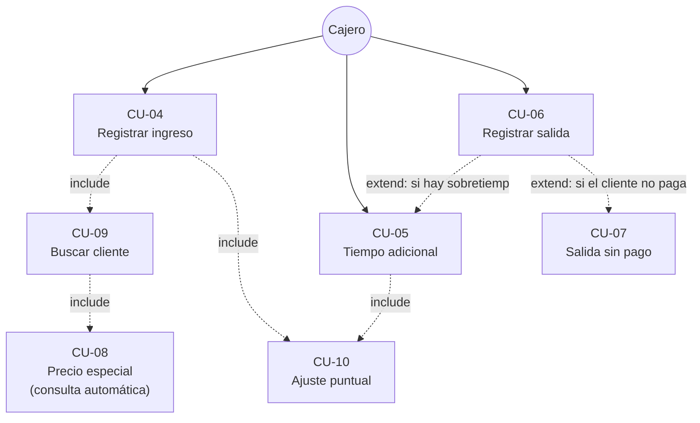

### 15.3 Diagrama del módulo de Tienda (detalle)

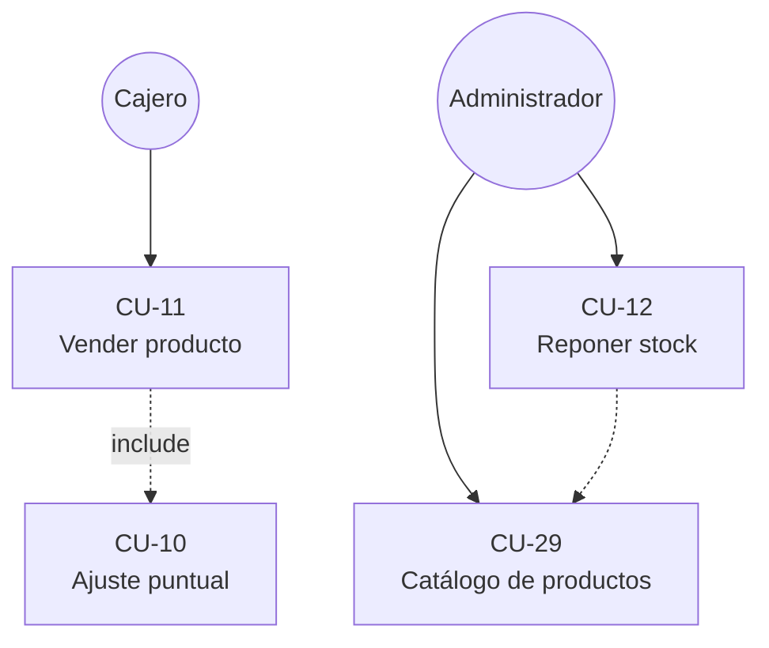

### 15.4 Diagrama del módulo de Caja y Turnos (detalle)

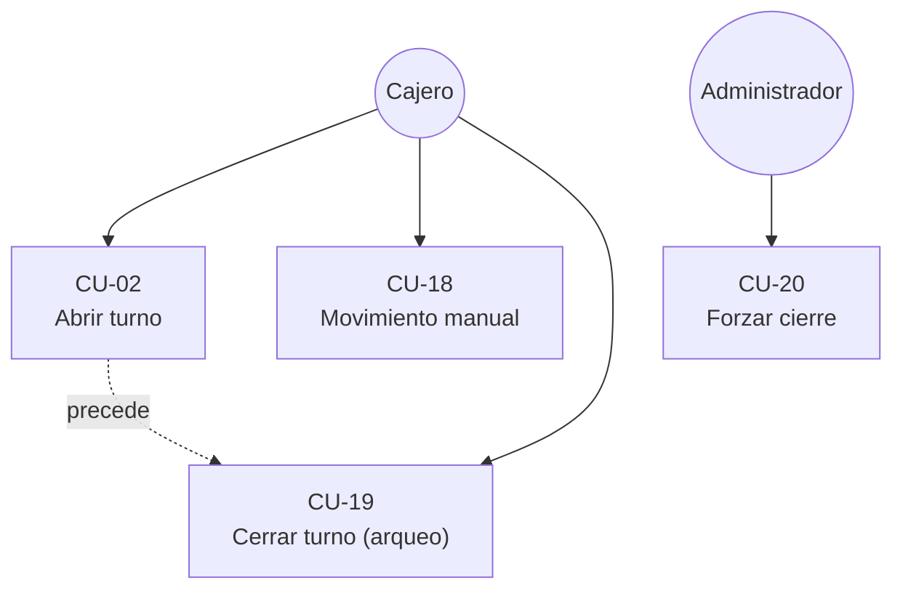

### 15.5 Diagrama del módulo de Limpieza (detalle)

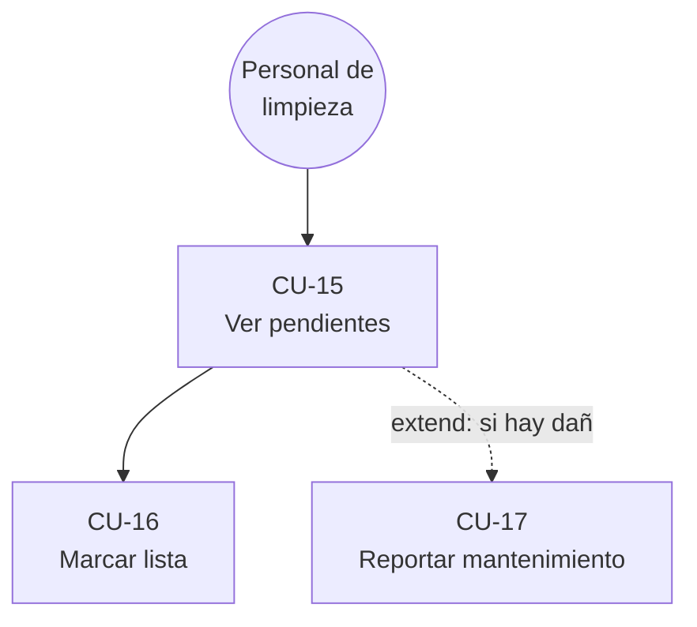

### 15.6 Diagrama del módulo Administrativo (detalle)

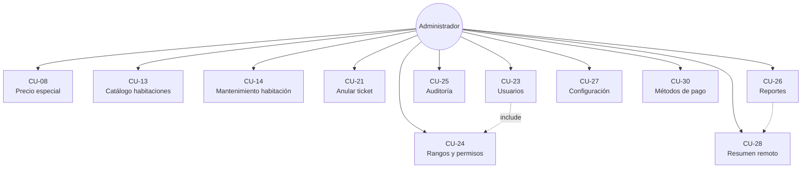

---

# PARTE III — REQUISITOS

## 16. Requisitos funcionales

### 16.1 Criterio de descomposición

Cada requisito funcional describe una capacidad atómica y verificable del sistema. Los requisitos de mayor sensibilidad financiera y temporal (módulos de Alquileres, Precios, Tienda, Caja y Anulaciones — RF-01 a RF-30) se desarrollan con el formato completo solicitado. Los requisitos de naturaleza administrativa o de configuración (RF-31 a RF-63) se presentan en formato tabular compacto, sin omitir ningún campo relevante para su implementación.

### 16.2 Módulo de Alquileres — Ingreso (CU-04)

---

**RF-01 — Selección de habitación disponible para ingreso**
**Descripción:** El sistema deberá permitir al cajero seleccionar, desde el tablero de habitaciones, únicamente una habitación cuyo estado actual sea "Libre" para iniciar un nuevo alquiler.
**Justificación:** Es la precondición fundamental para no violar RN-27 y RN-28 (una sola ocupación por habitación).
**Actor/es relacionados:** Cajero.
**Módulo:** Alquileres.
**Prioridad:** Crítica.
**Precondiciones:** Turno de caja abierto (RN-32).
**Resultado esperado:** La habitación queda seleccionada como origen del nuevo alquiler a registrar.
**Reglas de negocio relacionadas:** RN-27, RN-28, RN-32.
**Casos de uso relacionados:** CU-04.
**Datos afectados:** Ninguno aún (selección, no persistencia).
**Validaciones:** El estado de la habitación debe ser "Libre" en el momento exacto de la selección.
**Errores posibles:** La habitación ya no está disponible (fue ocupada por otra operación concurrente) — código `ROOM_NOT_AVAILABLE`.
**Criterios de aceptación:** Dado un turno abierto y una habitación en estado "Libre", cuando el cajero la selecciona, entonces el sistema permite continuar con el registro del ingreso. Dado que dos cajeros intentan seleccionar la misma habitación "Libre" de forma simultánea, cuando ambos confirman, entonces solo uno de los dos ingresos se registra exitosamente.

---

**RF-02 — Cálculo automático del precio de ingreso**
**Descripción:** El sistema deberá calcular automáticamente el precio a cobrar por el ingreso, aplicando el precio especial del cliente si existe una coincidencia de cliente + habitación, o el precio base de la habitación en caso contrario.
**Justificación:** Automatiza RN-13 y RN-14, eliminando el cálculo manual y sus errores asociados (problema P-03).
**Actor/es relacionados:** Cajero (visualiza), Sistema (calcula).
**Módulo:** Alquileres / Clientes y Precios Especiales.
**Prioridad:** Crítica.
**Precondiciones:** Habitación seleccionada (RF-01).
**Resultado esperado:** Se muestra al cajero el precio a cobrar, indicando si corresponde a lista o a un precio especial.
**Reglas de negocio relacionadas:** RN-13, RN-14, RN-15.
**Casos de uso relacionados:** CU-04, CU-08.
**Datos afectados:** Ninguno aún (cálculo, no persistencia).
**Validaciones:** Ninguna adicional; el cálculo es determinista a partir de los datos existentes.
**Errores posibles:** Ninguno esperado en condiciones normales.
**Criterios de aceptación:** Dado un cliente identificado con un precio especial vigente para la habitación seleccionada, cuando se cotiza el ingreso, entonces el precio mostrado es el precio especial, no el de lista. Dado un cliente sin precio especial para esa habitación, cuando se cotiza el ingreso, entonces el precio mostrado es el precio de lista de la habitación.

---

**RF-03 — Cálculo automático de la hora de salida programada**
**Descripción:** El sistema deberá calcular la hora de salida programada de un nuevo alquiler sumando la duración base configurada (RN-01) — más, si el cajero indicó horas adicionales pagadas desde el ingreso (RF-64), esa cantidad de horas — al momento exacto de la confirmación del ingreso.
**Justificación:** Fundamenta todo el cálculo posterior de estado temporal (RN-11) y de tiempo adicional.
**Actor/es relacionados:** Sistema.
**Módulo:** Alquileres.
**Prioridad:** Crítica.
**Precondiciones:** Ingreso confirmado (pago recibido).
**Resultado esperado:** El alquiler queda con una hora de salida programada consistente con la configuración vigente al momento del ingreso y con las horas adicionales pagadas al ingreso, si las hubo.
**Reglas de negocio relacionadas:** RN-01, RN-08 (caso a), RN-43.
**Casos de uso relacionados:** CU-04.
**Datos afectados:** Campo de hora de salida programada del alquiler.
**Validaciones:** La duración base utilizada debe ser la vigente en el momento del ingreso (no una configuración posterior).
**Errores posibles:** Ninguno esperado en condiciones normales.
**Criterios de aceptación:** Dada una duración base configurada en 8 horas, cuando se confirma un ingreso a las 14:00 sin horas adicionales, entonces la hora de salida programada queda establecida en las 22:00 del mismo día. Dado el mismo ingreso con 2 horas adicionales pagadas desde el inicio, entonces la hora de salida programada queda establecida en las 00:00 del día siguiente (ver también RF-64 y el caso T-16 de la sección 16.10).

---

**RF-04 — Registro del cobro de ingreso**
**Descripción:** El sistema deberá registrar, en una única operación consistente, el alquiler, el ticket de cobro y el pago recibido, únicamente cuando el monto recibido cubra el total calculado.
**Justificación:** Garantiza RN-04 (ocupar solo con pago confirmado, heredada de la integridad financiera general) y evita estados inconsistentes.
**Actor/es relacionados:** Cajero.
**Módulo:** Alquileres.
**Prioridad:** Crítica.
**Precondiciones:** Precio calculado (RF-02); turno abierto.
**Resultado esperado:** Se genera un ticket vigente y un pago confirmado por el total exacto.
**Reglas de negocio relacionadas:** RN-32, RN-36, RN-37.
**Casos de uso relacionados:** CU-04.
**Datos afectados:** Ticket, líneas del ticket, pago.
**Validaciones:** El monto recibido debe ser igual o mayor al total (si es mayor, se calcula el vuelto); el turno debe seguir abierto al momento de confirmar.
**Errores posibles:** Monto insuficiente — código `PAYMENT_INSUFFICIENT`.
**Criterios de aceptación:** Dado un total de S/ 30.00 y un monto recibido de S/ 50.00, cuando se confirma el cobro, entonces el sistema registra el pago por S/ 30.00 y calcula un vuelto de S/ 20.00.

---

**RF-05 — Cambio de estado de habitación a Ocupada**
**Descripción:** El sistema deberá cambiar el estado de la habitación a "Ocupada" en la misma operación en la que se confirma el cobro del ingreso.
**Justificación:** Evita el estado inconsistente de una habitación "Libre" con un alquiler ya cobrado (o viceversa).
**Actor/es relacionados:** Sistema.
**Módulo:** Habitaciones / Alquileres.
**Prioridad:** Crítica.
**Precondiciones:** Cobro de ingreso confirmado (RF-04).
**Resultado esperado:** La habitación deja de estar disponible para nuevos ingresos.
**Reglas de negocio relacionadas:** RN-27, RN-28.
**Casos de uso relacionados:** CU-04.
**Datos afectados:** Estado de la habitación.
**Validaciones:** Ninguna adicional (es consecuencia directa de RF-04).
**Errores posibles:** Ninguno esperado; si RF-04 falla, este paso no se ejecuta (atomicidad de la operación).
**Criterios de aceptación:** Dado un cobro de ingreso confirmado, cuando la operación se completa, entonces la habitación aparece como "Ocupada" en el tablero de forma inmediata.

---

**RF-06 — Emisión del comprobante de ingreso**
**Descripción:** El sistema deberá generar, tras confirmar el cobro de un ingreso, un comprobante para impresión, con el contenido y las restricciones definidas en RN-38 y RN-39.
**Justificación:** Entrega al cliente un respaldo de su pago, sin comprometer su privacidad ni la naturaleza no fiscal del documento.
**Actor/es relacionados:** Sistema.
**Módulo:** Comprobantes.
**Prioridad:** Alta.
**Precondiciones:** Cobro de ingreso confirmado.
**Resultado esperado:** Un trabajo de impresión queda encolado con el contenido del comprobante.
**Reglas de negocio relacionadas:** RN-38, RN-39.
**Casos de uso relacionados:** CU-04.
**Datos afectados:** Registro de comprobante / trabajo de impresión.
**Validaciones:** El contenido no debe incluir nombre ni documento del cliente.
**Errores posibles:** Falla de impresión (no revierte el cobro; ver RF-60).
**Criterios de aceptación:** Dado un cobro de ingreso confirmado, cuando se genera el comprobante, entonces su contenido no incluye ningún dato personal del cliente y sí incluye la leyenda de documento no fiscal.

---

**RF-64 — Selección de horas adicionales pagadas en el momento del ingreso**
**Descripción:** El sistema deberá permitir, en el momento de registrar un ingreso, indicar opcionalmente una cantidad de horas adicionales a pagar desde el inicio, incluyendo la posibilidad de ofrecer una selección rápida de cantidades frecuentes (por ejemplo, 1, 2 o 5 horas) además de permitir indicar cualquier otra cantidad entera. El importe y el tiempo de esas horas deberán incorporarse al cálculo inicial del total y de la hora de salida programada, junto con la duración base.
**Justificación:** El negocio confirmó que, en la práctica, algunos clientes desean pagar horas adicionales desde el ingreso, y no únicamente como una operación posterior durante la estadía (RN-08, caso a). La selección rápida de cantidades es una mejora de usabilidad solicitada, no una exigencia estricta de interfaz.
**Actor/es relacionados:** Cajero.
**Módulo:** Alquileres.
**Prioridad:** Alta (la capacidad de cálculo es Alta; el detalle de los botones de selección rápida es una recomendación de usabilidad no obligatoria).
**Precondiciones:** Habitación seleccionada (RF-01); precio ya calculado (RF-02).
**Resultado esperado:** El total a cobrar y la hora de salida programada del nuevo alquiler ya incluyen, desde su creación, las horas adicionales indicadas.
**Reglas de negocio relacionadas:** RN-08 (caso a), RN-09, RN-10.
**Casos de uso relacionados:** CU-04.
**Datos afectados:** Cantidad de horas adicionales indicada al ingreso, incorporada al total y a la hora de salida programada del alquiler (no se registra como una operación de "hora adicional" separada, dado que forma parte del mismo ingreso).
**Validaciones:** La cantidad de horas, si se indica, debe ser un número entero positivo.
**Errores posibles:** Ninguno adicional a los ya definidos para el ingreso (RF-04).
**Criterios de aceptación:** Dada una habitación de S/ 30.00, una duración base de 8 horas y un precio de hora adicional de S/ 8.00, cuando el cajero registra un ingreso indicando 2 horas adicionales desde el inicio, entonces el total cobrado es S/ 46.00 (30 + 2×8) y la hora de salida programada queda calculada como el momento del ingreso más 10 horas (8 + 2), sin que se genere un registro separado de "hora adicional" (a diferencia de una extensión solicitada durante una estadía ya en curso, RF-10).
**Notas:** Esta capacidad reutiliza el mismo cálculo de precio de hora adicional que CU-05 (RF-09), aplicado en un momento distinto (al ingreso, en vez de durante la estadía). La interfaz del POS puede implementar la selección rápida sugerida (botones de 1, 2 y 5 horas) como una conveniencia de uso; no es un requisito estrictamente obligatorio y puede sustituirse por cualquier mecanismo de selección igualmente claro.

---

### 16.3 Módulo de Alquileres — Tiempo adicional (CU-05)

---

**RF-07 — Cálculo del estado temporal de un alquiler**
**Descripción:** El sistema deberá calcular, en cualquier momento en que se consulte, el estado temporal de un alquiler abierto (a tiempo, por vencer, en cortesía o en sobretiempo), a partir de la hora actual y de la hora de salida programada, sin almacenar dicho estado como un valor persistente.
**Justificación:** Es el fundamento de RN-11 y evita inconsistencias ante reinicios del sistema.
**Actor/es relacionados:** Sistema.
**Módulo:** Alquileres.
**Prioridad:** Crítica.
**Precondiciones:** Existe un alquiler en estado "Abierto".
**Resultado esperado:** Un valor de estado temporal, siempre coherente con la hora actual.
**Reglas de negocio relacionadas:** RN-03 a RN-07, RN-11.
**Casos de uso relacionados:** CU-03, CU-05, CU-06.
**Datos afectados:** Ninguno (cálculo derivado, no persistido).
**Validaciones:** Ninguna adicional.
**Errores posibles:** Ninguno esperado.
**Criterios de aceptación:** Ver la tabla completa de casos de prueba de tiempo y precio en la sección 16.10 (equivalente a la tabla 6.7 de los Planos Técnicos), que debe pasar en su totalidad antes de considerar este requisito satisfecho.

---

**RF-08 — Determinación automática del tipo de operación de tiempo adicional**
**Descripción:** El sistema deberá determinar automáticamente si una solicitud de tiempo adicional corresponde a una "extensión anticipada" (el alquiler aún no venció) o a una "liquidación de sobretiempo" (el alquiler ya superó su periodo de cortesía), sin requerir que el cajero elija manualmente entre ambas.
**Justificación:** Traduce directamente RN-06 y RN-08; evita que un cajero seleccione por error el tipo incorrecto de operación.
**Actor/es relacionados:** Sistema.
**Módulo:** Alquileres.
**Prioridad:** Crítica.
**Precondiciones:** RF-07 ejecutado.
**Resultado esperado:** La operación de tiempo adicional queda clasificada correctamente antes de cotizarse.
**Reglas de negocio relacionadas:** RN-06, RN-08.
**Casos de uso relacionados:** CU-05.
**Datos afectados:** Ninguno aún.
**Validaciones:** Ninguna adicional.
**Errores posibles:** Ninguno esperado.
**Criterios de aceptación:** Dado un alquiler cuyo tiempo aún no venció, cuando se solicita tiempo adicional, entonces la operación se clasifica como "extensión anticipada". Dado un alquiler cuyo periodo de cortesía ya fue superado, cuando se solicita tiempo adicional, entonces la operación se clasifica como "liquidación de sobretiempo".

---

**RF-09 — Cotización de la hora adicional**
**Descripción:** El sistema deberá calcular el importe a cobrar por una hora adicional, utilizando el precio configurado globalmente (RN-10), independientemente del precio base de la habitación o de si el cliente tiene un precio especial.
**Justificación:** RN-10 establece explícitamente que el precio de la hora adicional es independiente del precio de la habitación.
**Actor/es relacionados:** Cajero (visualiza), Sistema (calcula).
**Módulo:** Alquileres.
**Prioridad:** Crítica.
**Precondiciones:** RF-08 ejecutado.
**Resultado esperado:** Importe a cobrar mostrado al cajero.
**Reglas de negocio relacionadas:** RN-09, RN-10.
**Casos de uso relacionados:** CU-05.
**Datos afectados:** Ninguno aún.
**Validaciones:** Ninguna adicional.
**Errores posibles:** Ninguno esperado.
**Criterios de aceptación:** Dado un precio de hora adicional configurado en S/ 8.00, cuando se cotiza una hora adicional para cualquier habitación, entonces el importe mostrado es S/ 8.00 (salvo que se aplique un ajuste puntual, RF-19).

---

**RF-10 — Registro del cobro de tiempo adicional y actualización de la hora de salida**
**Descripción:** El sistema deberá registrar el cobro de la hora adicional y actualizar la hora de salida programada del alquiler: sumándola a la hora de salida vigente si la operación es una extensión anticipada, o calculándola desde el momento exacto del pago si la operación es una liquidación de sobretiempo.
**Justificación:** Implementa directamente RN-06 y RN-08, la corrección más importante identificada durante el análisis del negocio.
**Actor/es relacionados:** Cajero.
**Módulo:** Alquileres.
**Prioridad:** Crítica.
**Precondiciones:** RF-09 ejecutado; pago confirmado.
**Resultado esperado:** Nueva hora de salida programada, consistente con el tipo de operación.
**Reglas de negocio relacionadas:** RN-06, RN-08, RN-09, RN-10, RN-32, RN-36, RN-37.
**Casos de uso relacionados:** CU-05.
**Datos afectados:** Registro de hora adicional, hora de salida programada del alquiler, ticket, pago.
**Validaciones:** El monto recibido debe cubrir el importe cotizado.
**Errores posibles:** Monto insuficiente — `PAYMENT_INSUFFICIENT`.
**Criterios de aceptación:** Dado un alquiler cuya hora de salida programada es 16:00 y se solicita una extensión anticipada a las 15:30, cuando se confirma el pago, entonces la nueva hora de salida es 17:00. Dado un alquiler cuya hora de salida programada es 16:00 y se liquida un sobretiempo con el pago confirmado a las 16:20, cuando se confirma el pago, entonces la nueva hora de salida es 17:20 (una hora desde el momento del pago, no desde las 16:00).

---

**RF-11 — Consumo único del periodo de cortesía**
**Descripción:** El sistema deberá marcar como consumido el periodo de cortesía de un alquiler la primera vez que se registre una liquidación de sobretiempo sobre él, y deberá impedir que se vuelva a otorgar cortesía dentro del mismo alquiler en adelante.
**Justificación:** Implementa RN-07, explícitamente diferenciado por el negocio ("esta vez no hay tolerancia").
**Actor/es relacionados:** Sistema.
**Módulo:** Alquileres.
**Prioridad:** Crítica.
**Precondiciones:** RF-10 ejecutado con tipo "liquidación de sobretiempo".
**Resultado esperado:** El alquiler queda marcado con la cortesía consumida.
**Reglas de negocio relacionadas:** RN-04, RN-07.
**Casos de uso relacionados:** CU-05.
**Datos afectados:** Indicador de cortesía consumida del alquiler.
**Validaciones:** Ninguna adicional.
**Errores posibles:** Ninguno esperado.
**Criterios de aceptación:** Dado un alquiler que ya liquidó un sobretiempo una vez, cuando vuelve a superar su nueva hora de salida, entonces el sistema clasifica de inmediato la situación como "en sobretiempo", sin pasar por un nuevo periodo de cortesía.

---

**RF-12 — Avisos automáticos de vencimiento**
**Descripción:** El sistema deberá generar un aviso visible para el cajero cuando un alquiler se aproxime a su vencimiento (según los minutos de aviso configurados) y cuando supere su vencimiento entrando en sobretiempo.
**Justificación:** Traduce RN-03 y sustituye el cálculo mental hoy realizado por el personal (problema P-03).
**Actor/es relacionados:** Sistema (genera), Cajero (recibe).
**Módulo:** Alquileres.
**Prioridad:** Alta.
**Precondiciones:** Existen alquileres abiertos.
**Resultado esperado:** El cajero recibe una señal (visual, y idealmente también en el propio tablero) del cambio de estado temporal de cada alquiler relevante.
**Reglas de negocio relacionadas:** RN-03, RN-04.
**Casos de uso relacionados:** CU-03, CU-05.
**Datos afectados:** Ninguno persistente (es una notificación).
**Validaciones:** Ninguna adicional.
**Errores posibles:** Ninguno esperado; una falla en la notificación en tiempo real no debe impedir que el estado correcto se refleje al consultar el tablero (RF-07 sigue siendo la fuente de verdad).
**Criterios de aceptación:** Dado un alquiler cuya hora de salida programada está a 10 minutos, cuando se cumplen esos 10 minutos, entonces el cajero recibe un aviso visible en un lapso razonable (no mayor a 60 segundos).

### 16.4 Módulo de Alquileres — Salida (CU-06, CU-07)

---

**RF-13 — Registro de salida sin cargo adicional**
**Descripción:** El sistema deberá permitir registrar la salida de un alquiler cuyo estado temporal sea "a tiempo", "por vencer" o "en cortesía", cerrándolo sin generar ningún cargo adicional, incluso si la salida ocurre antes de agotar el tiempo contratado.
**Justificación:** Implementa RN-02 (sin devolución) y la parte permitida de RN-12.
**Actor/es relacionados:** Cajero.
**Módulo:** Alquileres.
**Prioridad:** Crítica.
**Precondiciones:** Alquiler en estado "Abierto", con estado temporal distinto de "en sobretiempo".
**Resultado esperado:** El alquiler pasa a estado "Cerrado".
**Reglas de negocio relacionadas:** RN-02, RN-12, RN-29.
**Casos de uso relacionados:** CU-06.
**Datos afectados:** Estado del alquiler, momento de cierre.
**Validaciones:** El estado temporal no debe ser "en sobretiempo".
**Errores posibles:** Ninguno esperado en este flujo (el caso de sobretiempo se trata en RF-14).
**Criterios de aceptación:** Dado un alquiler con 3 horas restantes de su tiempo contratado, cuando se registra su salida, entonces se cierra sin cargo adicional y sin devolución.

---

**RF-14 — Bloqueo de cierre de alquileres en sobretiempo no resuelto**
**Descripción:** El sistema deberá impedir el cierre de un alquiler cuyo estado temporal sea "en sobretiempo", a menos que se ejecute previamente el cobro de la hora adicional correspondiente (RF-10) o se registre explícitamente una salida sin pago (RF-15).
**Justificación:** Es la salvaguarda directa de RN-12, que evita que se pierda el registro de un cobro pendiente.
**Actor/es relacionados:** Cajero.
**Módulo:** Alquileres.
**Prioridad:** Crítica.
**Precondiciones:** Alquiler en estado temporal "en sobretiempo".
**Resultado esperado:** El sistema rechaza el intento de cierre directo y ofrece las dos alternativas válidas.
**Reglas de negocio relacionadas:** RN-12.
**Casos de uso relacionados:** CU-06 (flujo de excepción E1), CU-05, CU-07.
**Datos afectados:** Ninguno (rechazo de la operación).
**Validaciones:** Estado temporal del alquiler.
**Errores posibles:** Intento de cierre directo en sobretiempo — código `OVERTIME_UNRESOLVED`.
**Criterios de aceptación:** Dado un alquiler en estado "en sobretiempo", cuando el cajero intenta registrar la salida directamente, entonces el sistema rechaza la operación e indica las dos alternativas disponibles (cobrar o registrar salida sin pago).

---

**RF-15 — Registro de salida sin pago de sobretiempo**
**Descripción:** El sistema deberá permitir cerrar un alquiler en sobretiempo sin cobrar, exigiendo un motivo obligatorio, y dejando registrado de forma destacada que existió un sobretiempo no cobrado.
**Justificación:** Implementa CU-07; evita que RN-12 se convierta en un bloqueo sin salida ante un cliente que ya se retiró.
**Actor/es relacionados:** Cajero.
**Módulo:** Alquileres.
**Prioridad:** Alta.
**Precondiciones:** Alquiler en estado temporal "en sobretiempo".
**Resultado esperado:** El alquiler se cierra, con un indicador de sobretiempo no cobrado y su motivo.
**Reglas de negocio relacionadas:** RN-12, RN-29, RN-36, RN-42.
**Casos de uso relacionados:** CU-07.
**Datos afectados:** Estado del alquiler, indicador de sobretiempo no cobrado, motivo, usuario responsable.
**Validaciones:** El motivo no puede estar vacío.
**Errores posibles:** Motivo no proporcionado — `REASON_REQUIRED`.
**Criterios de aceptación:** Dado un alquiler en sobretiempo cuyo cliente ya se retiró, cuando el cajero registra la salida sin pago con un motivo válido, entonces el alquiler se cierra y queda visible en la auditoría como un evento de sobretiempo no cobrado.

### 16.5 Módulo de Clientes y Precios Especiales (CU-08)

---

**RF-16 — Creación de precio especial de cliente**
**Descripción:** El sistema deberá permitir a un usuario con el permiso correspondiente crear un precio fijo total para una combinación específica de cliente (identificado por documento o nombre) y habitación.
**Justificación:** Implementa RN-14, resolviendo el problema P-04 (decisiones comerciales sin trazabilidad).
**Actor/es relacionados:** Administrador.
**Módulo:** Clientes y Precios Especiales.
**Prioridad:** Alta.
**Precondiciones:** El usuario posee el permiso `client_pricing.manage`.
**Resultado esperado:** Queda registrado un precio especial vigente para esa combinación exacta.
**Reglas de negocio relacionadas:** RN-14, RN-15, RN-16.
**Casos de uso relacionados:** CU-08.
**Datos afectados:** Registro de precio especial (cliente, habitación, precio, autor, momento).
**Validaciones:** El precio debe ser mayor o igual a cero; no puede existir más de un precio especial vigente para la misma combinación cliente + habitación.
**Errores posibles:** Combinación ya existente — `CLIENT_ROOM_PRICE_ALREADY_EXISTS` (se debe editar el existente, no crear uno nuevo).
**Criterios de aceptación:** Dado un cliente identificado y una habitación seleccionada, cuando el administrador fija un precio especial de S/ 50.00, entonces ese precio queda disponible para aplicación automática en la próxima visita de ese cliente a esa habitación.

---

**RF-17 — Aplicación automática del precio especial**
**Descripción:** El sistema deberá detectar y aplicar automáticamente, sin intervención manual del cajero, un precio especial vigente al momento de cotizar un ingreso, siempre que el cliente identificado y la habitación seleccionada coincidan exactamente con un registro existente.
**Justificación:** Es el corazón funcional de RN-14; sin esta automatización, el precio especial no cumpliría su propósito de aliviar al personal de tener que recordarlo.
**Actor/es relacionados:** Sistema.
**Módulo:** Alquileres / Clientes y Precios Especiales.
**Prioridad:** Alta.
**Precondiciones:** El cliente fue identificado (documento o nombre) durante la cotización del ingreso.
**Resultado esperado:** El precio mostrado y cobrado es el precio especial, no el de lista.
**Reglas de negocio relacionadas:** RN-14, RN-15.
**Casos de uso relacionados:** CU-04, CU-08, CU-09.
**Datos afectados:** Ninguno adicional (consulta).
**Validaciones:** Coincidencia exacta de cliente y habitación.
**Errores posibles:** Ninguno esperado.
**Criterios de aceptación:** Ver criterios de RF-02.

---

**RF-18 — Edición y eliminación de precio especial**
**Descripción:** El sistema deberá permitir a un usuario con el permiso correspondiente editar el monto de un precio especial existente o eliminarlo por completo, sin que ello requiera un flujo de aprobación adicional.
**Justificación:** El negocio determinó explícitamente que no es necesario un flujo de aprobación para el MVP.
**Actor/es relacionados:** Administrador.
**Módulo:** Clientes y Precios Especiales.
**Prioridad:** Media.
**Precondiciones:** Existe un precio especial previamente creado.
**Resultado esperado:** El monto queda actualizado, o el registro deja de existir (y, a partir de ese momento, se vuelve a aplicar el precio de lista).
**Reglas de negocio relacionadas:** RN-14, RN-16.
**Casos de uso relacionados:** CU-08.
**Datos afectados:** Registro de precio especial.
**Validaciones:** Igual que RF-16 para el caso de edición de monto.
**Errores posibles:** Ninguno adicional esperado.
**Criterios de aceptación:** Dado un precio especial existente, cuando el administrador lo elimina, entonces la siguiente cotización para ese cliente en esa habitación utiliza el precio de lista.

### 16.6 Ajuste puntual de precio (CU-10)

---

**RF-19 — Aplicación de ajuste puntual**
**Descripción:** El sistema deberá permitir a un cajero modificar el total de una transacción en curso (ingreso, hora adicional o venta), indicando un nuevo monto y un motivo obligatorio.
**Justificación:** Implementa RN-17, dando al personal flexibilidad comercial controlada.
**Actor/es relacionados:** Cajero.
**Módulo:** Alquileres / Tienda.
**Prioridad:** Alta.
**Precondiciones:** Existe una cotización automática ya calculada.
**Resultado esperado:** El total de la transacción refleja el nuevo monto.
**Reglas de negocio relacionadas:** RN-17, RN-19.
**Casos de uso relacionados:** CU-10 (invocado desde CU-04, CU-05, CU-11).
**Datos afectados:** Línea de ajuste dentro del ticket, con monto original, monto ajustado y motivo.
**Validaciones:** Motivo no vacío (ver también RF-20 para el límite de monto).
**Errores posibles:** Motivo no proporcionado — `REASON_REQUIRED`.
**Criterios de aceptación:** Dado un precio calculado automáticamente de S/ 30.00, cuando el cajero aplica un ajuste a S/ 40.00 con motivo "cliente ingresó solo", entonces el ticket refleja S/ 40.00 como total, con el motivo registrado.

---

**RF-20 — Restricción del ajuste puntual a un mínimo**
**Descripción:** El sistema deberá rechazar cualquier ajuste puntual cuyo nuevo monto sea inferior al monto que el sistema hubiese calculado automáticamente (precio de lista o precio especial del cliente, el que corresponda).
**Justificación:** Implementa RN-18, una de las reglas de mayor sensibilidad financiera del proyecto: impide que el personal otorgue descuentos no autorizados.
**Actor/es relacionados:** Cajero (intenta), Sistema (valida y, si corresponde, rechaza).
**Módulo:** Alquileres / Tienda.
**Prioridad:** Crítica.
**Precondiciones:** RF-19 en curso.
**Resultado esperado:** Un intento de ajuste por debajo del mínimo es rechazado con un mensaje explicativo.
**Reglas de negocio relacionadas:** RN-18.
**Casos de uso relacionados:** CU-10.
**Datos afectados:** Ninguno (rechazo de la operación; no se persiste ningún ajuste inválido).
**Validaciones:** `nuevoMonto >= montoCalculadoAutomáticamente`.
**Errores posibles:** Monto por debajo del mínimo — `ADJUSTMENT_BELOW_MINIMUM`.
**Criterios de aceptación:** Dado un precio calculado automáticamente de S/ 30.00, cuando el cajero intenta aplicar un ajuste a S/ 25.00, entonces el sistema rechaza la operación y no permite continuar con ese monto.

### 16.7 Módulo de Tienda — Venta (CU-11)

---

**RF-21 — Selección de productos y cantidades para venta**
**Descripción:** El sistema deberá permitir al cajero seleccionar uno o más productos del catálogo y especificar la cantidad de cada uno para una venta.
**Justificación:** Base operativa de CU-11.
**Actor/es relacionados:** Cajero.
**Módulo:** Tienda.
**Prioridad:** Crítica.
**Precondiciones:** Turno abierto.
**Resultado esperado:** Una lista de líneas de venta (producto, cantidad) lista para cotizar.
**Reglas de negocio relacionadas:** — (base operativa).
**Casos de uso relacionados:** CU-11.
**Datos afectados:** Ninguno aún.
**Validaciones:** Cantidad mayor a cero.
**Errores posibles:** Ninguno esperado en este paso.
**Criterios de aceptación:** Dado un catálogo de productos activo, cuando el cajero selecciona 2 unidades de un producto, entonces esa línea queda disponible para la cotización.

---

**RF-22 — Aplicación del precio de huésped o de público**
**Descripción:** El sistema deberá aplicar, a cada línea de venta, el precio de huésped si la venta se identifica como realizada a un huésped con alquiler activo, o el precio de público en caso contrario.
**Justificación:** Implementa RN-20 y RN-22.
**Actor/es relacionados:** Sistema.
**Módulo:** Tienda.
**Prioridad:** Alta.
**Precondiciones:** RF-21 ejecutado.
**Resultado esperado:** Cada línea de venta refleja el precio correcto según la condición del comprador.
**Reglas de negocio relacionadas:** RN-20, RN-22.
**Casos de uso relacionados:** CU-11.
**Datos afectados:** Ninguno aún (cálculo).
**Validaciones:** Ninguna adicional.
**Errores posibles:** Ninguno esperado.
**Criterios de aceptación:** Dada una venta marcada como asociada a una habitación con alquiler activo, cuando se cotiza, entonces se aplica el precio de huésped de cada producto. Dada una venta sin asociación a ninguna habitación, cuando se cotiza, entonces se aplica el precio de público.

---

**RF-23 — Asociación opcional de venta a habitación**
**Descripción:** El sistema deberá permitir asociar una venta a una habitación con alquiler activo de forma opcional, únicamente con fines de referencia, sin que dicha asociación sea requerida para completar la venta.
**Justificación:** Implementa RN-24, explícitamente aclarado como no obligatorio por el negocio.
**Actor/es relacionados:** Cajero.
**Módulo:** Tienda.
**Prioridad:** Media.
**Precondiciones:** RF-21 en curso.
**Resultado esperado:** La venta, con o sin asociación, se puede completar igualmente.
**Reglas de negocio relacionadas:** RN-24.
**Casos de uso relacionados:** CU-11.
**Datos afectados:** Referencia opcional de habitación en el ticket de venta.
**Validaciones:** Ninguna (es opcional).
**Errores posibles:** Ninguno esperado.
**Criterios de aceptación:** Dada una venta sin asociación a ninguna habitación, cuando se completa, entonces se registra exitosamente sin ningún campo obligatorio adicional.

---

**RF-24 — Descuento de stock en la misma operación de venta**
**Descripción:** El sistema deberá descontar del stock la cantidad exacta vendida de cada producto, en la misma operación en la que se confirma el cobro de la venta.
**Justificación:** Implementa RN-23 (integridad transaccional entre venta y stock).
**Actor/es relacionados:** Sistema.
**Módulo:** Tienda.
**Prioridad:** Crítica.
**Precondiciones:** Cobro de venta confirmado.
**Resultado esperado:** El stock de cada producto vendido queda reducido en la cantidad exacta vendida.
**Reglas de negocio relacionadas:** RN-21, RN-23, RN-26.
**Casos de uso relacionados:** CU-11.
**Datos afectados:** Stock del producto, movimiento de inventario tipo "venta".
**Validaciones:** Stock suficiente (ver RF-25).
**Errores posibles:** Ninguno adicional a RF-25.
**Criterios de aceptación:** Dado un producto con 10 unidades en stock, cuando se venden 3 unidades y se confirma el cobro, entonces el stock queda en 7 unidades.

---

**RF-25 — Prevención de stock negativo**
**Descripción:** El sistema deberá impedir que se complete una venta cuya cantidad solicitada de un producto supere el stock disponible, salvo que exista una configuración explícita que autorice stock negativo.
**Justificación:** Implementa RN-26; evita vender algo que físicamente no está disponible.
**Actor/es relacionados:** Sistema.
**Módulo:** Tienda.
**Prioridad:** Alta.
**Precondiciones:** RF-21 en curso, sobre un producto con control de stock activado.
**Resultado esperado:** La venta de la cantidad solicitada se rechaza si excede el stock.
**Reglas de negocio relacionadas:** RN-26.
**Casos de uso relacionados:** CU-11.
**Datos afectados:** Ninguno (rechazo).
**Validaciones:** `cantidadSolicitada <= stockDisponible` (salvo configuración de excepción).
**Errores posibles:** Stock insuficiente — `INSUFFICIENT_STOCK`.
**Criterios de aceptación:** Dado un producto con 2 unidades en stock, cuando se intentan vender 5 unidades, entonces el sistema rechaza la operación indicando la cantidad disponible.

### 16.8 Módulo de Caja y Turnos (CU-19)

---

**RF-27 — Cálculo del efectivo esperado**
**Descripción:** El sistema deberá calcular el efectivo esperado de un turno como la suma del efectivo inicial, los cobros recibidos en efectivo durante el turno y los movimientos manuales de ingreso, menos los movimientos manuales de retiro.
**Justificación:** Implementa RN-33, la base del control de caja (objetivo OBJ-N-002).
**Actor/es relacionados:** Sistema.
**Módulo:** Caja y Turnos.
**Prioridad:** Crítica.
**Precondiciones:** Se solicita el cierre de un turno abierto.
**Resultado esperado:** Un monto de efectivo esperado, calculado de forma determinista.
**Reglas de negocio relacionadas:** RN-33, RN-35.
**Casos de uso relacionados:** CU-19.
**Datos afectados:** Ninguno aún (cálculo).
**Validaciones:** Solo se consideran pagos en métodos marcados como "afecta caja" (RN-35).
**Errores posibles:** Ninguno esperado.
**Criterios de aceptación:** Dado un turno con efectivo inicial de S/ 100.00, cobros en efectivo por S/ 250.00, un ingreso manual de S/ 20.00 y un retiro manual de S/ 30.00, cuando se calcula el efectivo esperado, entonces el resultado es S/ 340.00.

---

**RF-28 — Arqueo ciego al cierre de turno**
**Descripción:** El sistema deberá solicitar al cajero el monto de efectivo físico contado **antes** de mostrarle el monto que el sistema esperaba encontrar, y solo entonces calcular y mostrar la diferencia entre ambos.
**Justificación:** Implementa RN-34, una práctica estándar de control de caja adoptada explícitamente para este proyecto.
**Actor/es relacionados:** Cajero.
**Módulo:** Caja y Turnos.
**Prioridad:** Alta.
**Precondiciones:** RF-27 disponible internamente, pero no revelado aún al cajero.
**Resultado esperado:** El cierre de turno queda registrado con el monto contado, el esperado y la diferencia.
**Reglas de negocio relacionadas:** RN-34.
**Casos de uso relacionados:** CU-19.
**Datos afectados:** Registro de cierre de turno (contado, esperado, diferencia).
**Validaciones:** El monto contado no puede ser negativo.
**Errores posibles:** Ninguno adicional esperado.
**Criterios de aceptación:** Dado un turno a cerrar, cuando el cajero inicia el cierre, entonces el sistema le solicita el monto contado antes de mostrarle el esperado, y solo después de recibido el monto contado calcula y muestra la diferencia.

### 16.9 Anulación de tickets (CU-21)

---

**RF-29 — Anulación con ticket compensatorio**
**Descripción:** El sistema deberá permitir anular un ticket vigente generando un ticket compensatorio, vinculado explícitamente al original, por el importe inverso, sin eliminar ni modificar el ticket original.
**Justificación:** Implementa RN-36 en el caso específico de corrección de errores.
**Actor/es relacionados:** Administrador (o Cajero autorizado).
**Módulo:** Alquileres / Tienda / Caja.
**Prioridad:** Alta.
**Precondiciones:** Existe un ticket en estado vigente.
**Resultado esperado:** El ticket original queda marcado como anulado; existe un nuevo ticket compensatorio vinculado a él.
**Reglas de negocio relacionadas:** RN-36, RN-42.
**Casos de uso relacionados:** CU-21.
**Datos afectados:** Estado del ticket original, ticket compensatorio, motivo, usuario responsable.
**Validaciones:** El ticket no debe haber sido anulado previamente; motivo obligatorio.
**Errores posibles:** Ticket ya anulado — `TICKET_ALREADY_VOIDED`; motivo no proporcionado — `REASON_REQUIRED`.
**Criterios de aceptación:** Dado un ticket vigente por S/ 30.00, cuando se anula con un motivo válido, entonces el ticket original queda marcado como anulado y existe un ticket compensatorio por -S/ 30.00 vinculado a él.

---

**RF-30 — Resolución de efectos secundarios de una anulación**
**Descripción:** El sistema deberá resolver de forma consistente los efectos secundarios de anular un ticket: si el ticket correspondía al ingreso de un alquiler aún abierto, deberá resolverse el estado de ese alquiler y de su habitación; si correspondía a una venta con descuento de stock, deberá generarse el movimiento de inventario compensatorio.
**Justificación:** Sin este requisito, una anulación dejaría al sistema en un estado financiera u operativamente inconsistente (por ejemplo, una habitación "Ocupada" sin ningún ticket vigente que respalde esa ocupación).
**Actor/es relacionados:** Sistema.
**Módulo:** Alquileres / Tienda.
**Prioridad:** Alta.
**Precondiciones:** RF-29 ejecutado.
**Resultado esperado:** El estado del alquiler/habitación/inventario queda consistente con la anulación.
**Reglas de negocio relacionadas:** RN-21, RN-27, RN-36.
**Casos de uso relacionados:** CU-21.
**Datos afectados:** Estado de alquiler, estado de habitación, movimientos de inventario.
**Validaciones:** Depende del tipo de origen del ticket anulado.
**Errores posibles:** Ninguno adicional esperado.
**Criterios de aceptación:** Dado un ticket de ingreso de un alquiler aún abierto, cuando se anula, entonces el alquiler y la habitación quedan en un estado consistente (por ejemplo, la habitación vuelve a estar disponible si corresponde). Dado un ticket de venta con descuento de stock, cuando se anula, entonces el stock del producto se restituye mediante un movimiento de inventario compensatorio.

### 16.9bis Autorización remota por código temporal (CU-21, resuelve PEND-04)

---

**RF-65 — Generación de código de autorización temporal**
**Descripción:** El sistema deberá permitir a un usuario Administrador generar, desde el Dashboard, un código de autorización temporal: aleatorio, de un solo uso y con una vigencia breve configurable (por ejemplo, algunos minutos), destinado a habilitar puntualmente a un Cajero para anular un ticket sin que ese permiso le sea asignado de forma permanente. El Administrador debe poder generarlo estando físicamente en el local o de forma remota (fuera de la red local del negocio).
**Justificación:** El negocio determinó que la autorización de anulaciones por parte de un cajero debe depender de una habilitación puntual otorgada por la propietaria, incluso cuando ella no está presente en el local, en lugar de depender de un permiso fijo asignado a un rango o de la presencia física de un supervisor (resuelve `PEND-04`).
**Actor/es relacionados:** Administrador.
**Módulo:** Usuarios y Permisos / Caja (soporte a CU-21).
**Prioridad:** Alta.
**Precondiciones:** El usuario que genera el código posee el permiso `tickets.void`.
**Resultado esperado:** Un código válido, no adivinable, asociado a un único uso posible y a una ventana de vigencia limitada.
**Reglas de negocio relacionadas:** RN-46.
**Casos de uso relacionados:** CU-21.
**Datos afectados:** Registro del código generado (valor, momento de generación, vigencia, autor, estado de uso).
**Validaciones:** Solo un Administrador puede generarlo.
**Errores posibles:** Ninguno esperado en la generación; los errores relevantes ocurren en su validación (RF-66).
**Criterios de aceptación:** Dado un Administrador con sesión válida, cuando genera un código de autorización, entonces el sistema produce un valor aleatorio no predecible, distinto en cada generación, válido por la ventana de tiempo configurada.
**Notas:** El mecanismo se diseña de forma general (no acoplado específicamente a la anulación de tickets), de modo que pueda reutilizarse en el futuro para autorizar otras operaciones sensibles, si el negocio lo solicitara.

---

**RF-66 — Validación del código de autorización al anular un ticket**
**Descripción:** El sistema deberá exigir, cuando un Cajero (sin el permiso `tickets.void`) intente anular un ticket, un código de autorización temporal válido, vigente y no utilizado previamente; al usarse exitosamente, el código deberá quedar consumido de forma permanente, sin poder reutilizarse para una segunda anulación.
**Justificación:** Traduce RN-46 en una validación concreta y evita que un código quede disponible indefinidamente o se reutilice más allá de la operación puntual para la que fue generado.
**Actor/es relacionados:** Cajero.
**Módulo:** Caja / Alquileres / Tienda (soporte a CU-21).
**Prioridad:** Alta.
**Precondiciones:** Existe un intento de anulación por parte de un Cajero sin el permiso `tickets.void`.
**Resultado esperado:** La anulación procede solo si el código es válido; el código queda marcado como consumido inmediatamente después de su uso exitoso.
**Reglas de negocio relacionadas:** RN-46.
**Casos de uso relacionados:** CU-21.
**Datos afectados:** Estado de consumo del código de autorización.
**Validaciones:** El código debe existir, no haber expirado, no haber sido usado previamente, y haber sido generado por un usuario con el permiso `tickets.void`.
**Errores posibles:** Código incorrecto, expirado o ya utilizado — `AUTH_CODE_INVALID`.
**Criterios de aceptación:** Dado un código de autorización recién generado, cuando un cajero lo usa para anular un ticket, entonces la anulación se ejecuta y el código queda inutilizable para cualquier intento posterior. Dado un código ya utilizado, cuando un cajero intenta reutilizarlo, entonces el sistema rechaza la anulación.

### 16.10 Casos de prueba obligatorios de tiempo y precio

Esta tabla formaliza los criterios de aceptación conjuntos de RF-01 a RF-15 y debe implementarse como un conjunto de pruebas automatizadas antes de dar por completo el módulo de Alquileres. Supuestos: habitación con precio base S/ 30.00, horas base = 8, minutos de cortesía = 15, precio de hora adicional = S/ 8.00.

| # | Escenario | Resultado esperado | RF relacionado |
|---|---|---|---|
| T-01 | Ingreso normal, sin cliente identificado | Total S/ 30.00; salida programada = ingreso + 8 h | RF-02, RF-03 |
| T-02 | Cliente sale exactamente a la hora programada | Sin cargo adicional | RF-13 |
| T-03 | Cliente sale 10 minutos después de la hora programada (dentro de la cortesía) | Sin cargo adicional; cortesía aún no consumida | RF-07, RF-13 |
| T-04 | Cliente sale 16 minutos después (supera la cortesía de 15) y paga | Se cobra 1 hora adicional (S/ 8.00); nueva hora de salida = momento del pago + 60 min; cortesía queda consumida | RF-08, RF-10, RF-11 |
| T-05 | Cliente sale 2 horas antes de su hora programada | Sin cargo adicional, sin devolución | RF-13 |
| T-06 | Cliente solicita 1 hora más estando aún dentro de su tiempo contratado | Se cobra S/ 8.00; nueva hora de salida = hora de salida anterior + 60 min; cortesía sin cambios | RF-08, RF-10 |
| T-16 | Cliente paga, en el mismo momento del ingreso, la base más 2 horas adicionales (usando, por ejemplo, un botón de selección rápida de "+2 horas") | Total = precio base + 2 × S/ 8.00; salida programada = ingreso + 8 h + 2 h, calculada desde el inicio | RF-02, RF-03, RF-64 |
| T-07 | Con la cortesía ya consumida, el cliente vuelve a superar su tiempo | Sin cortesía: se cobra 1 hora de inmediato o se retira | RF-11 |
| T-08 | Cliente con precio especial de S/ 50.00 en esa habitación | Total S/ 50.00, independientemente del precio de lista | RF-17 |
| T-09 | Ese mismo cliente ingresa a otra habitación sin precio especial asignado | Paga el precio de lista de esa otra habitación | RF-17 |
| T-10 | Cajero aplica ajuste puntual de +S/ 10.00 con motivo | Total S/ 40.00 solo para esa transacción; la siguiente visita vuelve a calcularse desde cero | RF-19 |
| T-11 | Cajero intenta aplicar un ajuste puntual por debajo del mínimo calculado | Rechazado | RF-20 |
| T-12 | Venta asociada a una habitación con alquiler activo | Se ofrece precio de huésped | RF-22, RF-23 |
| T-13 | Venta sin ninguna habitación asociada | Se ofrece precio de público | RF-22 |
| T-14 | Intento de cerrar un alquiler en estado "en sobretiempo" sin cobrar ni registrar salida sin pago | Rechazado | RF-14 |
| T-15 | Dos cajeros intentan iniciar un alquiler sobre la misma habitación "Libre" de forma simultánea | Solo uno tiene éxito | RF-01, RF-62 |

### 16.11 Requisitos funcionales administrativos y transversales (formato compacto)

| ID | Descripción (*El sistema deberá...*) | Justificación | Módulo / Actor | Prioridad | RN / CU relacionados | Validaciones clave | Criterio de aceptación (resumen) |
|---|---|---|---|---|---|---|---|
| RF-31 | ...autenticar a cada usuario mediante credenciales propias, individuales e intransferibles, antes de permitir cualquier operación. | RN-40 | Usuarios y Permisos / Todos | Crítica | RN-40 / CU-01 | Credenciales válidas y cuenta activa | Un intento con credenciales inválidas es rechazado sin indicar cuál dato es incorrecto |
| RF-32 | ...permitir abrir un turno de caja indicando el monto de efectivo inicial. | RN-32 | Caja / Cajero | Crítica | RN-32 / CU-02 | No puede existir ya un turno abierto para ese usuario/terminal | Un turno queda en estado "Abierto" con el efectivo inicial registrado |
| RF-33 | ...mostrar, en el tablero de habitaciones, el estado de cada una de las 17 habitaciones y, si está ocupada, su tiempo restante o de sobretiempo, actualizado sin intervención manual. | Problema P-03; RN-11 | Habitaciones / Cajero, Administrador | Crítica | RN-11, RN-27 / CU-03 | — | El tablero refleja un cambio de estado en un lapso razonable (≤60 s) sin recargar manualmente |
| RF-34 | ...permitir buscar un cliente registrado por documento de identidad o por nombre (búsqueda parcial). | RN-14 | Clientes / Cajero, Administrador | Alta | — / CU-09 | — | Una búsqueda por nombre parcial devuelve coincidencias razonables |
| RF-35 | ...permitir registrar el ingreso de mercadería nueva, incrementando el stock del producto correspondiente. | RN-25 | Tienda / Administrador | Media | RN-25 / CU-12 | Cantidad positiva | El stock aumenta exactamente en la cantidad ingresada |
| RF-36 | ...permitir registrar una nueva habitación, indicando su número y su precio base. | RN-13 | Habitaciones / Administrador | Alta | RN-13 / CU-13 | Número único; precio ≥ 0 | Una habitación nueva aparece disponible en el tablero |
| RF-37 | ...permitir editar el precio base de una habitación existente, sin afectar a los alquileres ya iniciados con el precio anterior. | RN-44 | Habitaciones / Administrador | Alta | RN-13, RN-44 / CU-13 | Precio ≥ 0 | Un alquiler abierto antes del cambio conserva su precio original; uno posterior usa el nuevo |
| RF-38 | ...permitir marcar una habitación como "En mantenimiento", bloqueándola para nuevos alquileres, exigiendo un motivo. | RN-31 | Habitaciones / Administrador | Media | RN-31 / CU-14 | La habitación no debe tener un alquiler abierto; motivo obligatorio | La habitación deja de estar disponible para nuevos ingresos |
| RF-39 | ...permitir reactivar una habitación desde "En mantenimiento" hacia "Libre". | RN-31 | Habitaciones / Administrador | Media | RN-31 / CU-14 | — | La habitación vuelve a estar disponible |
| RF-40 | ...permitir consultar el listado de habitaciones en estado "Pendiente de limpieza". | RN-29 | Limpieza / Personal de limpieza | Crítica | RN-29 / CU-15 | — | El listado incluye exactamente las habitaciones cuya salida fue registrada y aún no marcadas listas |
| RF-41 | ...permitir al personal de limpieza reportar una habitación como que requiere mantenimiento, en lugar de marcarla lista. | RN-31 | Limpieza / Personal de limpieza | Alta | RN-31 / CU-17 | Motivo recomendado | La habitación pasa a "Mantenimiento" en vez de a "Libre" |
| RF-42 | ...permitir registrar un movimiento manual de caja (ingreso o retiro de efectivo), exigiendo un motivo. | Control de caja (OBJ-N-002) | Caja / Cajero | Media | RN-33 / CU-18 | Motivo obligatorio; monto positivo | El movimiento se refleja en el cálculo del efectivo esperado (RF-27) |
| RF-43 | ...permitir a un usuario Administrador forzar el cierre de un turno abierto por otro usuario, dejando constancia de que fue un cierre forzado. | Continuidad operativa ante turnos abandonados | Caja / Administrador | Baja | RN-32 a RN-34 / CU-20 | — | El turno queda cerrado y auditado como "cierre forzado" |
| RF-44 | ...permitir reimprimir un comprobante ya emitido, identificándolo de forma visible como copia. | Atención al cliente | Comprobantes / Cajero | Media | RN-39 / CU-22 | El comprobante debe existir previamente | La reimpresión incluye la palabra "COPIA" de forma visible |
| RF-45 | ...permitir crear, editar y desactivar cuentas de usuario, sin permitir su eliminación física. | RN-36 (aplicado a usuarios), RN-40 | Usuarios / Administrador | Alta | RN-40 / CU-23 | Nombre de usuario único | Un usuario desactivado no puede iniciar sesión, pero su historial permanece intacto |
| RF-46 | ...permitir consultar el historial de auditoría, filtrado por usuario, rango de fechas, tipo de acción o entidad afectada. | RN-42 | Auditoría / Administrador | Media | RN-42 / CU-25 | — | Una búsqueda filtrada devuelve únicamente los registros que cumplen todos los filtros aplicados |
| RF-47 | ...permitir consultar reportes de ventas filtrados por fecha, origen (habitación/tienda/hora adicional) y método de pago. | OBJ-N-005; MVP (9.3) | Reportes / Administrador | Alta | — / CU-26 | — | Los totales del reporte coinciden con la suma de los tickets vigentes del periodo filtrado |
| RF-48 | ...permitir consultar un reporte de ocupación por habitación. | Necesidad de información para decisiones (4.9) | Reportes / Administrador | Media | — / CU-26 | — | El reporte identifica correctamente las habitaciones con mayor y menor uso en el periodo |
| RF-49 | ...permitir registrar egresos categorizados (obligatoriamente sueldos y recibos de servicios, además de categorías libres definidas por el Administrador) y consultar un reporte comparativo de ingresos contra egresos. **[Fase 2]** | OBJ-N-005 (visión financiera completa) | Reportes / Administrador | Alta (Fase 2) | — / CU-26 | Categoría y monto obligatorios; comentario obligatorio si la categoría es libre | El reporte muestra el neto (ingresos menos egresos) del periodo filtrado |
| RF-50 | ...permitir configurar, de forma global, la duración base del alquiler, los minutos de aviso y los minutos de cortesía. | RN-43 | Configuración / Administrador | Alta | RN-01, RN-03, RN-04, RN-43 / CU-27 | Valores numéricos positivos | Un cambio de configuración afecta solo a los alquileres iniciados después del cambio |
| RF-51 | ...permitir configurar, de forma global, el precio de la hora adicional. | RN-43 | Configuración / Administrador | Alta | RN-10, RN-43 / CU-27 | Monto ≥ 0 | Igual que RF-50, aplicado al precio de hora adicional |
| RF-52 | ...permitir configurar los datos visibles en el comprobante (nombre del negocio y datos complementarios configurables), sin permitir configurar un formato que contradiga RN-39. | RN-39 | Configuración / Administrador | Media | RN-39 / CU-27 | El sistema no debe permitir ingresar términos reservados a comprobantes fiscales (p. ej. "boleta", "factura", series con formato SUNAT) | Los comprobantes emitidos reflejan la configuración vigente |
| RF-53 | ...permitir registrar y editar productos de la tienda, incluyendo sus dos precios (huésped y público). | RN-20 | Tienda / Administrador | Alta | RN-20 / CU-29 | Precio de huésped y de público ≥ 0 | Un producto nuevo aparece disponible para la venta con ambos precios |
| RF-54 | ...permitir habilitar o deshabilitar un método de pago, indicando si afecta el efectivo esperado y si requiere número de referencia. | RN-35 | Configuración / Administrador | Media | RN-35 / CU-30 | — | Un método deshabilitado deja de aparecer como opción de cobro |
| RF-55 | ...emitir, para todo cobro confirmado en cualquier módulo, un comprobante interno que nunca incluya datos personales del cliente y que declare explícitamente su condición de documento no fiscal. | RN-38, RN-39 | Comprobantes / Sistema | Crítica | RN-38, RN-39 / CU-04, CU-05, CU-11 | El contenido no debe incluir nombre ni documento del cliente | Verificación automatizada de que ningún campo de datos personales aparece en la plantilla de impresión |
| RF-56 | ...reintentar automáticamente la impresión de un comprobante ante una falla de la impresora, sin revertir el cobro ya confirmado. | RN-36 (aplicado a impresión: cobrar y persistir son distintos de imprimir) | Comprobantes / Sistema | Alta | — / CU-04, CU-11, CU-22 | — | Un cobro confirmado permanece válido incluso si la impresora falla; el trabajo de impresión queda pendiente de reintento |
| RF-57 | ...registrar, de forma inmutable, todo evento clasificado como acción sensible (sección 23), indicando el usuario responsable, el momento exacto y el detalle relevante. | RN-42 | Auditoría / Sistema | Crítica | RN-42 / Todos | El registro de auditoría nunca debe poder editarse ni eliminarse | Toda acción de la lista de la sección 23 genera exactamente un registro de auditoría |
| RF-58 | ...garantizar que no exista más de un alquiler en estado "Abierto" simultáneamente sobre una misma habitación, incluso ante solicitudes concurrentes. | RN-27 | Alquileres / Sistema | Crítica | RN-27 / CU-04 | — | Ver T-15 (sección 16.10) |
| RF-59 | ...garantizar que una operación de cobro, al reintentarse por causa de un fallo de comunicación, no se procese más de una vez. | Integridad financiera general | Todos / Sistema | Crítica | RN-36 / CU-04, CU-05, CU-11 | Identificador de operación repetible sin duplicar su efecto | Un reintento con el mismo identificador de operación devuelve el mismo resultado, sin generar un segundo cobro |
| RF-60 | ...sincronizar periódicamente, de forma unidireccional, un resumen de ingresos (y, en la Fase 2, egresos) hacia el espejo en la nube, sin sincronizar el detalle operativo completo ni permitir escritura desde la nube hacia el sistema local. | RN-45 | Sincronización Remota / Sistema | Alta | RN-45 / CU-28 | — | El resumen remoto refleja los totales locales con una demora aceptable, sin exponer el tablero de ocupación en vivo |
| RF-61 | ...permitir a un usuario Administrador consultar el resumen remoto desde un dispositivo fuera de la red local del negocio. | RN-45 | Sincronización Remota / Administrador | Alta | RN-45 / CU-28 | Sesión de administrador válida | El resumen es accesible con conexión a internet, independientemente de la red local |
| RF-62 | ...permitir crear rangos personalizados como combinaciones del catálogo fijo de permisos del sistema. | RN-41 | Usuarios y Permisos / Administrador | Media (interfaz completa: Fase 2) | RN-41 / CU-24 | Nombre de rango único | Un rango nuevo puede asignarse a un usuario y sus permisos entran en vigor de inmediato |
| RF-63 | ...permitir asignar uno o más rangos a un usuario, entrando en vigor de inmediato sin requerir que el usuario vuelva a iniciar sesión manualmente en el siguiente request. | RN-41 | Usuarios y Permisos / Administrador | Media | RN-41 / CU-23, CU-24 | El usuario debe existir; el rango debe existir | Un cambio de permisos se refleja en la siguiente operación que el usuario intente realizar |

## 17. Requisitos no funcionales

Cada requisito no funcional incluye, cuando es razonablemente posible, un criterio medible para su verificación.

### 17.1 Rendimiento

| ID | Requisito | Criterio medible |
|---|---|---|
| RNF-PERF-01 | Las operaciones de cotización y consulta del tablero deberán responder en un tiempo imperceptible para la operación diaria dentro de la red local. | Tiempo de respuesta ≤ 300 ms en el percentil 95, medido en la red local del negocio |
| RNF-PERF-02 | Las operaciones de cobro (ingreso, hora adicional, venta) deberán completarse, excluyendo el tiempo de la impresora física, en un tiempo que no interrumpa el flujo de atención al cliente. | Tiempo de respuesta ≤ 1 segundo en el percentil 95 |
| RNF-PERF-03 | El tablero de habitaciones deberá reflejar cambios de estado sin que el cajero deba recargar manualmente la pantalla. | Actualización visible en ≤ 60 segundos desde el evento que originó el cambio |

### 17.2 Disponibilidad

| ID | Requisito | Criterio medible |
|---|---|---|
| RNF-DISP-01 | El sistema deberá permanecer operativo para el cobro y registro de operaciones durante las 24 horas del día, todos los días, dado que el negocio opera de forma ininterrumpida. | Objetivo de disponibilidad del servicio local ≥ 99% mensual, excluyendo mantenimientos programados y cortes de energía externos |
| RNF-DISP-02 | El sistema deberá seguir operativo dentro de la red local del negocio aun cuando no exista conexión a internet. | Verificación funcional: apagar la salida a internet del router y confirmar que el POS y el Dashboard local siguen operando con normalidad |

### 17.3 Confiabilidad

| ID | Requisito | Criterio medible |
|---|---|---|
| RNF-CONF-01 | Una operación de cobro que se interrumpa por una falla de red o de energía no deberá dejar al sistema en un estado financiero inconsistente. | Prueba de interrupción forzada durante una transacción, verificando que el resultado sea "no ocurrió" o "ocurrió una sola vez", nunca un estado parcial |
| RNF-CONF-02 | Una falla de la impresora térmica no deberá afectar la validez de un cobro ya confirmado. | Prueba con impresora desconectada: el cobro se confirma igualmente y el comprobante queda pendiente de reintento |

### 17.4 Integridad de datos

| ID | Requisito | Criterio medible |
|---|---|---|
| RNF-INT-01 | Ninguna operación financiera podrá eliminarse físicamente del sistema. | Ausencia de cualquier operación de borrado físico sobre alquileres, tickets, pagos y movimientos de caja/inventario en el diseño e implementación |
| RNF-INT-02 | Todo importe monetario deberá almacenarse y calcularse en unidades enteras menores (céntimos), nunca en tipos de punto flotante. | Revisión de esquema de datos: ausencia de columnas de tipo decimal/float para campos monetarios |

### 17.5 Seguridad

| ID | Requisito | Criterio medible |
|---|---|---|
| RNF-SEG-01 | Cada usuario deberá autenticarse con credenciales propias e individuales; el sistema no deberá permitir sesiones compartidas entre distintas personas. | Cada acción auditada queda asociada a exactamente un usuario identificable |
| RNF-SEG-02 | Toda operación deberá autorizarse según el permiso específico requerido, aplicando el principio de mínimo privilegio (un usuario solo puede hacer lo que su rango le concede explícitamente). | Prueba de autorización: un usuario sin un permiso determinado recibe un rechazo explícito al intentar la operación correspondiente |
| RNF-SEG-03 | Las contraseñas de los usuarios deberán almacenarse mediante una función de hash criptográfico, nunca en texto plano. | Revisión de almacenamiento: ninguna contraseña recuperable en texto plano desde la base de datos |
| RNF-SEG-04 | La primera cuenta administradora del sistema deberá crearse con una contraseña generada de forma segura, nunca con un valor por defecto conocido o predecible. | Verificación en el procedimiento de instalación |
| RNF-SEG-05 | El sistema deberá permitir revocar la sesión de un usuario de forma inmediata (por ejemplo, ante el cese de un empleado). | La revocación surte efecto en la siguiente solicitud del usuario afectado, en un tiempo no mayor a algunos segundos |
| RNF-SEG-06 | El acceso al espejo en la nube deberá requerir la misma autenticación que el sistema local; no deberá existir un modo de acceso remoto sin autenticación. | Revisión de configuración del servicio de sincronización remota |

### 17.6 Usabilidad

| ID | Requisito | Criterio medible |
|---|---|---|
| RNF-USA-01 | La interfaz del POS deberá permitir completar un ingreso típico (sin condiciones especiales) en un número mínimo de interacciones. | Un ingreso estándar se completa en no más de 4 a 5 toques/clics desde el tablero |
| RNF-USA-02 | La interfaz de la aplicación de limpieza deberá ser utilizable con comodidad desde la pantalla de un teléfono celular común, sin necesidad de instrucción previa extensa. | Prueba de usabilidad con el personal real de limpieza, completando su tarea sin asistencia tras una breve explicación inicial |
| RNF-USA-03 | El sistema deberá comunicar los errores de negocio en lenguaje comprensible para el personal operativo, evitando terminología técnica o códigos sin explicación. | Revisión de todos los mensajes de error visibles al usuario final |

### 17.7 Accesibilidad

| ID | Requisito | Criterio medible |
|---|---|---|
| RNF-ACC-01 | El estado temporal de una habitación (a tiempo, por vencer, en cortesía, en sobretiempo) deberá comunicarse mediante texto e ícono, no exclusivamente mediante color, para su correcta interpretación bajo cualquier condición de iluminación o percepción visual. | Revisión de diseño: cada estado posee una etiqueta textual además de su color asociado |

### 17.8 Compatibilidad

| ID | Requisito | Criterio medible |
|---|---|---|
| RNF-COMP-01 | El Dashboard y la aplicación de limpieza deberán funcionar correctamente en los navegadores web modernos de uso común en dispositivos de escritorio y móviles. | Prueba funcional en al menos dos navegadores distintos (de escritorio y móvil) |
| RNF-COMP-02 | La aplicación del POS deberá operar de forma fluida en un equipo de especificaciones modestas ("gama baja"), sin requerir hardware costoso, permitiendo a la vez una mejora de fluidez si el negocio decide invertir en mejores componentes. | Prueba de funcionamiento en el equipo real adquirido para el cajero, previo a la puesta en producción |

### 17.9 Mantenibilidad

| ID | Requisito | Criterio medible |
|---|---|---|
| RNF-MANT-01 | Las reglas de negocio de tiempo y precio deberán implementarse de forma aislada, sin dependencias de infraestructura, para poder modificarse y probarse sin afectar el resto del sistema. | Revisión de arquitectura: el módulo de reglas de negocio no depende de la base de datos ni de la interfaz |
| RNF-MANT-02 | El módulo de productos, inventario y ventas deberá construirse sin dependencias estructurales hacia los conceptos propios del hospedaje (habitaciones, alquileres). | Revisión de arquitectura: ausencia de referencias directas desde el módulo de Tienda hacia entidades de Alquileres, salvo la asociación opcional de referencia (RF-23) |

### 17.10 Escalabilidad

| ID | Requisito | Criterio medible |
|---|---|---|
| RNF-ESC-01 | El sistema deberá soportar sin degradación perceptible la operación simultánea de al menos tres usuarios concurrentes (un cajero, un miembro del personal de limpieza y un administrador), consistente con el tamaño real del equipo del negocio. | Prueba de carga con tres sesiones simultáneas ejecutando operaciones típicas |

### 17.11 Portabilidad

| ID | Requisito | Criterio medible |
|---|---|---|
| RNF-PORT-01 | El servidor y la base de datos del sistema deberán poder trasladarse a un nuevo equipo (por ejemplo, ante el reemplazo del hardware del negocio) mediante un procedimiento de copia de archivos, sin dependencias de licencias atadas a un equipo específico. | Prueba de migración a un equipo distinto, siguiendo el procedimiento documentado |

### 17.12 Recuperación ante errores

| ID | Requisito | Criterio medible |
|---|---|---|
| RNF-REC-01 | Ante un reinicio inesperado del servidor, el sistema deberá recuperar automáticamente un estado consistente, sin requerir intervención manual para reconstruir el estado de los alquileres abiertos. | Prueba de reinicio forzado con alquileres abiertos; verificación de que el tablero refleja el estado correcto tras el reinicio |
| RNF-REC-02 | El sistema deberá definir objetivos de recuperación ante un fallo mayor del equipo servidor. | Objetivo de punto de recuperación (RPO) ≤ 15 minutos de datos; objetivo de tiempo de recuperación (RTO) ≤ 60 minutos, mediante restauración desde el respaldo más reciente |

### 17.13 Copias de seguridad

| ID | Requisito | Criterio medible |
|---|---|---|
| RNF-BKP-01 | El sistema deberá generar copias de seguridad consistentes de la base de datos de forma periódica y automática, incluyendo al menos una copia conservada fuera del propio equipo servidor. | Copia local cada 15 minutos; copia externa (u otro medio de almacenamiento externo) al menos diaria |
| RNF-BKP-02 | Deberá verificarse periódicamente que una copia de seguridad puede restaurarse exitosamente. | Prueba de restauración completa documentada, realizada al menos antes de la puesta en producción |

### 17.14 Auditoría y trazabilidad

Ver el desarrollo completo en la sección 23. Como requisito no funcional transversal: **RNF-AUD-01** — todo evento de auditoría deberá ser inmutable una vez registrado (no editable, no eliminable), verificable mediante revisión de los mecanismos de acceso a esa parte del almacenamiento.

### 17.15 Concurrencia

| ID | Requisito | Criterio medible |
|---|---|---|
| RNF-CONC-01 | El sistema deberá prevenir, a nivel de almacenamiento de datos (no solo de interfaz), que dos operaciones concurrentes generen un estado inválido (por ejemplo, dos alquileres abiertos sobre la misma habitación). | Prueba de concurrencia: dos solicitudes simultáneas de ingreso sobre la misma habitación; exactamente una tiene éxito |
| RNF-CONC-02 | Toda operación que module dinero, disponibilidad o inventario deberá ser idempotente frente a reintentos causados por fallos de comunicación. | Ver RF-59 |

### 17.16 Consistencia

| ID | Requisito | Criterio medible |
|---|---|---|
| RNF-CONS-01 | Un cambio en la configuración de precios o parámetros de tiempo no deberá alterar retroactivamente ninguna operación ya registrada. | Ver RF-37, RF-50, RF-51 (verificación funcional directa) |

### 17.17 Sincronización

| ID | Requisito | Criterio medible |
|---|---|---|
| RNF-SYNC-01 | La sincronización hacia el espejo en la nube deberá ser unidireccional (del sistema local hacia la nube); ninguna escritura desde el espejo deberá poder alterar el sistema local. | Revisión de arquitectura y prueba funcional: una modificación directa en el espejo (si fuera técnicamente posible) no debe reflejarse en el sistema local |
| RNF-SYNC-02 | Una interrupción de la sincronización remota (por ejemplo, por falta de internet) no deberá afectar la operación local del sistema. | Prueba funcional con la sincronización deshabilitada temporalmente |

### 17.18 Privacidad

| ID | Requisito | Criterio medible |
|---|---|---|
| RNF-PRIV-01 | Los datos personales del cliente (nombre, documento) deberán ser accesibles únicamente a través del sistema interno, con el permiso correspondiente, y nunca deberán aparecer en ningún comprobante impreso. | Ver RF-55 |
| RNF-PRIV-02 | Los registros de auditoría y de logs técnicos no deberán contener información sensible innecesaria (como contraseñas o datos completos de medios de pago). | Revisión del contenido efectivo de los registros de auditoría y de los logs técnicos |

### 17.19 Observabilidad y diagnóstico

| ID | Requisito | Criterio medible |
|---|---|---|
| RNF-OBS-01 | El sistema deberá exponer un mecanismo de verificación de su propio estado de salud (base de datos accesible, espacio en disco disponible, estado de la impresora, última sincronización realizada). | Existencia de un punto de verificación consultable, accesible por el Administrador desde el Dashboard |
| RNF-OBS-02 | El sistema deberá mantener un registro técnico (log) de errores relevantes para el diagnóstico, con una política de retención razonable. | Retención de logs técnicos de al menos 30 días |

### 17.20 Instalación y despliegue

| ID | Requisito | Criterio medible |
|---|---|---|
| RNF-DEPL-01 | El procedimiento de instalación inicial del sistema en el equipo del negocio deberá estar documentado paso a paso, de forma que pueda repetirse ante un reemplazo de equipo. | Existencia de un documento de procedimiento de instalación, verificado al menos una vez de forma práctica |
| RNF-DEPL-02 | Toda actualización del sistema deberá poder aplicarse sin pérdida de datos existentes, precedida de una copia de seguridad automática. | Ver RNF-BKP-01; procedimiento de actualización documentado |

---

# PARTE IV — DATOS, ESTADOS Y CALIDAD OPERATIVA

## 18. Modelo conceptual del dominio

Esta sección describe las entidades del dominio del negocio, independientemente de cómo se representen físicamente en una base de datos (ese diseño corresponde al documento de "Planos Técnicos"). El objetivo es que cualquier lector — técnico o no — entienda qué información maneja el sistema y cómo se relaciona entre sí.

### 18.1 Entidades principales

**Habitación.** Representa una de las 17 unidades físicas alquilables. Responsabilidad: mantener su identidad, su precio base y su estado operativo actual. Información principal: número identificador, precio, estado (Libre, Ocupada, Pendiente de limpieza, Mantenimiento). Relaciones: puede tener, en cualquier momento, como máximo un Alquiler en curso; puede tener precios especiales definidos para distintos Clientes. Reglas importantes: RN-13, RN-27 a RN-31, RN-44.

**Alquiler.** Representa una estadía concreta de un cliente en una habitación, desde el ingreso hasta la salida. Responsabilidad: registrar el periodo de ocupación, el precio pactado y su historial de tiempo adicional. Información principal: habitación, cliente (si se identificó), momento de ingreso, hora de salida programada (que puede cambiar por Horas Adicionales), indicador de cortesía consumida, momento y forma de cierre. Relaciones: pertenece a una Habitación y, opcionalmente, a un Cliente; genera uno o más Tickets (el de ingreso y, eventualmente, los de horas adicionales); ocurre dentro de un Turno. Reglas importantes: toda la sección 8.1 y 8.2 del catálogo de reglas de negocio.

**Hora Adicional.** Representa un evento de cobro de tiempo adicional dentro de un Alquiler, con su clasificación (extensión anticipada o liquidación de sobretiempo). Responsabilidad: dejar constancia de cada extensión de tiempo y su efecto sobre la hora de salida programada. Información principal: alquiler al que pertenece, tipo, momento, hora de salida anterior y nueva. Relaciones: pertenece a un Alquiler; genera un Ticket. Reglas importantes: RN-06 a RN-11.

**Cliente.** Representa a una persona identificada por su documento de identidad o su nombre, cuyo registro permite reconocerla en visitas futuras. Responsabilidad: servir de referencia para los Precios Especiales. Información principal: documento de identidad (si se proporcionó), nombre. Relaciones: puede tener uno o más Precios Especiales, cada uno asociado a una Habitación distinta; puede estar asociado a uno o más Alquileres. Reglas importantes: RN-14, RN-15.

**Precio Especial de Cliente.** Representa la decisión comercial de la propietaria de fijar un precio total para un Cliente en una Habitación específica. Responsabilidad: sustituir el precio de lista de esa combinación. Información principal: cliente, habitación, precio fijo, quién lo creó y cuándo. Relaciones: vincula exactamente un Cliente con exactamente una Habitación. Reglas importantes: RN-14 a RN-16.

**Ticket.** Representa el registro interno de cualquier operación cobrada (el ingreso de un alquiler, una hora adicional, o una venta de tienda). Responsabilidad: ser la fuente única de verdad de cuánto se cobró y por qué concepto. Información principal: origen (a qué operación corresponde), líneas de detalle, total, estado (vigente o anulado). Relaciones: puede originarse en un Alquiler, una Hora Adicional o una Venta; contiene una o más Líneas de Ticket; se salda con uno o más Pagos; pertenece a un Turno. Reglas importantes: RN-17 a RN-19, RN-36, RN-37.

**Línea de Ticket.** Representa un concepto individual dentro de un Ticket (por ejemplo, "Habitación 205 — 8 horas", o "Gaseosa x 2"). Responsabilidad: detallar de qué se compone el total de un Ticket. Información principal: descripción, cantidad, precio unitario, importe. Relaciones: pertenece a exactamente un Ticket; puede referenciar un Producto (en el caso de una venta).

**Pago.** Representa el dinero efectivamente recibido para saldar un Ticket. Responsabilidad: registrar el método utilizado y el monto. Información principal: método de pago, monto, referencia (si aplica), monto entregado y vuelto (si es efectivo). Relaciones: pertenece a un Ticket; utiliza un Método de Pago. Reglas importantes: RN-35.

**Método de Pago.** Representa una forma de pago aceptada por el negocio (efectivo, Yape, Plin, transferencia). Responsabilidad: definir si afecta el efectivo físico esperado y si requiere una referencia. Información principal: nombre, si afecta caja, si requiere referencia, si está activo. Relaciones: es utilizado por uno o más Pagos. Reglas importantes: RN-35.

**Turno.** Representa el periodo de trabajo de un cajero en un terminal, desde la apertura hasta el cierre con arqueo. Responsabilidad: acotar y controlar todas las operaciones de caja de ese periodo. Información principal: usuario responsable, efectivo inicial, efectivo esperado y contado al cierre, diferencia. Relaciones: contiene uno o más Alquileres, Tickets y Movimientos de Caja iniciados durante su vigencia. Reglas importantes: RN-32 a RN-35.

**Movimiento de Caja.** Representa un ingreso o retiro manual de efectivo no asociado directamente a una venta (por ejemplo, un vuelto de caja chica). Responsabilidad: reflejar entradas o salidas de efectivo fuera de las ventas. Información principal: tipo (ingreso/retiro), monto, motivo. Relaciones: pertenece a un Turno. Reglas importantes: RN-33.

**Producto.** Representa un artículo vendible en la tienda. Responsabilidad: definir su identidad, sus dos precios y su stock disponible. Información principal: nombre, categoría, precio de huésped, precio de público, cantidad en stock. Relaciones: pertenece a una Categoría de Producto; es referenciado por Líneas de Ticket cuando se vende; genera Movimientos de Inventario. Reglas importantes: RN-20, RN-21, RN-25, RN-26.

**Categoría de Producto.** Agrupa productos de tipo similar (por ejemplo, "Bebidas"). Información principal: nombre.

**Movimiento de Inventario.** Representa un cambio en el stock de un Producto, sea por una venta, una anulación de venta o una reposición. Responsabilidad: dejar constancia del kardex del producto. Información principal: producto, tipo de movimiento, cantidad, referencia al ticket (si aplica). Relaciones: pertenece a un Producto; puede estar vinculado a un Ticket. Reglas importantes: RN-23 a RN-26.

**Usuario.** Representa la cuenta individual de una persona que opera el sistema. Responsabilidad: identificar de forma única a cada actor humano. Información principal: nombre de usuario, credenciales, estado (activo/inactivo), rango(s) asignado(s). Relaciones: tiene asignado uno o más Rangos; es el responsable de las operaciones que ejecuta y de los eventos de Auditoría que genera. Reglas importantes: RN-40.

**Rango.** Representa una combinación configurable de Permisos, asignable a uno o más Usuarios. Responsabilidad: definir qué puede hacer un conjunto de usuarios. Información principal: nombre, conjunto de permisos concedidos. Relaciones: agrupa uno o más Permisos; es asignado a uno o más Usuarios. Reglas importantes: RN-41.

**Permiso.** Representa una capacidad concreta y fija del sistema (por ejemplo, "registrar ingreso"). Responsabilidad: ser la unidad mínima de autorización, verificada realmente por el software en cada operación. Información principal: identificador fijo, descripción. Relaciones: es concedido por uno o más Rangos. Reglas importantes: RN-41.

**Registro de Auditoría.** Representa la constancia inmutable de una acción sensible. Responsabilidad: preservar quién hizo qué y cuándo, de forma irreversible. Información principal: usuario, acción, entidad afectada, momento, detalle. Relaciones: puede referenciar cualquier otra entidad del sistema como "entidad afectada". Reglas importantes: RN-36, RN-42.

**Código de Autorización Temporal.** Representa una habilitación puntual, aleatoria y de un solo uso, que un Administrador genera para permitir a un Cajero ejecutar una operación sensible específica (en esta versión, anular un ticket) sin necesidad de que ese permiso le sea asignado de forma permanente ni de que el Administrador esté físicamente presente. Responsabilidad: autorizar exactamente una operación, una única vez, dentro de una ventana breve de vigencia. Información principal: valor del código, momento de generación, vigencia, autor, estado de consumo. Relaciones: es generado por un Usuario Administrador; habilita, como máximo, una operación sobre un Ticket. Reglas importantes: RN-46.

**Comprobante / Trabajo de Impresión.** Representa la salida impresa de un Ticket. Responsabilidad: componer el contenido no fiscal y gestionar su impresión (incluyendo reintentos). Información principal: ticket de origen, contenido, estado de impresión (pendiente, impreso, con error), indicador de copia. Relaciones: se origina en un Ticket. Reglas importantes: RN-38, RN-39.

**Configuración Global.** Representa los parámetros operativos ajustables del sistema (horas base, minutos de aviso y cortesía, precio de hora adicional, datos del comprobante). Responsabilidad: centralizar los valores que la propietaria puede modificar sin intervención técnica. Reglas importantes: RN-43.

**Resumen Sincronizado (espejo en la nube).** Representa la información agregada que se envía periódicamente hacia el servicio remoto de solo lectura. Responsabilidad: dar visibilidad financiera a la propietaria fuera del local, sin exponer el detalle operativo completo. Reglas importantes: RN-45.

### 18.2 Diagrama conceptual de entidades y relaciones

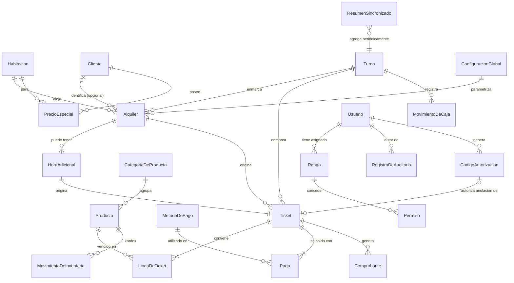

## 19. Modelo de información

### 19.1 Clasificación de los datos del sistema

| Categoría | Ejemplos en este sistema |
|---|---|
| Datos maestros | Habitaciones, Productos, Categorías de Producto, Métodos de Pago, Rangos, Permisos, Clientes |
| Datos transaccionales | Alquileres, Horas Adicionales, Tickets, Líneas de Ticket, Pagos, Ventas, Movimientos de Inventario, Movimientos de Caja |
| Datos operativos | Estado actual de cada Habitación, Turno en curso, sesiones activas de Usuario |
| Datos históricos | Todo registro transaccional una vez cerrado o anulado; historial de cambios de estado de habitación; Registros de Auditoría |
| Datos configurables | Configuración Global (horas base, minutos de aviso/cortesía, precio de hora adicional, datos del comprobante) |
| Datos de auditoría | Registros de Auditoría (por definición, un tipo de dato histórico especialmente protegido) |

### 19.2 Ciclos de vida relevantes

**Alquiler:** `Abierto → Cerrado` (flujo normal), o `Abierto → Voided/Anulado` (si el ticket de ingreso se anula). No existen otros estados intermedios persistidos; los estados temporales (a tiempo, por vencer, en cortesía, en sobretiempo) son proyecciones calculadas, no fases del ciclo de vida almacenadas (RN-11).

**Habitación:** `Libre → Ocupada → Pendiente de limpieza → Libre`, con la rama alternativa `→ Mantenimiento → Libre` accesible desde "Libre" o desde "Pendiente de limpieza".

**Ticket:** `Emitido (vigente) → Anulado`. Un ticket anulado no vuelve a estar vigente; la corrección posterior, si la hubiera, se realiza con un nuevo ticket.

**Turno:** `Abierto → Cerrado`. Un turno cerrado no vuelve a abrirse.

**Trabajo de impresión:** `Pendiente → Impreso`, o `Pendiente → Error → Pendiente` (reintento) `→ Impreso`.

**Precio Especial de Cliente:** `Vigente → (editado, permanece Vigente) | Eliminado`. No existe un estado "pendiente de aprobación" en esta versión (decisión explícita del negocio para el MVP).

## 20. Estados del sistema y máquinas de estado

### 20.1 Habitación

| Estado | Significado | Transición | Evento que la produce | Actor autorizado | Restricciones |
|---|---|---|---|---|---|
| Libre | Disponible para un nuevo alquiler | → Ocupada | Confirmación de un ingreso (RF-05) | Sistema (automático, dentro de CU-04) | Solo desde Libre puede iniciarse un alquiler (RN-28) |
| Ocupada | Tiene un alquiler abierto | → Pendiente de limpieza | Registro de salida (CU-06/CU-07) | Sistema (automático) | No puede iniciarse un segundo alquiler (RN-27) |
| Pendiente de limpieza | Requiere limpieza antes de reutilizarse | → Libre / → Mantenimiento | Marcado como lista (CU-16) / Reporte de mantenimiento (CU-17) | Personal de limpieza | Ninguna otra transición posible desde este estado |
| Mantenimiento | Bloqueada por reparación o incidencia | → Libre | Reactivación (CU-14) | Administrador | No puede recibir alquileres mientras esté en este estado (implícito en RN-28) |

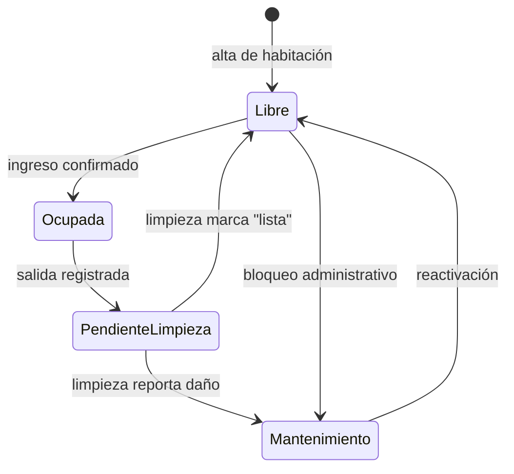

### 20.2 Alquiler

| Estado | Significado | Transición | Evento | Actor autorizado | Restricciones |
|---|---|---|---|---|---|
| Abierto | Estadía en curso | → Cerrado | Registro de salida (con o sin pago de sobretiempo) | Cajero | No puede cerrarse en sobretiempo sin resolverlo (RN-12) |
| Abierto | Estadía en curso (con horas adicionales) | → Abierto (se mantiene) | Cobro de hora adicional | Cajero | Cada hora adicional queda registrada individualmente |
| Cerrado | Estadía finalizada | (estado final) | — | — | Inmutable una vez alcanzado |
| Anulado | El ingreso original fue anulado | (estado final) | Anulación del ticket de ingreso | Administrador | Solo aplicable si el alquiler no tiene otros tickets vigentes posteriores sin resolver |

Ver también el diagrama de estados de la sección 8.2 de los Planos Técnicos, plenamente vigente para este documento.

### 20.3 Ticket

| Estado | Significado | Transición | Evento | Actor autorizado |
|---|---|---|---|---|
| Emitido | Cobro vigente | → Anulado | Anulación (CU-21) | Administrador (o Cajero autorizado) |
| Anulado | Cobro sin efecto, compensado | (estado final) | — | — |

### 20.4 Turno

| Estado | Significado | Transición | Evento | Actor autorizado |
|---|---|---|---|---|
| Abierto | Cajero operando | → Cerrado | Arqueo (CU-19) o cierre forzado (CU-20) | Cajero (el propio) o Administrador (forzado) |
| Cerrado | Periodo finalizado y controlado | (estado final) | — | — |

### 20.5 Trabajo de impresión

| Estado | Significado | Transición | Evento | Actor autorizado |
|---|---|---|---|---|
| Pendiente | En cola para imprimirse | → Impreso / → Error | Impresión exitosa / Falla de impresión | Sistema (automático) |
| Error | Falló el intento de impresión | → Pendiente | Reintento (manual o automático) | Sistema / Cajero |
| Impreso | Entregado a la impresora exitosamente | (estado final) | — | — |

## 21. Validaciones del sistema

| Categoría | Validaciones aplicables |
|---|---|
| Formatos | El documento de identidad, si se proporciona, debe registrarse en un formato reconocible (sin imponer un único formato rígido, dado que pueden presentarse distintos tipos de documento); los montos monetarios se ingresan y almacenan como enteros en la unidad menor de la moneda |
| Valores mínimos/máximos | Todo monto monetario debe ser mayor o igual a cero; la cantidad de horas adicionales solicitadas debe ser un entero positivo; el precio especial de un cliente debe ser mayor o igual a cero |
| Unicidad | Un número de habitación debe ser único; un nombre de usuario debe ser único; no puede existir más de un precio especial vigente para la misma combinación cliente + habitación; no puede existir más de un alquiler "Abierto" simultáneo para la misma habitación (RN-27) |
| Disponibilidad | Un alquiler solo puede iniciarse sobre una habitación en estado "Libre" (RN-28); una venta de un producto con control de stock no puede exceder la cantidad disponible (RN-26) |
| Consistencia | Un ajuste puntual nunca puede resultar en un monto inferior al mínimo calculado automáticamente (RN-18); el total de un ticket debe ser igual a la suma de sus líneas; la suma de los pagos de un ticket debe ser igual a su total |
| Integridad | Ninguna operación financiera puede eliminarse; toda corrección debe expresarse como una operación compensatoria vinculada a la original (RN-36) |
| Validación temporal | El estado temporal de un alquiler (RN-11) debe calcularse siempre a partir de la hora actual del servidor, nunca de la hora del dispositivo cliente, para evitar manipulación o desincronización |
| Restricciones comerciales | El precio de la hora adicional es independiente del precio base de la habitación (RN-10); el recargo o descuento de un cliente reemplaza, no suma, al precio de lista (RN-14) |

## 22. Matriz de permisos

Esta matriz desarrolla, a nivel de acción individual, la vista general ya presentada en la sección 11.2.

| Acción | Administrador | Cajero | Limpieza |
|---|:---:|:---:|:---:|
| Iniciar sesión | ✅ | ✅ | ✅ |
| Abrir turno propio | ✅ | ✅ | ❌ |
| Cerrar turno propio (arqueo) | ✅ | ✅ | ❌ |
| Forzar cierre de turno de otro usuario | ✅ | ❌ | ❌ |
| Registrar movimiento manual de caja | ✅ | ✅ | ❌ |
| Consultar tablero de habitaciones | ✅ | ✅ | Solo pendientes de limpieza |
| Registrar ingreso de huésped | ✅ | ✅ | ❌ |
| Cobrar tiempo adicional | ✅ | ✅ | ❌ |
| Registrar salida | ✅ | ✅ | ❌ |
| Registrar salida sin pago de sobretiempo | ✅ | ✅ (con motivo) | ❌ |
| Aplicar ajuste puntual (solo al alza) | ✅ | ✅ | ❌ |
| Crear/editar/eliminar precio especial de cliente | ✅ | ❌ | ❌ |
| Buscar cliente | ✅ | ✅ | ❌ |
| Vender en tienda | ✅ | ✅ | ❌ |
| Registrar ingreso de mercadería | ✅ | ❌ | ❌ |
| Gestionar catálogo de productos y sus precios | ✅ | ❌ | ❌ |
| Gestionar catálogo de habitaciones y precios | ✅ | ❌ | ❌ |
| Marcar habitación en mantenimiento / reactivar | ✅ | ❌ | ❌ |
| Ver habitaciones pendientes de limpieza | ✅ | ❌ | ✅ |
| Marcar habitación como lista | ✅ | ❌ | ✅ |
| Reportar habitación para mantenimiento | ✅ | ❌ | ✅ |
| Anular un ticket | ✅ | ✅ (solo con código de autorización temporal vigente, generado por un Administrador) | ❌ |
| Reimprimir comprobante | ✅ | ✅ | ❌ |
| Gestionar usuarios | ✅ | ❌ | ❌ |
| Gestionar rangos y permisos | ✅ | ❌ | ❌ |
| Consultar auditoría | ✅ | ❌ | ❌ |
| Consultar reportes | ✅ | ❌ | ❌ |
| Configurar parámetros generales | ✅ | ❌ | ❌ |
| Configurar métodos de pago | ✅ | ❌ | ❌ |
| Consultar resumen remoto | ✅ | ❌ | ❌ |

## 23. Auditoría y trazabilidad

### 23.1 Eventos que deben ser auditables

Todo evento de esta lista debe registrar, como mínimo: usuario responsable, fecha y hora exactas, tipo de acción, entidad afectada (y su identificador), y — cuando aplique — el valor previo, el valor nuevo y el motivo declarado.

- Inicio y cierre de sesión de usuario (incluyendo intentos fallidos de autenticación)
- Apertura y cierre de turno, incluyendo el resultado del arqueo
- Registro de movimiento manual de caja
- Registro de ingreso de huésped, incluyendo el precio aplicado (de lista, especial o con ajuste) y su origen
- Cobro de hora adicional, incluyendo su clasificación (extensión anticipada o liquidación de sobretiempo)
- Registro de salida, incluyendo el caso particular de salida sin pago de sobretiempo, con su motivo
- Creación, edición y eliminación de un precio especial de cliente
- Aplicación de un ajuste puntual de precio, con su motivo
- Venta de productos en la tienda
- Registro de ingreso de mercadería
- Cambios de estado de una habitación (incluyendo mantenimiento y reactivación)
- Anulación de un ticket, con su motivo
- Reimpresión de un comprobante
- Creación, edición y desactivación de un usuario
- Creación y edición de un rango, y cambios en los permisos que concede
- Asignación o cambio de rango de un usuario
- Cambios en la configuración general del sistema (horas base, minutos de aviso/cortesía, precio de hora adicional, datos del comprobante, métodos de pago)

### 23.2 Operaciones que nunca deben modificarse o eliminarse sin dejar trazabilidad

De acuerdo con RN-36, las siguientes entidades son estrictamente de solo adición (append-only) desde la perspectiva del negocio: **Alquileres**, **Tickets y sus Líneas**, **Pagos**, **Movimientos de Caja**, **Movimientos de Inventario** y los propios **Registros de Auditoría**. Cualquier corrección sobre estas entidades debe expresarse mediante un nuevo registro compensatorio o complementario (por ejemplo, un ticket de anulación), nunca mediante la edición o el borrado del registro original.

## 24. Manejo de errores

### 24.1 Clasificación de errores

| Categoría | Ejemplos en este sistema | Comportamiento esperado |
|---|---|---|
| Validación | Motivo vacío en un ajuste puntual o en una anulación; monto negativo | Rechazo inmediato de la operación, sin persistir ningún dato parcial, con un mensaje claro sobre el campo inválido |
| Negocio | Intento de cerrar un alquiler en sobretiempo sin resolverlo (RN-12); ajuste puntual por debajo del mínimo (RN-18); venta que excede el stock disponible (RN-26) | Rechazo de la operación con un mensaje que explique la regla de negocio incumplida, en lenguaje comprensible para el personal operativo |
| Permisos | Un usuario intenta ejecutar una acción para la que su rango no tiene el permiso correspondiente | Rechazo explícito, sin ejecutar ninguna parte de la operación; el intento queda registrado |
| Concurrencia | Dos solicitudes simultáneas de ingreso sobre la misma habitación | Exactamente una solicitud tiene éxito; la otra recibe un rechazo indicando que la habitación ya no está disponible |
| Infraestructura | Falla de la impresora térmica; falla temporal de la base de datos | La operación financiera, si ya fue confirmada, permanece válida; el efecto secundario que falló (por ejemplo, la impresión) queda en un estado de reintento, sin afectar el dato ya persistido |
| Comunicación | Corte de red entre un cliente (POS, Dashboard, app de limpieza) y el servidor durante una operación | El cliente debe poder reintentar la misma operación de forma segura (idempotencia, RF-59), sin riesgo de duplicar su efecto |
| Disponibilidad | El servidor local no responde (por ejemplo, durante un reinicio) | Los clientes deben informar claramente que el sistema no está disponible en ese momento, sin registrar operaciones parciales ni datos inconsistentes |
| Integridad | Se detecta una inconsistencia entre el total de un ticket y la suma de sus líneas o pagos | Este escenario no debería ocurrir si las validaciones se aplican correctamente en cada operación; de detectarse, debe tratarse como un defecto a corregir, y no como un caso a "manejar" silenciosamente |

### 24.2 Principio general de manejo de errores

Ante cualquier error de las categorías Validación, Negocio, Permisos o Concurrencia, el sistema no debe registrar ningún dato parcial: la operación se ejecuta por completo o no se ejecuta en absoluto. Este documento no fija, de forma deliberada, los códigos de error técnicos específicos (por ejemplo, códigos HTTP), salvo los identificadores de error de negocio ya mencionados a lo largo de la sección 16 (como `ROOM_NOT_AVAILABLE` o `ADJUSTMENT_BELOW_MINIMUM`), que sí deben mantenerse estables porque son parte del contrato entre el sistema y quienes lo integran.

---

# PARTE V — OPERACIÓN, INTERFACES Y CALIDAD DEL PROYECTO

## 25. Reportes y consultas

| Reporte | Objetivo | Usuarios | Filtros | Datos incluidos | Agrupaciones | Periodo | Exportación | Alcance |
|---|---|---|---|---|---|---|---|---|
| Ventas por periodo | Conocer cuánto ingresó y por qué concepto | Administrador | Fecha, origen (ingreso/hora adicional/tienda), método de pago, turno | Totales y detalle de tickets vigentes | Por día, por turno, por método de pago, por origen | Configurable (día, semana, mes, rango libre) | No definida como obligatoria en el MVP `[PEND-06]` | MVP (versión básica) |
| Ocupación por habitación | Identificar qué habitaciones tienen mayor y menor rotación | Administrador | Fecha, habitación | Cantidad de alquileres, horas vendidas por habitación | Por habitación, por franja horaria | Configurable | `[PEND-06]` | MVP (versión básica), profundidad adicional en Fase 2 |
| Productos vendidos | Identificar qué productos se venden más y en qué horario | Administrador | Fecha, producto, categoría | Cantidad vendida, ingreso generado | Por producto, por horario | Configurable | `[PEND-06]` | Fase 2 (versión con analítica por horario); un reporte básico de ventas por producto puede formar parte del MVP |
| Arqueos de caja | Controlar diferencias de caja por turno y cajero | Administrador | Fecha, cajero, terminal | Efectivo esperado, contado, diferencia | Por turno, por cajero | Configurable | `[PEND-06]` | MVP |
| Ingresos vs. egresos | Visión financiera neta del negocio | Administrador | Fecha, categoría de egreso | Ingresos totales, egresos por categoría, neto | Por categoría de egreso, por periodo | Configurable | `[PEND-06]` | Fase 2 |
| Resumen remoto | Visibilidad financiera para la propietaria fuera del local | Administrador (remoto) | Periodo reciente | Totales agregados de ingresos (y, en Fase 2, egresos) | Por día/semana | Reciente (con demora aceptable) | No aplica (solo consulta) | MVP |

## 26. Configuración del sistema

| Tipo de configuración | Elementos | Quién la gestiona |
|---|---|---|
| Configuración operativa | Duración base del alquiler (horas), minutos de aviso previo, minutos de cortesía, precio de la hora adicional, umbral de diferencia de arqueo que amerita una nota `[PEND-05]` | Administrador |
| Configuración comercial | Precio base de cada habitación, precios especiales por cliente, precios de huésped y de público de cada producto, métodos de pago habilitados | Administrador |
| Parámetros técnicos | Datos del comprobante (nombre del negocio y datos visibles), parámetros de la impresora (ancho de papel, tipo de conexión) | Administrador |

Todo elemento configurable listado aquí debe poder modificarse desde el Dashboard, sin intervención técnica directa sobre el sistema (RN-43).

## 27. Integraciones

En esta versión del sistema **no existen integraciones con sistemas externos de terceros**. El sistema opera de forma autónoma dentro de la red local del negocio, con dos excepciones que no constituyen integraciones con sistemas de terceros en sentido estricto: la comunicación con la **impresora térmica** (un dispositivo, no un sistema de información externo) y la sincronización hacia el **espejo en la nube** (un servicio propio del proyecto, no un tercero).

No se contempla, en el alcance de este documento, ninguna integración con pasarelas de pago electrónico, con el sistema de facturación electrónica de la autoridad tributaria, ni con sistemas de terceros de reservas u otros servicios. Si en el futuro se decidiera incorporar alguna de estas integraciones, requeriría una revisión y ampliación formal de este documento.

## 28. Requisitos de interfaz

### 28.1 Interfaz de usuario

El sistema se compone de tres interfaces de usuario diferenciadas, cada una diseñada para su contexto de uso específico: el **POS**, orientado a la operación rápida y repetitiva del cajero, priorizando un número mínimo de interacciones para las operaciones más frecuentes (RNF-USA-01); el **Dashboard**, orientado a la configuración y supervisión por parte de la propietaria, priorizando claridad sobre densidad de información dado su nivel de experiencia esperado en el uso de software (sección 11.1); y la **aplicación de limpieza**, deliberadamente mínima, pensada para uso ocasional desde un teléfono móvil, sin necesidad de instrucción previa (RNF-USA-02). En ninguna de las tres interfaces se realizan cálculos de precio o de tiempo: toda esa lógica reside exclusivamente en el sistema central, y las interfaces únicamente presentan lo que este determina.

### 28.2 Interfaz de hardware

La única interfaz de hardware relevante es la **impresora térmica** utilizada para emitir los comprobantes internos. El sistema debe comunicarse con ella mediante el conjunto de comandos estándar de la industria para este tipo de dispositivos (ESC/POS), soportando anchos de papel habituales (58 mm u 80 mm, configurable), y debe considerar explícitamente el correcto tratamiento de caracteres especiales del idioma español (tildes, la letra "ñ") en la codificación utilizada.

### 28.3 Interfaces con otros sistemas

No aplican en esta versión (ver sección 27).

### 28.4 Interfaces de comunicación

El sistema opera principalmente sobre la **red local (LAN)** del negocio, que ya existe y no requiere instalación adicional. La comunicación entre los clientes (POS, Dashboard local, aplicación de limpieza) y el sistema central se realiza dentro de esa red, sin depender de una conexión a internet para la operación diaria (RNF-DISP-02). Una comunicación adicional, hacia el **espejo en la nube**, requiere conexión a internet únicamente para la sincronización periódica y para la consulta remota de la propietaria (CU-28); esta comunicación es secundaria y no crítica para la operación diaria del negocio.

## 29. Restricciones

| ID | Restricción | Tipo | Descripción |
|---|---|---|---|
| RES-01 | Operación 24 horas | Operativa | El sistema debe permanecer disponible de forma ininterrumpida, dado que el negocio opera las 24 horas del día, todos los días |
| RES-02 | Desacople del módulo de tienda | Técnica / organizacional | El módulo de productos, inventario y ventas debe construirse sin dependencias estructurales hacia los conceptos del hospedaje, en previsión de su eventual reutilización para los otros dos negocios de la propietaria (papelería y ferretería), aunque dicha reutilización no forma parte del alcance actual |
| RES-03 | Hardware de gama modesta para el POS | Hardware | La aplicación del POS debe poder ejecutarse con fluidez en un equipo de especificaciones modestas, dado que el negocio planea adquirir un único equipo dedicado para el cajero con un presupuesto acotado (aunque con cierto margen de inversión adicional posible) |
| RES-04 | Operación local sin dependencia de internet | Infraestructura / conectividad | El sistema debe funcionar por completo dentro de la red local del negocio, incluso sin conexión a internet; solo la sincronización remota y la consulta fuera del local dependen de internet |
| RES-05 | Sin visibilidad en tiempo real fuera del local | Operativa (decisión explícita del negocio) | La propietaria, estando fuera del local, accede únicamente a un resumen con demora aceptable, no al tablero de ocupación en tiempo real; esta es una decisión deliberada, no una limitación técnica no resuelta |
| RES-06 | Desarrollo mediante múltiples agentes de inteligencia artificial en paralelo | Organizacional / de proceso de desarrollo | El sistema será construido con la colaboración de tres agentes de desarrollo asistido por inteligencia artificial distintos, trabajando en paralelo bajo la coordinación de un único integrador humano. Esta circunstancia no altera ninguna regla de negocio, pero impone la necesidad de que las reglas de negocio y los contratos de datos entre módulos queden formalizados con un nivel de precisión que permita a partes construidas de forma independiente integrarse sin ambigüedad |
| RES-07 | Comprobante sin valor tributario | Legal / de cumplimiento | El comprobante emitido por el sistema no constituye, en ningún caso, un documento fiscal válido ante la autoridad tributaria; el sistema debe evitar deliberadamente cualquier formato que pueda generar confusión al respecto (RN-39) |
| RES-08 | Presupuesto y alcance familiar del proyecto | Económica | El proyecto es desarrollado en un contexto de recursos acotados propios de un negocio familiar de una sola sede, lo que descarta soluciones de infraestructura de alto costo (servidores dedicados de gran capacidad, servicios en la nube de pago intensivo) a favor de soluciones locales y económicas |

**Nota sobre restricciones que no lo son:** durante el levantamiento de este proyecto, algunas ideas inicialmente consideradas como restricciones resultaron ser preferencias reconsiderables (por ejemplo, la elección original de un cliente de escritorio pesado para el POS fue reemplazada por una alternativa más liviana una vez evaluadas las alternativas). Este documento solo lista como restricción aquello que efectivamente condiciona el diseño de forma no negociable dentro del alcance actual del proyecto.

## 30. Supuestos y dependencias

| ID | Supuesto/Dependencia | Impacto | Riesgo si no se cumple |
|---|---|---|---|
| SUP-01 | El negocio ya cuenta con conexión a internet y red wifi instalada en el local | Permite el acceso local sin cableado adicional y sirve de base para la sincronización remota | Bajo — ya fue confirmado explícitamente por el negocio |
| SUP-02 | El negocio adquirirá un equipo dedicado para el cajero, de especificaciones al menos modestas | El POS depende de ejecutarse en ese equipo | Medio — si el equipo finalmente adquirido resultara insuficiente, podría requerir ajustes de rendimiento o una inversión adicional |
| SUP-03 | Se dispondrá de una impresora térmica compatible con comandos ESC/POS estándar | La emisión de comprobantes depende de esta compatibilidad | Medio — el modelo específico de impresora aún no fue confirmado (ver `PEND-07` en la sección 38) |
| SUP-04 | La propietaria y su hija dispondrán de un dispositivo con navegador web (celular, laptop) para el acceso administrativo y remoto | El Dashboard depende de esta disponibilidad | Bajo |
| SUP-05 | El personal de limpieza dispone de un teléfono celular personal o provisto por el negocio, con navegador web | La aplicación de limpieza depende de esta disponibilidad | Bajo |
| SUP-06 | Los tres agentes de desarrollo de inteligencia artificial mantendrán acceso continuo durante el desarrollo, bajo la coordinación de Reizo | La velocidad y consistencia del desarrollo depende de esta disponibilidad | Bajo — es una condición ya establecida del proyecto |
| SUP-07 | El diseño visual definitivo (Figma) será entregado por el equipo del proyecto en un momento posterior al desarrollo funcional | La aplicación del diseño final depende de esta entrega, programada para la Fase 2 | Bajo — no bloquea el MVP |
| SUP-08 | El negocio cuenta hoy con la capacidad operativa (personal, horarios) para sostener un periodo de operación en paralelo entre el sistema nuevo y el cuaderno actual, durante la puesta en marcha | Permite validar el sistema sin riesgo de pérdida de información durante la transición | Medio — si no se sostiene el paralelo, un error temprano del sistema podría no detectarse a tiempo |

## 31. Escenarios operativos completos

### Escenario 31.1 — Ciclo completo de un alquiler sin incidencias

**Normal:** El cajero abre su turno (CU-02) con S/ 100.00 de efectivo inicial. A las 14:00, un cliente solicita una habitación; el cajero selecciona la habitación 205 (libre, precio S/ 30.00), no identifica al cliente por documento, cobra S/ 30.00 en efectivo (CU-04). El sistema calcula la salida programada a las 22:00 (8 horas base) y emite el comprobante. A las 21:50, el sistema avisa que faltan 10 minutos. A las 22:05, el cliente sale — dentro del periodo de cortesía de 15 minutos — y el cajero registra la salida sin cargo (CU-06). La habitación pasa a "Pendiente de limpieza"; minutos después, el personal de limpieza la marca como lista desde su celular (CU-16), quedando disponible nuevamente.

**Alternativo:** El cliente sale exactamente a las 22:00, sin ningún retraso; el flujo es idéntico salvo que no llega a activarse ningún aviso de sobretiempo.

**Errores posibles:** Ninguno en este escenario; se documenta como caso base de referencia.

**Información generada:** Un alquiler cerrado, un ticket de ingreso vigente, un pago, un comprobante impreso, un cambio de estado de habitación (dos veces: a Ocupada y luego a Pendiente de limpieza), un cambio de estado de habitación a Libre por acción de limpieza.

**Módulos afectados:** Caja y Turnos, Habitaciones, Alquileres, Comprobantes, Limpieza.

### Escenario 31.2 — Sobretiempo con venta de tienda asociada

**Normal:** Un huésped en la habitación 107 (ingresó a las 10:00, salida programada 18:00) compra, a las 15:00, dos bebidas en la tienda; el cajero asocia la venta a su habitación (de forma opcional, RN-24) y aplica el precio de huésped (CU-11). A las 18:20, superados los 15 minutos de cortesía, el sistema clasifica el alquiler como "en sobretiempo". El cajero cotiza la hora adicional: como corresponde a una liquidación de sobretiempo, el sistema calcula la nueva salida como las 19:20 (una hora desde el momento del pago, no desde las 18:00). El cliente paga S/ 8.00 (CU-05); el sistema marca la cortesía de este alquiler como consumida. A las 19:10, el cliente decide retirarse antes de agotar esa hora adicional; el cajero registra la salida sin cargo adicional, dado que el alquiler ya no está en sobretiempo (CU-06).

**Alternativo:** El cliente, en lugar de retirarse a las 19:10, vuelve a exceder su tiempo tras las 19:20. Como la cortesía ya fue consumida, el sistema exige de inmediato el pago de otra hora adicional o la salida, sin otorgar un nuevo periodo de tolerancia (RN-07).

**Errores posibles:** Si el cajero intentara registrar la salida directamente a las 18:20 (en sobretiempo) sin pasar por CU-05 o CU-07, el sistema lo rechaza (RF-14).

**Información generada:** Un ticket de venta, un ticket de hora adicional (clasificado como sobretiempo), actualización de la hora de salida programada, indicador de cortesía consumida en el alquiler.

**Módulos afectados:** Alquileres, Tienda, Comprobantes.

### Escenario 31.3 — Cliente con precio especial que además excede su tiempo y se retira sin pagar

**Normal:** Un cliente reconocido por su documento ingresa a la habitación 202, para la cual la propietaria le fijó un precio especial de S/ 50.00 (en lugar del precio de lista). El cajero lo identifica al ingresar; el sistema detecta y aplica automáticamente el precio especial (CU-04, RF-17). Horas después, el alquiler entra en sobretiempo; el cliente ya se había retirado sin avisar. El cajero, al intentar registrar la salida, es bloqueado por el sistema (RF-14) e invoca en su lugar el flujo de salida sin pago (CU-07), indicando el motivo "cliente se retiró sin avisar".

**Alternativo:** Si el cliente hubiese regresado antes de que otro huésped necesitara la habitación, el cajero podría haber cobrado normalmente la hora adicional en vez de usar CU-07.

**Errores posibles:** Ninguno adicional a los ya cubiertos en CU-07.

**Información generada:** Ingreso con precio especial aplicado, alquiler cerrado con indicador de sobretiempo no cobrado y su motivo — un evento que alimentará directamente los reportes de control en la Fase 2.

**Módulos afectados:** Alquileres, Clientes y Precios Especiales, Auditoría.

### Escenario 31.4 — Turno con múltiples operaciones y diferencia de caja al cierre

**Normal:** El cajero abre su turno con S/ 50.00. Durante el turno, registra varios ingresos y ventas en efectivo, Yape y Plin, además de un retiro manual de S/ 20.00 (para un gasto menor). Al cerrar el turno (CU-19), cuenta el efectivo físico antes de que el sistema le revele el esperado (RN-34); el sistema calcula el esperado sumando el inicial, los cobros en efectivo y el resultado neto de los movimientos manuales (RN-33), y determina una diferencia de −S/ 5.00.

**Alternativo:** Si la diferencia resultara significativa según el umbral configurado, el sistema podría solicitar una nota explicativa antes de completar el cierre — comportamiento sujeto a confirmación (`PEND-05`).

**Errores posibles:** Ninguno bloqueante; una diferencia de caja no impide el cierre del turno, solo queda registrada para su revisión posterior por la propietaria.

**Información generada:** Cierre de turno con efectivo esperado, contado y diferencia; historial completo de movimientos del turno disponible para auditoría.

**Módulos afectados:** Caja y Turnos, Auditoría, Reportes.

### Escenario 31.5 — Corrección de un error mediante anulación

**Normal:** El cajero registra por error el ingreso de un cliente en la habitación 105 en lugar de la 106. Detecta el error inmediatamente después de confirmado el cobro. Solicita la anulación del ticket de ingreso (CU-21), indicando el motivo "habitación incorrecta". El sistema genera un ticket compensatorio, revierte el estado de la habitación 105 (dado que su alquiler asociado queda anulado) y el cajero procede a registrar correctamente el ingreso en la habitación 106.

**Alternativo:** Si para ese momento el cliente ya hubiese pagado además una hora adicional sobre el alquiler mal registrado, el sistema exige anular primero esa hora adicional antes de poder anular el ingreso original (para mantener la consistencia de RN-36).

**Errores posibles:** Intento de anular un ticket que ya fue anulado previamente (`TICKET_ALREADY_VOIDED`).

**Información generada:** Ticket compensatorio vinculado al original, cambio de estado de la habitación 105 (de vuelta a disponible), nuevo alquiler correctamente registrado en la habitación 106, registro de auditoría de la anulación con su motivo.

**Módulos afectados:** Alquileres, Habitaciones, Auditoría, Caja y Turnos (si la anulación afecta el efectivo esperado del turno vigente).

## 32. Casos borde

| Situación | Comportamiento esperado | Módulos afectados |
|---|---|---|
| Interrupción de red o de energía a mitad de la confirmación de un cobro | Al restablecerse la conexión, un reintento con el mismo identificador de operación no debe duplicar el cobro (RF-59); el resultado final debe ser "el cobro ocurrió exactamente una vez" o "no ocurrió en absoluto", nunca un estado intermedio | Alquileres, Tienda, Caja |
| Dos cajeros (o dos terminales) intentan iniciar un alquiler sobre la misma habitación de forma simultánea | Exactamente uno tiene éxito; el otro recibe un rechazo indicando que la habitación ya no está disponible (RF-58, T-15) | Habitaciones, Alquileres |
| Se intenta anular un ticket de ingreso cuando el alquiler ya tiene horas adicionales cobradas sobre él | El sistema debe exigir la resolución de las operaciones dependientes antes de permitir la anulación del ticket de origen, o resolverlas de forma consistente como parte de la misma anulación — comportamiento exacto sujeto a definición de diseño posterior, sin contradecir RN-36 | Alquileres |
| Se modifica el precio de una habitación mientras existe un alquiler abierto sobre ella | El alquiler abierto conserva el precio con el que fue pactado (RN-44); solo los alquileres iniciados después del cambio usan el nuevo precio | Habitaciones, Alquileres |
| Se modifican los minutos de cortesía o el precio de la hora adicional mientras existen alquileres abiertos | Los alquileres ya abiertos deben continuar rigiéndose por los parámetros vigentes al momento de su ingreso, de forma consistente con RN-44 — extensión razonable del mismo principio a los parámetros de configuración `[PEND-08]` | Configuración, Alquileres |
| Un mismo cliente se presenta en distintas visitas con variaciones menores en cómo se escribe su nombre, sin documento de identidad | El sistema no puede garantizar el reconocimiento automático si no existe un documento como identificador estable; se recomienda priorizar el documento de identidad como clave de reconocimiento siempre que esté disponible | Clientes y Precios Especiales |
| El personal de limpieza intenta marcar como lista una habitación que no se encuentra en estado "Pendiente de limpieza" | El sistema rechaza la operación, dado que esa transición solo es válida desde ese estado específico (sección 20.1) | Limpieza, Habitaciones |
| Falla de la impresora térmica durante la emisión de un comprobante | El cobro permanece válido; el trabajo de impresión queda en estado "Error", disponible para reintento manual o automático, sin afectar ninguna otra operación (RF-56) | Comprobantes |
| Doble clic o doble confirmación accidental de un cobro por parte del cajero | El identificador de operación (idempotencia) impide que se genere un segundo cobro; el sistema debe devolver el mismo resultado de la primera confirmación | Alquileres, Tienda |
| El cajero selecciona accidentalmente la habitación incorrecta para registrar una salida | Si la salida se registra por error, la corrección se realiza mediante los mecanismos de anulación disponibles (CU-21), no mediante la edición directa del alquiler ya cerrado, preservando RN-36 | Alquileres, Auditoría |
| Un turno queda abierto durante un periodo excesivamente largo (el cajero olvida cerrarlo) | El sistema no cierra turnos automáticamente en esta versión; un usuario Administrador puede forzar su cierre (CU-20) cuando lo detecte | Caja y Turnos |
| El reloj del equipo servidor se desincroniza respecto a la hora real | Dado que todo el cálculo de tiempo depende del reloj del servidor (RN-11, RF-07), una desincronización de ese reloj afecta directamente la exactitud de los cobros de tiempo; se recomienda como buena práctica de despliegue mantener el reloj del servidor sincronizado por un mecanismo estándar, aunque esto excede el alcance funcional de este documento | Alquileres (impacto transversal) |
| Se elimina un precio especial de cliente mientras ese cliente se encuentra actualmente alojado bajo ese precio | La eliminación no afecta al alquiler ya en curso (que conserva el precio con el que fue pactado, por el mismo principio de RN-44); solo afecta a partir de la siguiente visita | Clientes y Precios Especiales, Alquileres |
| Un producto sin control de stock activado (por ejemplo, un servicio) se vende repetidamente | La venta se permite sin verificación de cantidad disponible, dado que ese producto no lleva control de stock; esta es una configuración válida por producto, no una excepción del sistema | Tienda |

## 33. Criterios generales de aceptación

El sistema se considera aceptable para su puesta en producción cuando se verifican, como mínimo, las siguientes condiciones: (1) todos los requisitos funcionales de prioridad Crítica y Alta (sección 16) se encuentran implementados y verificados mediante sus criterios de aceptación individuales; (2) la totalidad de los casos de prueba de tiempo y precio de la sección 16.10 pasa de forma consistente; (3) los requisitos no funcionales de Seguridad, Integridad de Datos y Confiabilidad (secciones 17.4, 17.5 y 17.3) se encuentran verificados; (4) se ha ejecutado al menos una prueba de restauración de respaldo exitosa (RNF-BKP-02); (5) el sistema ha operado en un piloto paralelo al cuaderno actual durante un periodo no menor a una semana, sin discrepancias significativas entre ambos registros; (6) el personal operativo real del negocio (no solo el equipo de desarrollo) ha completado sin asistencia las operaciones más frecuentes (ingreso, salida, venta, cierre de turno, marcado de limpieza) tras una capacitación breve; y (7) no existen defectos abiertos de severidad crítica o alta relacionados con el cálculo de tiempo, precio o efectivo.
