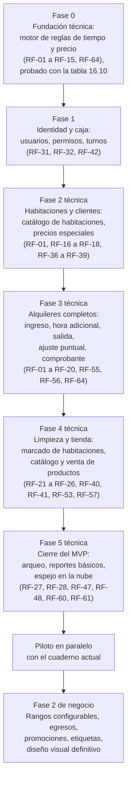

# Especificación de Requisitos de Software (SRS)

## Sistema Integral de Gestión — El Apurimeño

### Parte 2 de 2 — Trazabilidad, gestión del proyecto y cierre

*Continúa directamente la numeración y las convenciones establecidas en la Parte 1 (secciones 1 a 33). Este documento no repite el contenido ya cubierto; debe leerse como continuación del mismo SRS versión 1.0.*

---

# PARTE VI — TRAZABILIDAD, GESTIÓN DEL PROYECTO Y CIERRE

## 34. Matriz de trazabilidad

Esta matriz recorre, para cada objetivo de negocio, la cadena completa hasta los requisitos concretos que lo satisfacen: **Objetivo → Necesidad → Regla de negocio (representativa) → Caso de uso → Requisito funcional → Requisito no funcional**. No repite exhaustivamente cada una de las más de cien referencias cruzadas ya documentadas dentro de las secciones 8, 14 y 16 (donde cada regla, caso de uso y requisito individual ya declara sus relaciones); su propósito es demostrar que **ninguna funcionalidad del sistema carece de una razón de negocio que la justifique**, y viceversa.

| Objetivo | Necesidad | RN (representativas) | CU (representativos) | RF (representativos) | RNF (representativos) |
|---|---|---|---|---|---|
| OBJ-N-001 / OBJ-S-001 — Eliminar el registro en papel | Registro confiable e irreversible de cada transacción | RN-36, RN-37 | CU-04, CU-06, CU-11 | RF-04, RF-13, RF-24, RF-29 | RNF-INT-01, RNF-INT-02, RNF-CONF-01 |
| OBJ-N-002 / OBJ-S-003 — Control de caja verificable | Control verificable del dinero | RN-32 a RN-35 | CU-02, CU-19, CU-18 | RF-27, RF-28, RF-32, RF-42 | RNF-SEG-01, RNF-CONC-01 |
| OBJ-N-003 / OBJ-S-002 — Estandarizar el cobro del tiempo | Aplicar consistentemente las reglas de tiempo y precio | RN-01 a RN-12 | CU-04, CU-05, CU-06 | RF-01 a RF-15, RF-64 | RNF-PERF-01, RNF-MANT-01 |
| OBJ-N-004 / OBJ-S-004 — Trazabilidad de decisiones comerciales | Delegar operación sin perder control | RN-14 a RN-19 | CU-08, CU-10 | RF-16 a RF-20 | RNF-SEG-02, RNF-AUD-01 |
| OBJ-N-005 / OBJ-S-005 — Visibilidad remota | Supervisión sin presencia física constante | RN-45 | CU-28 | RF-60, RF-61 | RNF-SYNC-01, RNF-SYNC-02, RNF-DISP-02 |
| OBJ-N-006 / OBJ-S-006 — Base reutilizable para otros negocios | Aprovechar el módulo de tienda a futuro | RN-20 a RN-26 | CU-11, CU-12, CU-29 | RF-21 a RF-25, RF-53, RF-57 | RNF-MANT-02 |
| OBJ-N-007 / OBJ-S-007 — Privacidad del cliente | Proteger datos personales | RN-38, RN-39 | CU-04, CU-22 | RF-06, RF-44, RF-55 | RNF-PRIV-01, RNF-PRIV-02 |

**Observación de completitud:** todas las reglas de negocio catalogadas en la sección 8 quedan referenciadas por al menos un caso de uso (sección 14) y al menos un requisito funcional (sección 16), con la única excepción deliberada de RN-08 en su alcance más amplio, cuya implementación completa (incluido RF-64) fue incorporada tras la confirmación explícita del negocio durante la revisión de este documento.

## 35. Priorización (MoSCoW)

La clasificación siguiente no elimina ninguna funcionalidad del alcance final del producto (sección 9.1); organiza el orden en que debe construirse. Se aplica a nivel de módulo/capacidad, no a cada RF individual (cuya prioridad Crítica/Alta/Media/Baja ya se declaró en la sección 16).

### Must Have (indispensable para el MVP, sección 9.3)

Gestión de habitaciones con precio individual; ciclo completo de alquiler (ingreso, hora adicional en sus dos casos — incluyendo horas pagadas al ingreso, RF-64 —, salida, salida sin pago); precios especiales de cliente; ajuste puntual con su regla de mínimo; tienda con doble precio y stock único; limpieza con marcado directo; turnos de caja con arqueo ciego; comprobante térmico no fiscal sin datos personales; motor de permisos con los tres rangos iniciales operando; reportes básicos de ventas; sincronización remota con resumen para la propietaria.

### Should Have (deseable en el corto plazo tras el MVP)

Interfaz de creación y edición libre de rangos y permisos personalizados; anulación de tickets con resolución de efectos secundarios; reimpresión de comprobantes; consulta de auditoría con filtros; reporte de ocupación por habitación.

### Could Have (valioso, sin urgencia)

Registro estructurado de egresos y reportes comparativos de ingresos contra egresos; reporte de productos más vendidos con analítica por horario; botones de selección rápida de horas adicionales (1/2/5 horas) como mejora de usabilidad del POS (RF-64); exportación de reportes.

### Won't Have por ahora (explícitamente fuera del alcance actual, sección 9.2)

Comprobante fiscal real (SUNAT); reservas anticipadas; alquiler por días; aplicaciones móviles nativas; integración con pasarelas de pago; soporte funcional multi-negocio; sistema de promociones (hasta que se definan sus reglas, `PEND-03`).

## 36. Riesgos del proyecto

| ID | Riesgo | Categoría | Probabilidad | Impacto | Mitigación |
|---|---|---|---|---|---|
| RIE-01 | Un error en el cálculo de tiempo/precio (el módulo más sensible del sistema) llega a producción sin detectarse | Técnico / de datos | Media | Alto | Implementar y ejecutar en verde la totalidad de los casos de prueba de la sección 16.10 antes de cualquier liberación; tratar `packages/domain` (equivalente en los Planos Técnicos) como código crítico sujeto a revisión obligatoria |
| RIE-02 | El personal operativo se resiste a adoptar el sistema y continúa usando el cuaderno en paralelo indefinidamente | Adopción | Media | Alto | Priorizar la simplicidad de la interfaz del POS (RNF-USA-01); realizar el piloto en paralelo (sección 33) con acompañamiento activo durante la transición |
| RIE-03 | Los tres agentes de desarrollo de IA producen implementaciones incompatibles entre sí de una misma regla de negocio | Técnico / de proceso | Media | Alto | Este mismo documento como contrato único; disciplina de contratos de datos compartidos entre los módulos construidos por cada agente (RES-06) |
| RIE-04 | El equipo adquirido para el cajero resulta insuficiente en la práctica para un uso fluido | Infraestructura | Baja-Media | Medio | Definir con antelación los requisitos mínimos de hardware antes de la compra; considerar el margen de inversión adicional ya contemplado por el negocio |
| RIE-05 | Pérdida de datos por falla del equipo servidor sin respaldo verificado | Datos | Baja | Muy alto | Cumplimiento estricto de RNF-BKP-01 y RNF-BKP-02 (respaldo periódico y prueba de restauración) antes de la puesta en producción |
| RIE-06 | Un cajero, actuando de mala fe, cobra un ajuste puntual y no lo declara correctamente al cliente, o abusa de la salida sin pago de sobretiempo | Seguridad / control interno | Baja-Media | Medio | Auditoría obligatoria de ambos eventos (RN-42); los reportes de control de la Fase 2 (sección 25) están específicamente pensados para detectar patrones de este tipo |
| RIE-07 | El comprobante impreso, pese a las precauciones de diseño, es percibido o utilizado como si tuviera valor fiscal | Legal / de cumplimiento | Baja | Alto | Cumplimiento estricto de RN-39 y RES-07; revisión del contenido del comprobante antes de la puesta en producción; recomendación de consulta legal si el negocio tuviera dudas específicas |
| RIE-08 | La sincronización hacia el espejo en la nube expone información del negocio ante un incidente de seguridad del servicio remoto | Seguridad | Baja | Medio | Limitar la sincronización a datos agregados de resumen, nunca al detalle operativo completo (RNF-SYNC-01); autenticación obligatoria para el acceso remoto (RNF-SEG-06) |
| RIE-09 | El alcance del proyecto crece de forma descontrolada durante el desarrollo ("scope creep"), retrasando el MVP | Alcance | Media | Medio | Disciplina de las secciones 9.3/9.4 (MVP vs. Fase 2) y 35 (MoSCoW); cualquier incorporación debe justificarse contra este documento, no decidirse de forma ad hoc |
| RIE-10 | Dependencia de un integrador único (Reizo) para la coordinación entre los tres agentes de desarrollo y la relación con el negocio | Organizacional | Baja-Media | Alto | Mantener este documento como fuente de verdad autosuficiente, de forma que el conocimiento del proyecto no dependa exclusivamente de una persona |

## 37. Decisiones ya tomadas

### 37.1 Inconsistencias detectadas y resueltas durante el análisis

Como parte del análisis crítico de este documento, se identificaron y resolvieron las siguientes contradicciones entre versiones sucesivas del entendimiento del proyecto:

> ⚠ **Inconsistencia detectada (resuelta):** una versión preliminar de las reglas de negocio establecía que un alquiler vencido "no genera deuda automática" y que el cierre de un alquiler nunca debía ser un momento de cobro. Esta afirmación entraba en contradicción directa con la regla, posteriormente confirmada de forma explícita, de que "cada hora extra se cobra S/ 8.00" y de que existe un margen de cortesía que, una vez superado, debe traducirse en un cobro real. **Resolución adoptada:** se introdujo el mecanismo de liquidación de sobretiempo (RN-06, RN-12) como la forma en que el cobro efectivamente ocurre al momento de la salida, preservando a la vez el principio de que no existen cuentas abiertas ni cobros automáticos sin intervención del cajero.

> ⚠ **Inconsistencia detectada (resuelta):** una fórmula preliminar de cálculo aplicaba el margen de cortesía sobre el tiempo *comprado* por el cliente al ingresar, en lugar de aplicarlo exclusivamente sobre el momento de la *salida*. Esto habría permitido, por ejemplo, que un cliente que solicitara 8 horas y 10 minutos pagara como si hubiese solicitado solo 8 horas — un comportamiento que nadie del negocio había decidido. **Resolución adoptada:** el margen de cortesía (RN-04) se aplica única y exclusivamente a la tolerancia de salida tras el vencimiento del tiempo contratado, nunca al tiempo solicitado al ingresar.

### 37.2 Tabla de decisiones tomadas

| Decisión | Motivación | Impacto | Módulos afectados |
|---|---|---|---|
| El sobretiempo se liquida (se cobra) al momento de la salida, en lugar de no generar cargo | Coherencia con la regla explícita de cobro de horas extra; ver 37.1 | Introduce RN-06, RN-07, RN-11, RN-12 y los casos de uso CU-05, CU-06, CU-07 | Alquileres |
| El precio de cada habitación se fija individualmente, según sus comodidades, y no por piso | El negocio confirmó, con evidencia fotográfica, que el precio depende de si la habitación tiene baño propio y su tamaño, no de su ubicación en el edificio | Descarta cualquier modelo de "tarifa por piso"; cada habitación mantiene su propio precio configurable | Habitaciones |
| El precio especial de un cliente reemplaza al precio de lista, en vez de sumarse a él | Aclaración explícita del negocio | Simplifica el cálculo de precio (RN-14); evita ambigüedad sobre si un "descuento" se compone con el precio base | Clientes y Precios Especiales, Alquileres |
| El ajuste puntual del cajero solo puede aumentar el precio, nunca disminuirlo por debajo del mínimo calculado automáticamente | Corrección explícita del negocio, para evitar descuentos no autorizados por el personal | Introduce RN-18 y su validación correspondiente (RF-20) | Alquileres, Tienda |
| Los productos de la tienda tienen dos precios (huésped/público) sobre un único stock, en lugar de duplicar el inventario | Recomendación técnica aceptada por el negocio, que inicialmente había propuesto duplicar el inventario | Evita inconsistencias de stock entre dos "copias" del mismo producto | Tienda |
| El personal de limpieza marca una habitación como lista de forma directa, sin confirmación adicional del cajero | Aclaración explícita del negocio | Simplifica el flujo operativo de limpieza (RN-30, CU-16) | Limpieza |
| El sistema opera de forma local-first, con un espejo en la nube separado, de solo resumen y con demora aceptable | Requisito explícito de independencia de internet para la operación diaria, combinado con la necesidad de visibilidad remota de la propietaria | Define la arquitectura de despliegue completa (RES-04, RNF-DISP-02, RNF-SYNC-01) | Todo el sistema |
| Los permisos son un catálogo fijo en código; los rangos son libremente configurables sobre ese catálogo | Necesidad de que la configurabilidad solicitada por la propietaria sea real (cada permiso corresponde a una verificación efectiva) y no una promesa vacía | Define el modelo de autorización completo | Usuarios y Permisos |
| El comprobante impreso no incluye datos personales del cliente y declara explícitamente su condición de documento no fiscal | Aclaración explícita del negocio, reforzada por una recomendación de cumplimiento | Define el contenido obligatorio y prohibido del comprobante (RN-38, RN-39) | Comprobantes |
| Las horas adicionales pueden pagarse tanto de forma anticipada al ingreso como durante una estadía en curso, y ambas se cuentan de forma aditiva sobre la hora de salida vigente | Confirmación explícita del negocio, con el detalle adicional de que el cálculo inicial de la hora de salida debe contemplar las horas pagadas al ingreso | Resuelve `PEND-01`; introduce RF-64 | Alquileres |
| Un cajero puede anular un ticket con un código de autorización temporal generado por un Administrador desde el Dashboard, incluso de forma remota, en lugar de requerir la presencia física de un supervisor | Decisión explícita del negocio, que además resuelve el caso de una propietaria que supervisa a distancia | Resuelve `PEND-04`; introduce RN-46, RF-65, RF-66 y modifica CU-21 | Caja, Usuarios y Permisos |
| Los cambios en los parámetros de tiempo (cortesía, precio de hora adicional) no afectan a los alquileres ya abiertos | Confirmación explícita del negocio, por el mismo principio ya aplicado a los precios de habitación (RN-44) | Resuelve `PEND-08`; confirma el comportamiento ya especificado en RN-43, RF-50 y RF-51 | Configuración, Alquileres |
| La impresora térmica del negocio es el modelo REDPOS RED-E803 (80 mm, comandos ESC/POS, conexión USB o Bluetooth únicamente — sin red/wifi —, con soporte de códigos de barras 1D/2D y logotipos) | Compra ya realizada por el negocio; interfaz confirmada por el propietario a partir de material del fabricante | Resuelve `PEND-07` por completo; el sistema debe imprimir por USB o Bluetooth local al equipo del cajero, nunca por red | Comprobantes |

## 38. Decisiones de negocio aún pendientes

Cada decisión pendiente incluye un valor asumido razonable (cuando aplica) para no bloquear el desarrollo, sin que ese valor deba considerarse definitivo.

| ID | Pregunta | Por qué debe decidirse | Impacto | Alternativas razonables | Recomendación técnica | Momento del proyecto en que debe resolverse |
|---|---|---|---|---|---|---|
| PEND-01 | *(Resuelto durante esta revisión)* ¿Existe la extensión anticipada de horas en la práctica? | — | — | — | — | Resuelto: ver sección 37.2; incorporado como RN-08 y RF-64 |
| PEND-02 | ¿Qué etiquetas de servicios adicionales por habitación se desean a futuro (TV, internet, etc.)? | Define el catálogo inicial de la funcionalidad de Fase 2 correspondiente | Bajo en el corto plazo (no bloquea el MVP) | Catálogo abierto sin tipos predefinidos, cargado por el Administrador según necesidad | Diferir la decisión hasta que el negocio identifique casos concretos; el campo debe quedar configurable desde su diseño | Antes de iniciar la Fase 2 |
| PEND-03 | ¿Qué tipo de promociones se desean implementar? | Sin reglas concretas, no puede diseñarse el módulo correspondiente | Bajo (fuera del MVP) | — | Diferir hasta que el negocio proponga ejemplos concretos de promociones deseadas | Antes de iniciar la Fase 2 |
| PEND-04 | *(Resuelto)* ¿Debe un cajero poder anular un ticket por sí mismo con autorización de un supervisor, o esta operación debe quedar reservada exclusivamente al Administrador? | — | — | — | — | Resuelto: el cajero puede anular con un código de autorización temporal (aleatorio, de un solo uso, vigencia breve), generado por un Administrador desde el Dashboard incluso de forma remota. Ver RN-46, CU-21, RF-65, RF-66 |
| PEND-05 | Ante una diferencia significativa de arqueo al cierre de turno, ¿el sistema debe exigir una nota explicativa antes de permitir el cierre? | Afecta el flujo de CU-19 | Bajo-Medio | (a) Exigir nota sobre un umbral configurable; (b) permitir el cierre siempre, dejando la nota como opcional | Se recomienda la alternativa (a), con un umbral configurable razonable (por ejemplo, S/ 5.00) | Antes de finalizar el módulo de Caja y Turnos |
| PEND-06 | ¿Qué reportes del MVP requieren, desde el inicio, capacidad de exportación (por ejemplo, a una hoja de cálculo)? | Afecta el alcance exacto de RF-47/RF-48 dentro del MVP | Bajo | (a) Ninguna exportación en el MVP, solo consulta en pantalla; (b) exportación básica desde el inicio | Se recomienda (a) para el MVP, incorporando exportación en la Fase 2 junto con los reportes de egresos | Antes de cerrar el alcance detallado de la primera entrega |
| PEND-07 | *(Resuelto)* Modelo e interfaz de impresora confirmados: REDPOS RED-E803, 80 mm, comandos ESC/POS, conexión únicamente por USB o Bluetooth (sin red/wifi); soporta códigos de barras 1D/2D y logotipos. | — | — | — | El sistema debe imprimir por transporte local (USB o Bluetooth) al equipo del cajero, nunca por red; la capacidad de logotipo puede usarse para el encabezado del comprobante; cualquier código de barras/QR que se decida imprimir no debe imitar el formato de un comprobante SUNAT (RN-39) | Resuelto |
| PEND-08 | *(Resuelto)* ¿Un cambio en los parámetros de tiempo (minutos de cortesía, precio de hora adicional) debe respetar el mismo principio de "no retroactividad" que ya aplica a los precios de habitación (RN-44)? | — | — | — | — | Resuelto: confirmado por el negocio. Los cambios de configuración no afectan a los alquileres ya abiertos, por el mismo principio de RN-44 (ya reflejado en RN-43, RF-50 y RF-51) |

## 39. Roadmap funcional sugerido

El orden de las fases respeta las dependencias reales entre módulos (sección 13.2): no puede cobrarse sin turno de caja (RN-32), no puede calcularse un precio sin el motor de tiempo/precio, y no puede probarse la impresión sin que exista ya algo que imprimir.

Esta secuencia técnica corresponde exactamente al alcance del MVP definido en la sección 9.3 y a la priorización Must Have de la sección 35; la "Fase 2 de negocio" agrupa el resto de lo clasificado como Should/Could Have. No se organizan las fases por capas técnicas aisladas (por ejemplo, "primero todo el backend, luego todo el frontend"), sino por bloques de funcionalidad verificable de punta a punta, de forma que cada fase técnica entregue algo comprobable, no solo una porción invisible de infraestructura.

## 40. Glosario del dominio

| Término | Definición |
|---|---|
| Alquiler | Estadía de un cliente en una habitación, desde el ingreso hasta la salida |
| Ajuste puntual | Modificación del precio de una transacción específica, decidida por el cajero, únicamente al alza, con motivo obligatorio, sin efecto en visitas futuras |
| Arqueo | Conteo del efectivo físico al cierre de un turno, comparado contra el efectivo esperado por el sistema |
| Auditoría | Registro inmutable de las acciones sensibles realizadas en el sistema |
| Cortesía (periodo de) | Margen de 15 minutos (configurable) tras el vencimiento del tiempo contratado, durante el cual no se genera ningún cargo; se otorga una sola vez por alquiler |
| Dashboard | Aplicación web de administración y supervisión, de uso principal de la propietaria y su hija |
| Extensión anticipada | Compra de horas adicionales mientras el alquiler aún no ha vencido, ya sea al momento del ingreso o durante la estadía; el tiempo se suma a la hora de salida vigente |
| Hora adicional | Bloque de una hora, de precio fijo configurable, que se vende para prolongar una estadía |
| Hora base | Duración incluida en el precio de la habitación (8 horas, configurable) |
| Liquidación de sobretiempo | Cobro de una hora adicional cuando el cliente ya superó el periodo de cortesía; el nuevo periodo se cuenta desde el momento del pago |
| Perfil de negocio no fiscal | Condición del comprobante emitido por el sistema, que no constituye un documento tributario válido |
| Precio especial de cliente | Precio fijo total asignado por la propietaria a un cliente específico para una habitación específica, que reemplaza al precio de lista |
| Rango | Combinación configurable de permisos, asignable a uno o más usuarios |
| Sobretiempo | Situación en la que un alquiler superó su tiempo contratado más el periodo de cortesía, sin haberse resuelto (pagado o registrado como salida sin pago) |
| Tienda | Punto de venta de consumo (bebidas y otros productos) ubicado en la entrada del negocio, junto a la recepción |
| Ticket | Registro interno de una operación cobrada (su detalle y sus pagos) |
| Turno | Periodo de trabajo de un cajero en un terminal, desde la apertura de caja hasta su cierre con arqueo |

## 41. Anexos

### 41.1 Habitaciones reales del negocio (base para los datos semilla)

| Habitación | Precio | Característica |
|---|:---:|---|
| 101, 102, 103, 104 | S/ 25.00 | Sin baño propio |
| 107 | S/ 30.00 | Con baño propio |
| 105, 106 | S/ 40.00 | Grande, con baño propio |
| 201, 203, 204 | S/ 25.00 | Sin baño propio |
| 202 | S/ 30.00 | Con baño propio |
| 205, 206 | S/ 40.00 | Grande, con baño propio |
| 302 | S/ 25.00 | Sin baño propio |
| 301, 303, 304 | S/ 30.00 | Con baño propio |

Total: 17 habitaciones, consistente con el número confirmado por el negocio.

### 41.2 Parámetros de configuración inicial recomendados

| Parámetro | Valor inicial recomendado |
|---|:---:|
| Duración base del alquiler | 8 horas |
| Minutos de aviso previo | 10 minutos |
| Minutos de cortesía | 15 minutos |
| Bloque de hora adicional | 60 minutos |
| Precio de hora adicional | S/ 8.00 |
| Umbral de diferencia de arqueo que amerita nota (sujeto a `PEND-05`) | S/ 5.00 |

### 41.3 Catálogo fijo de permisos (referencia para el desarrollo)

`pos.access`, `dashboard.access`, `cleaning.access`, `shifts.open`, `shifts.close`, `shifts.cash_movement`, `shifts.force_close`, `rentals.checkin`, `rentals.extra_hour`, `rentals.checkout`, `rentals.manual_adjustment`, `rooms.manage`, `rooms.maintenance`, `client_pricing.manage`, `sales.sell`, `inventory.manage`, `cleaning.mark_ready`, `tickets.void`, `tickets.reprint`, `reports.view`, `users.manage`, `settings.manage`, `audit.view`.

### 41.4 Referencia cruzada con el documento de arquitectura técnica

Este SRS especifica *qué* debe hacer el sistema y *por qué*. El documento complementario *"Planos Técnicos del Sistema — El Apurimeño"*, ya elaborado, especifica *cómo* se construye técnicamente (stack tecnológico, esquema físico de base de datos, contratos de API, diagramas de despliegue). Ante cualquier diferencia entre ambos documentos sobre una regla de negocio, **este SRS prevalece**, por ser la versión más reciente y exhaustivamente validada; ante cualquier diferencia sobre una decisión puramente técnica de implementación, prevalece el documento de Planos Técnicos, salvo que este SRS la haya modificado explícitamente (ver sección 37).

## 42. Revisión de completitud del SRS

| Área | Estado | Observaciones |
|---|:---:|---|
| Dominio del negocio | ✅ Definido | Secciones 4 y 5 |
| Objetivos (negocio y sistema) | ✅ Definido | Secciones 5.1 y 12.1 |
| Procesos del negocio | ✅ Definido | Sección 5.2 |
| Actores | ✅ Definido | Sección 6 |
| Reglas de negocio | ✅ Definido | Sección 8 (45 reglas catalogadas) |
| Casos de uso del negocio | ✅ Definido | Sección 7 |
| Alcance | ✅ Definido | Sección 9 |
| Usuarios y roles | ✅ Definido | Secciones 11 y 5.3 (Parte 1) |
| Permisos | ✅ Definido | Secciones 11.2 y 22 |
| Módulos funcionales | ✅ Definido | Sección 13 |
| Casos de uso del sistema | ✅ Definido | Sección 14 (30 casos de uso) |
| Requisitos funcionales | ✅ Definido | Sección 16 (64 requisitos) |
| Requisitos no funcionales | ✅ Definido | Sección 17 (20 categorías) |
| Seguridad | ✅ Definido | Sección 17.5 |
| Auditoría | ✅ Definido | Sección 23 |
| Datos (modelo conceptual) | ✅ Definido | Sección 18 |
| Estados | ✅ Definido | Sección 20 |
| Concurrencia | ✅ Definido | Sección 17.15 |
| Integraciones | ✅ Definido (sin integraciones en esta versión) | Sección 27 |
| Validaciones | ✅ Definido | Sección 21 |
| Errores | ✅ Definido | Sección 24 |
| Reportes | ⚠ Parcialmente definido | Alcance de exportación pendiente (`PEND-06`) |
| Configuración | ✅ Definido | Sección 26 |
| Infraestructura y despliegue | ✅ Definido | Sección 17.20, RES-01 a RES-08 |
| Restricciones | ✅ Definido | Sección 29 |
| Trazabilidad | ✅ Definido | Sección 34 |
| Criterios de aceptación | ✅ Definido | Sección 33, y por cada RF individual |
| Casos borde | ✅ Definido | Sección 32 |
| Riesgos | ✅ Definido | Sección 36 |
| Decisiones pendientes | ⚠ Parcialmente definido (por diseño) | Cuatro decisiones abiertas (`PEND-02`, `PEND-03`, `PEND-05`, `PEND-06`), todas con valor asumido y sin bloquear el desarrollo; `PEND-01`, `PEND-04`, `PEND-07` y `PEND-08` quedaron resueltos durante esta revisión (sección 38) |

### Principales vacíos pendientes

Numeración exacta de las 17 habitaciones y su distribución por precio (confirmada mediante evidencia fotográfica, pero pendiente de validación formal por escrito de la propietaria); reglas concretas de promociones (`PEND-03`) y de etiquetas de servicios adicionales (`PEND-02`).

### Decisiones que deberían resolverse antes de comenzar el desarrollo

Con `PEND-04` (autorización de anulaciones) y `PEND-08` (no retroactividad de configuración) ya resueltos durante esta revisión, no queda ninguna decisión de esta categoría bloqueando el inicio del desarrollo.

### Decisiones que pueden resolverse durante el desarrollo

`PEND-05` (umbral de nota en arqueo) y `PEND-06` (alcance de exportación de reportes).

### Riesgos que podrían provocar cambios importantes en la arquitectura

`RIE-03` (incompatibilidad entre implementaciones de los tres agentes de IA) es el riesgo con mayor potencial de forzar un rediseño posterior si no se gestiona desde el inicio del desarrollo; `RIE-04` (hardware insuficiente) podría requerir reconsiderar decisiones de rendimiento ya tomadas en el documento de Planos Técnicos.

---

*Fin de la Especificación de Requisitos de Software — Versión 1.0. Este documento, junto con su Parte 1 (secciones 1 a 33), constituye la fuente de verdad funcional y de negocio del proyecto "El Apurimeño", vigente hasta que una nueva versión formal lo reemplace.*
